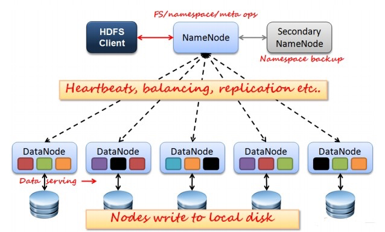

## HDFS 概述

## HDFS 架构

### HDFS 设计思想

### HDFS 核心架构

HDFS采用Master/Slave架构。

1. 一个HDFS集群包含一个单独的NameNode和多个DataNode。NameNode节点负责整个HDFS文件系统中的文件的元数据的保管和管理，集群中通常只有一台机器上运行NameNode实例，DataNode节点保存文件中的数据，集群中的机器分别运行一个DataNode实例。
2. NameNode作为Master服务，它负责管理文件系统的命名空间和客户端对文件的访问。NameNode会保存文件系统的具体信息，包括文件信息、文件被分割成具体block块的信息、以及每一个block块归属的DataNode的信息。对于整个集群来说，HDFS通过NameNode对用户提供了一个单一的命名空间。
3. DataNode作为Slave服务，在集群中可以存在多个。通常每一个DataNode都对应于一个物理节点。DataNode负责管理节点上它们拥有的存储，它将存储划分为多个block块，管理block块信息，同时周期性的将其所有的block块信息发送给NameNode。

下图为HDFS系统架构图，主要有三个角色，Client、NameNode、DataNode。

> 注意，上图中的 [Secondary NameNode](https://hadoop.apache.org/docs/stable/hadoop-project-dist/hadoop-hdfs/HdfsUserGuide.html) 定期合并fsimage和编辑日志文件，并将编辑日志大小保持在限制范围内。它通常在与主NameNode不同的机器上运行，因为它的内存需求与主NameNode的顺序相同。

## 参考资料

[大数据学习之路05——Hadoop原理与架构解析-腾讯云开发者社区-腾讯云 (tencent.com)](https://cloud.tencent.com/developer/article/1431491)

