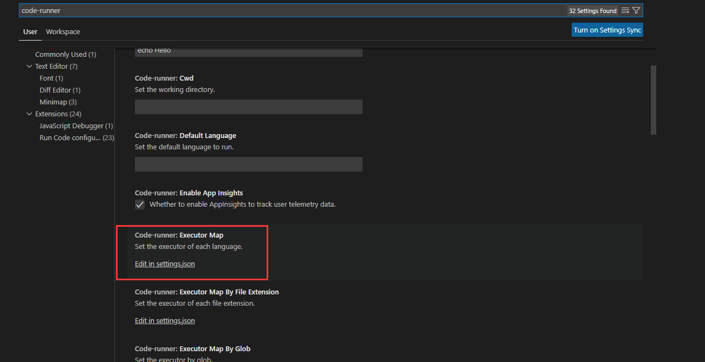
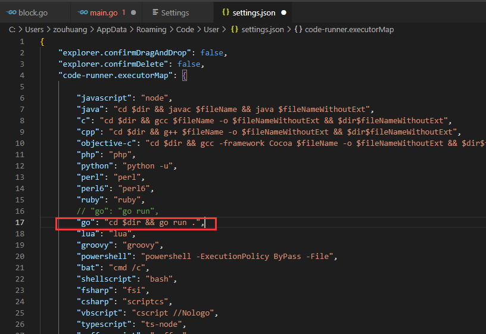

# 语言比较特殊语法

定义并初始化变量

a := 1


一般来说，通过指针访问一个对象的方式是`*pointer`，假设有一个指针指向一个结构体，按照这个逻辑，访问结构体字段的方式就应该是`(*pointer).field`，但是`Go`对结构体的指针做了优化，我们可以直接通过`pointer.field`的方式，用指针访问其指向的结构体的字段


byte其实是uint8的别名，byte 和 uint8 之间可以直接进行互转。 目前来只能将**0~255范围的int转成byte**。 因为超出这个范围，go在转换的时候，就会把多出来数据扔掉;如果需要将int32转成byte类型，我们只需要一个长度为4的 []byte数组就可以了


# string 与 []byte 互换

string 不能直接和byte数组转换

string可以和byte的切片转换

1,string 转为[]byte

var str string = "test"

var data []byte = []byte(str)

 

2,byte转为string

var data [10]byte 

byte[0] = 'T'

byte[1] = 'E'

var str string = string(data[:])


# 解决不同文件函数调用问题

## 方案一

在[vscode](https://so.csdn.net/so/search?q=vscode&spm=1001.2101.3001.7020)中，可以设置go.runner解决




修改配置文件

```
"code-runner.executorMap": {
  "go": "cd $dir && go run .",
}
```




## 方案二

可使用go run . 来编译执行目录下的所有go文件