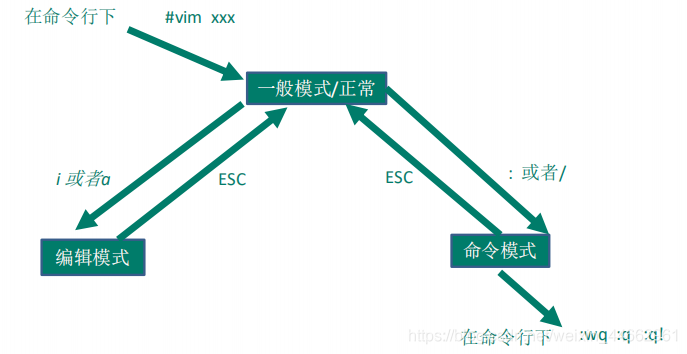

# 一、Vi和Vim基本介绍

- 所有的 Linux 系统都会内建 vi 文本编辑器。
- Vim 具有程序编辑的能力，可以看做是Vi的增强版本，可以主动的以字体颜色辨别语法的正确性，方便程序设计。代码补完、编译及错误跳转等方便编程的功能特别丰富，在程序员中被广泛使用。

# 二、Vim常用的三种模式

模式的中文命名比较麻烦，建议以英文为标准最好

## 2.1 正常模式(Command mode)

- 以 vim 打开一个文档就直接进入一般模式了(这是默认的模式)

- 在 这个模式中， 你可以使用“上下左右”按键来移动光标，你可以使用“删除字符”或“删除整列”来处理文件内容， 也可以使用“复制、粘贴”来处理你的文件数据。
- 在一般指令模式中可以进行删除、复制、粘贴等等的动作，但是却**无法编辑文件内容**的！

> 正常模式别名有：一般模式，一般指令模式

## 2.2 编辑模式(Insert mode)

- 要按下“$i, I, o, O, a, A, r, R$”等任何一个字母之后，才会进入编辑模式。

> 通常在 Linux 中，按 下这些按键时，在画面的左下方会出现“ INSERT 或 REPLACE ”的字样，此时才可以进行编辑

## 2.3 命令行模式(command-line mode)

- 在一般模式当中，输入“ : / ? ”三个中的任何一个按钮，就可以将光标移动到最下面那一列 ，进入命令行模式（一般指令模式，Last line mode 或者 command-line mode）
- 在这个模式当中， 可以提供你“搜寻数据”的动作，而读取、存盘、大量取代字符、离开 vi 、显示行号等等的动作则是在此模式中达成的！

# 三、Vim模式切换

注意：

- 编辑模式(Insert mode) 与 命令行模式(command-line mode) 之间不能切换

## 3.1 正常模式 切换到 编辑模式

进入插入或取代的编辑模式：

| i, I | 进入插入模式（Insert mode）：  i 为“从目前光标所在处插入”， I 为“在目前所在列的第一个非空白字符处开始插入”。 （常用） |
| ---- | ------------------------------------------------------------ |
| a, A | 进入插入模式（Insert mode）：  a 为“从目前光标所在的下一个字符处开始插入”， A 为“从光标所在列的最后一个字符处开始插 入”。（常用） |
| o, O | 进入插入模式（Insert mode）：  这是英文字母 o 的大小写。o 为“在目前光标所在的下一列处插入新的一列”； O 为在目前光标所在 处的上一列插入新的一列！（常用） |
| r, R | 进入取代模式（Replace mode）：  r 只会取代光标所在的那一个字符一次；R会一直取代光标所在的文字，直到按下 ESC 为止；（常用） |
|      |                                                              |

- 上面这些按键中，在 vi 画面的左下角处会出现“--INSERT--”或“--REPLACE--”的字样。 由名称就知道该动 作了吧！！特别注意的是，我们上面也提过了，你想要在文件里面输入字符时， 一定要在左下角处看到 INSERT 或 REPLACE 才能输入喔！
- [Esc] 退出编辑模式，回到一般指令模式中**（常用）**

## 3.2 Command mode 切换到 command-line mode

命令行界面的储存、离开等指令:

> 注意一下啊，那个惊叹号 **（!）** 在 vi 当中，常常具有“强制”的意思～

| :w            | 将编辑的数据写入硬盘文件中（常用）                           |
| ------------- | ------------------------------------------------------------ |
| :w!           | 若文件属性为“只读”时，强制写入该文件。不过，到底能不能写入， 还是跟你对该文件的 文件权限有关啊！ |
| :q            | 离开 vi （常用）                                             |
| :q!           | 若曾修改过文件，又不想储存，使用 ! 为强制离开不储存盘案      |
| :wq           | 储存后离开，若为 :wq! 则为强制储存后离开 （常用）            |
| ZZ            | 这是大写的 Z 喔！若文件没有更动，则不储存离开，若文件已经被更动过，则储存后离开！ |
| :w [filename] | 将编辑的数据储存成另一个文件（类似另存新文件                 |
| :r [filename] | 在编辑的数据中，读入另一个文件的数据。亦即将 “filename” 这个文件内容加到光标所在 列后面 |

vim环境的变更：

| :set nu   | 显示行号，设置之后，会在每一列的字首显示该列的行号 |
| --------- | -------------------------------------------------- |
| :set nonu | 与 set nu 相反，为取消行号！                       |

