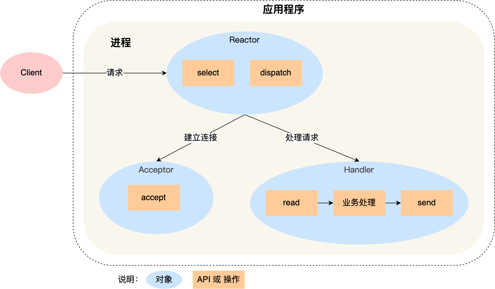
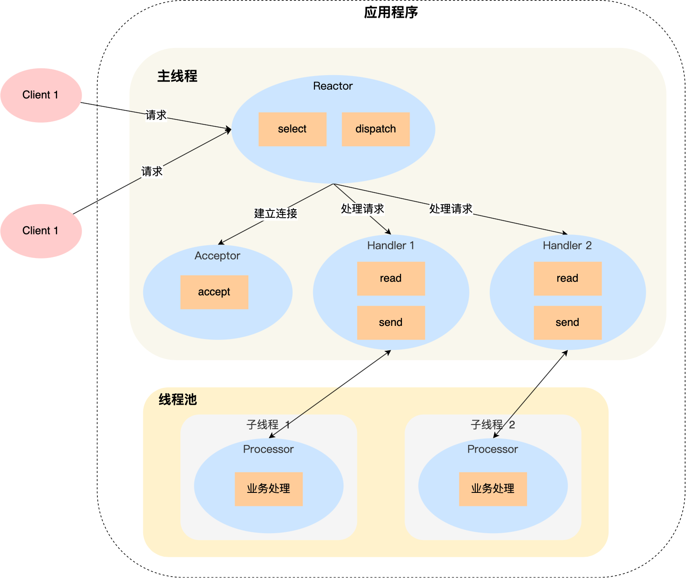
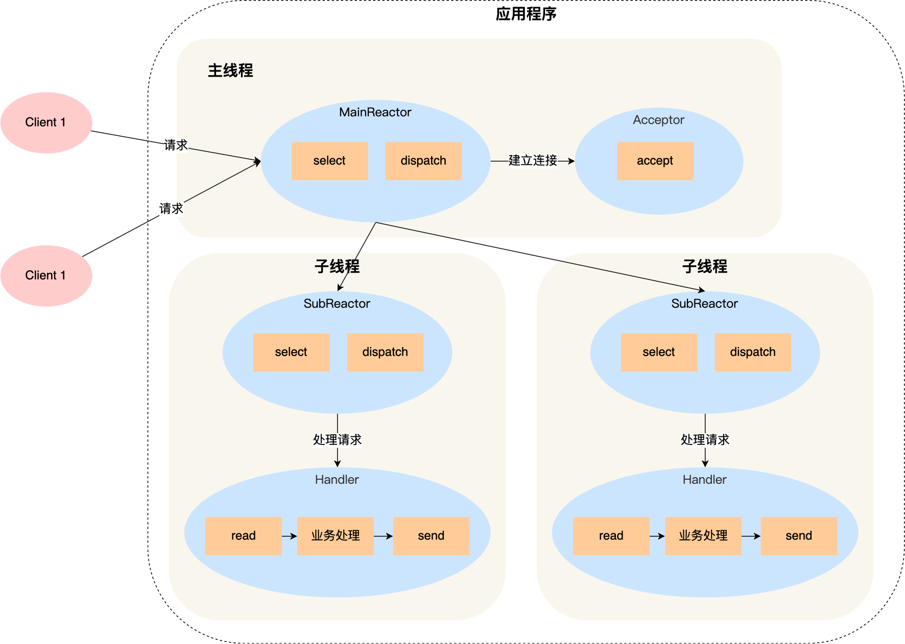

### 什么是 Reactor 模式

Reactor模式是一种非阻塞同步事件处理模式， 基于面向对象的思想对 I/O 多路复用和线程池做了一层封装。 

根据 Reactor 的数量和处理资源池线程的数量不同，有 3 种典型的实现：

- 单 Reactor 单线程；
- 单 Reactor 多线程；
- 主从 Reactor 多线程。

### Reactor 模式的领域模式

Reactor模式的核心思想是：**Reactor负责事件的分发和调度，而具体的事件处理交给具体的事件处理器（Handler）**。工作原理：

- **事件监听**：Reactor（事件分发器）监控多个I/O事件（例如网络连接、数据可读/可写等）。
- **事件触发**：当某个I/O事件发生时，Reactor将事件分发给对应的**事件处理器（Handler）**，通常是一个回调函数。
- **事件处理**：Handler负责处理事件，比如读/写数据、建立连接、关闭连接等。

### 单 Reactor 单线程

缺点：没有充分利用 多核CPU

### 单 Reactor 多线程

缺点：单个Reactor 很容易成为性能瓶颈。

### 多 Reactor 多线程

### 参考资料

[五分钟快速理解 Reactor 模型-腾讯云开发者社区-腾讯云 (tencent.com)](https://cloud.tencent.com/developer/article/1811347)

[高性能网络模式：Reactor 和 Proactor | 小林coding (xiaolincoding.com)](https://xiaolincoding.com/os/8_network_system/reactor.html#单-reactor-单进程-线程)