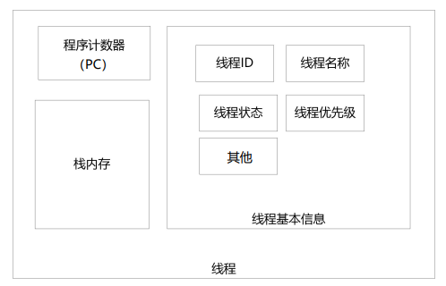

### 什么是线程

- 线程是指“进程代码段”的一次的顺序执行流程。

- 线程是CPU调度的最小单位。

- 各个线程之间可以共享地址空间和文件等资源；

实际上，操作系统的任务调度对象就是线程。

### 线程的组成

线程主要由三部分组成，即线程描述信息、程序计数器（Program Counter，PC） 和栈内存

- 线程描述信息：线程的基本信息，主要包括

### 进程的多个线程共享虚拟内存

进程内的多个线程共享的资源具体包括地址空间（代码段、数据段、堆）、文件描述符、信号和信号处理、工作目录和根目录、用户和组标识、内存映射文件、进程相关信息和资源限制。

- **地址空间**
  - **代码段**：所有线程共享相同的代码段，可以执行相同的程序代码。
  - **数据段**：全局变量和静态变量在所有线程之间共享。任何一个线程对这些变量的修改，其他线程都能看到。
  - **堆**：动态分配的内存（通过 `malloc`、`new` 等方式分配）在所有线程之间共享。

- **文件描述符表**：进程打开的文件、管道、套接字等资源在所有线程之间共享。任何一个线程打开或关闭一个文件，其他线程都会受到影响。
- **信号处理器**：进程的信号处理程序对所有线程都可见。如果一个线程设置或修改了信号处理程序，其他线程会共享这些设置。
-  **工作目录和根目录**
  - **工作目录**：所有线程共享相同的当前工作目录。任何一个线程更改了当前工作目录，其他线程也会受影响。
  - **根目录**：共享同一个根目录。

- **内存映射的文件**
  - **内存映射**：通过 `mmap` 映射到进程地址空间的文件在所有线程之间共享。

- **进程相关信息**
  - **进程ID**：所有线程共享相同的进程ID（PID）。
  - **父进程ID**：共享相同的父进程ID（PPID）

- **资源限制**：共享相同的资源限制（如文件打开数量、栈大小等）。

### 线程的上下文切换

- 当两个线程不是属于同一个进程，则切换的过程就跟进程上下文切换一样；
- **当两个线程是属于同一个进程，因为虚拟内存是共享的，所以在切换时，虚拟内存这些资源就保持不动，只需要切换线程的私有数据、寄存器等不共享的数据**；

### 为什么线程上下文切换开销更小

线程上下文切换开销更小，主要原因包括：

- **共享**同一地址空间，无需切换页表和段表。
- 共享文件描述符和其他资源，无需保存和恢复这些信息。
- 管理和调度更简单，内核开销更小。
- 只需保存和恢复少量寄存器和状态信息。

### 参考资料

《极致经典（卷2）：Java高并发核心编程(卷2)》