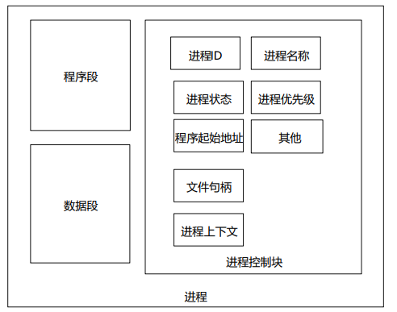
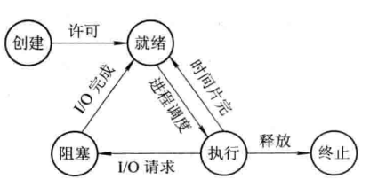
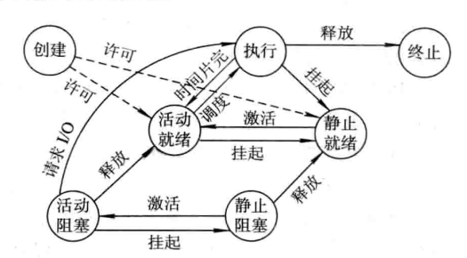

### 进程实体和进程

进程实体由程序段、数据段和进程控制块三部分组成。

在引入进程实体后，进程的定义为：**进程是进程实体的运行过程，是系统进行资源分配和调度的一个独立单位**。

对于进程的定义，从不同的角度可以有不同的定义，其中较典型的定义有:

- 进程是程序的一次执行
- 进程是一个程序及其数据在处理机上顺序执行时所发生的活动。
- 进程是具有独立功能的程序在一个数据集合上运行的过程，它是系统进行资源分配和调度的一个独立单位。

### 进程控制块组成

进程控制块（Process Control Block, PCB）是操作系统用于管理进程的重要数据结构。PCB主要由以下几部分组成：

### 进程上下文切换

CPU上下文切换：把前一个任务的 CPU 上下文（**CPU 寄存器和程序计数器**）保存起来，然后加载新任务的上下文到这些寄存器和程序计数器，最后再跳转到程序计数器所指的新位置，运行新任务。

进程上下文切换：操作系统将CPU从一个进程切换到另一个进程的过程

### 进程基本状态的转换

基本状态的转换如下：

如果引入挂起操作的话，进程基本状态转换将会变得更加复杂。

### 调度时机

在进程的生命周期中，当进程从一个运行状态到另外一状态变化的时候，其实会触发一次调度。

### 参考资料

[5.1 进程、线程基础知识 | 小林coding (xiaolincoding.com)](https://xiaolincoding.com/os/4_process/process_base.html#调度)