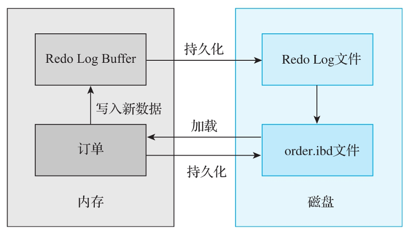
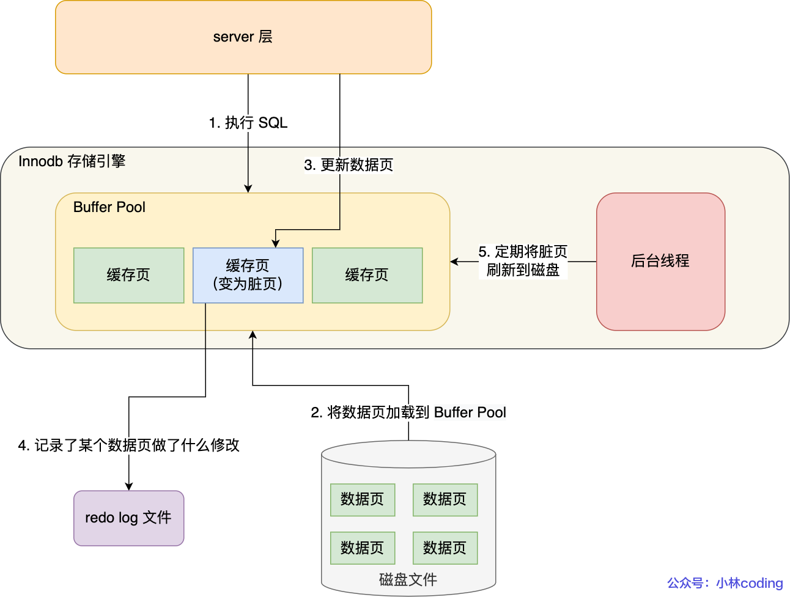

### 什么是 redo log

**redo Log** 是数据库系统中的一种物理日志，用于记录数据库事务的修改操作，确保在系统崩溃或断电等意外情况下，数据库能够通过重做操作来恢复到一个一致的状态。

redo log 主要使用 WAL 技术，保证持久性。

### redo log 的主要作用

- **数据恢复**：Redo Log 记录了所有已提交事务的修改操作。如果系统发生崩溃，在重新启动时，数据库可以通过读取 Redo Log 来重做这些事务的修改，从而恢复数据一致性。

- **持久性保证**：在事务提交时，数据库并不会立即将数据写入磁盘，而是先将数据修改记录到 Redo Log 中。一旦 Redo Log 写入磁盘，就可以保证事务的持久性，即使系统崩溃，事务的修改仍可以通过重做操作恢复。

### redo log 怎么保证持久性

- WAL 技术：
- Redo log 写入机制：Redo Log主要记录的是物理⽇志，采用**循环写**的方式，其⽂件内容是以顺序循环的⽅式写⼊的，⼀个⽂件写满时会 写⼊另⼀个⽂件，最后⼀个⽂件写满时，会向第⼀个⽂件写数据，并且是覆盖写
- checkpoint 机制

### redo log 的组成结构

Redo Log通常包含两部分：

- Redo Log Buffer：内存中的⽇志缓冲，比较容易丢失。
- Redo Log File：存放在磁盘上的重做日志文件，持久化到磁盘上，不容易丢失。

在MySQL发⽣故障时，尽⼒避免内存中的脏⻚数 据写⼊数据表的IBD⽂件。在重启MySQL服务时，可以根据Redo Log恢复事务已经提交但是还 未写⼊IBD⽂件中的数据，从⽽对事务提交的数据进⾏持久化操作。

例如，在商场系统的下单业务中，

### redo log 刷盘规则

### redo log 实际存储内容

redo log 是**物理日**志，记录了某个数据页做了什么修改，比如**对 xxX 表空间中的 Y 数据页 ZZZ 偏移量的地方做了AAA 更新**，每当执行一个事务就会产生这样的一条或者多条物理日志。
在事务提交时，只要先将redo log 持久化到磁盘即可，可以不需要等到将缓存在 Buffer Pool 里的脏页数据持久化到磁盘。

### redo Log 的工作流程

1. **事务开始**：当事务开始执行时，修改操作会先记录在 Redo Log 中。
2. **日志写入**：事务的每一步操作都会生成一条对应的 Redo Log 日志，表示该操作对数据的修改。这些日志会先写入到内存中的日志缓冲区（Log Buffer），然后周期性地写入磁盘。
3. **事务提交**：当事务提交时，系统确保将对应的 Redo Log 刷盘（写入磁盘），从而保证事务的修改操作被持久化。
4. **重做操作**：如果系统崩溃并重启，数据库会从 Redo Log 中读取已提交事务的日志记录，重新执行这些修改操作（称为重做操作），以恢复数据库状态。

