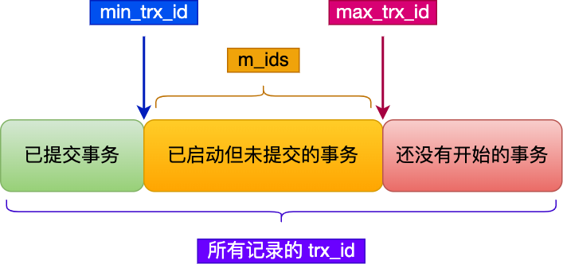

### 什么是 MVCC

MVCC 是一种并发控制机制，用于在多个并发事务同时读写数据库时保持数据的**一致性和隔离性**。

从某种角度来看**，MVCC 是行级锁的一个变种**，但是它在很多情况下避免了加锁操作，因此开销更低。根据其实现方式，不仅实现了非阻塞的读操作，写操作也只锁定必要的行。

它是通过在每个数据行上维护多个版本的数据来实现的。当一个事务要对数据库中的数据进行修改时，MVCC 会为该事务创建一个数据快照 Read View，而不是直接修改实际的数据行。

MVCC 通过创建数据的多个版本和使用快照读取来实现并发控制。‘

- **读操作**使用旧版本数据的快照，
- **写操作**创建新版本，并确保原始版本仍然可用。
- 事务提交和回滚
- 版本回收

### Read View 的内部结构

**MVCC（多版本并发控制）通过 ReadView + undo log 来实现**

Read View 有四个重要的字段

- **`min_trx_id`**：指示视图中能看到的最小事务 ID。
- **`max_trx_id`**：指示视图中能看到的最大事务 ID。
- **`m_ids`**：存储当前视图中所有活跃事务的事务 ID，用于确定哪些事务修改的数据对当前事务不可见。
- **`creator_trx_id `**：创建该 Read View 的事务的事务 id。
> 注意，MySQL InnoDB 存储引擎中的事务 ID (`trx_id`) 是按照递增的顺序分配的

某些情况下，**可能会出现 `min_trx_id <= 某个事务 trx_id < min_trx_id`，而该事务的 `trx_id` 不在 `m_ids` 中**，这表明该事务已经提交。

### 聚簇索引

聚簇索引记录中的两个隐藏列，分别指向事务Id 和指向undo log 的日志

### 判断是否可见的流程

**可重复读隔离级别是**启动事务时生成一个 Read View，然后整个事务期间都在用这个 Read View

MVCC 会在启动事务时生成一个 Read View，然后整个事务期间都在用这个 Read View

数据库中的每条记录在修改时，都会保留之前的旧版本。新版本会记录该事务的写操作，并且只有在事务成功提交后，新的版本才会对其他事务可见。

当某个事务修改数据时，系统会将这次修改与该事务关联，直到该事务提交。修改后，数据的版本链会更新，新版本的记录会标记为当前有效的版本。

当 min_trx_id <= 记录的 trx_id < min_trx_id 时，如果记录的 trx_id 不在 m_ids 里面，生成该版本记录的活跃事务已经被提交。

### 读操作（Snapshot Read）

- 当事务读取数据时，MVCC 机制会根据事务的开始时间戳选择合适的数据版本。每个事务会看到自己开始时刻的"数据快照"。
- 由于读取的是数据的历史版本，读操作**不需要加锁**。这意味着在 MVCC 中，读操作是非阻塞的，可以与写操作并发进行。

### 写操作

- 当事务进行写操作时，数据库并不会立即覆盖旧的数据版本，而是生成一个新的数据版本，并为其打上时间戳。
- 其他事务依然可以读取旧版本的数据，直到这些事务结束为止。
- 通常在写操作时，数据库会进行一些记录上的标记或产生新版本。这类操作通常不会涉及加锁，除非是特殊情况下需要保证写操作的唯一性和一致性。

### 如何避免事务之间的冲突

写写冲突：当两个事务同时试图写入相同的记录时，MVCC 通过锁机制避免同时写入，知道持有锁的事务完成提交。

**读写不冲突**：如果一个事务正在读取数据，另一个事务在修改相同的数据，MVCC 会通过版本控制来解决问题。读取的事务会看到修改前的数据快照，而写入的事务则会修改当前最新版本。

### 如何实现可重复读

**可重复读隔离级别是启动事务时生成一个 Read View，然后整个事务期间都在用这个 Read View**。

### 参考资料

[InnoDB存储引擎对MVCC的实现 | JavaGuide](https://javaguide.cn/database/mysql/innodb-implementation-of-mvcc.html#多版本并发控制-multi-version-concurrency-control)