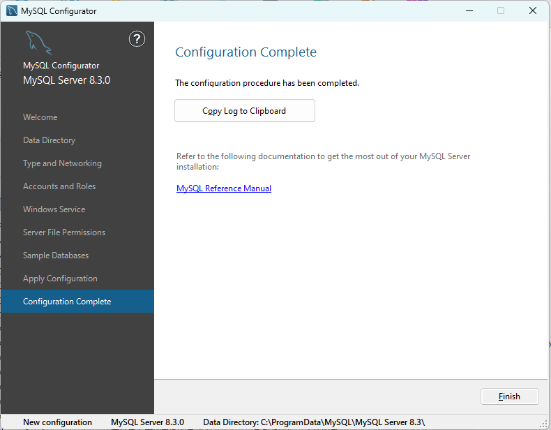
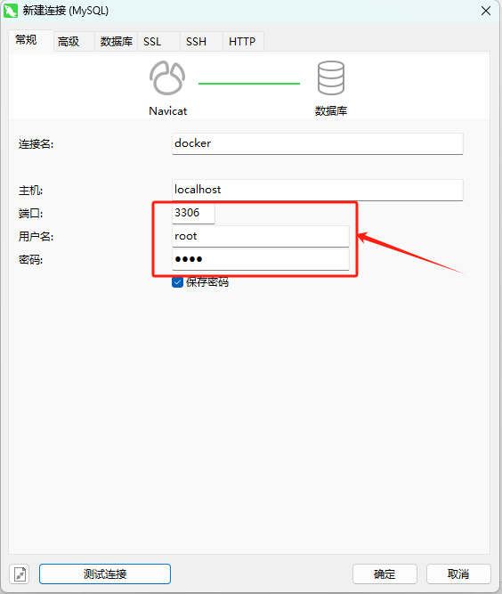

## 一、 MySQL 本地环境部署

### 1.1 安装 MySQL

在 [Mysql 下载官网](https://downloads.mysql.com/archives/installer/) 选择 MySQL Community Server 这一产品， 下载 `mysql-8.3.0-winx64.msi` 并安装软件。然后，在 MySQL Configurator 页面，配置安装目录、端口号、密码等设置。



比较重要的配置项有：

- 安装路径：默认为 `C:\Program Files\MySQL\MySQL Server 8.3\` 

- 默认端口号： 3306

- 密码：随意设置为 root


### 1.2 创建数据库

```shell
# 设置字符集(避免格式问题)
$ SET NAMES 'utf8mb4';
$ SET character_set_client = 'utf8mb4';
$ SET character_set_connection = 'utf8mb4';
$ SET character_set_results = 'utf8mb4';

# 创建数据库
$ CREATE DATABASE mydatabase CHARACTER SET 'utf8mb4' COLLATE 'utf8mb4_general_ci';

# 导入数据文件
$ use reggie
$ source D:\resources\udb.sql

# 退出 MySQL 命令行客户端
exit
```


## 二、Docker 中部署 MySQL

### 2.1 部署 MySQL

首先，从 Docker Hub 下载 

```shell
docker pull mysql:5.7.36
```

然后，在 Docker 容器中运行：

```shell
# Linux 系统
docker run --name mysql \
-p 3306:3306 \
-e MYSQL_ROOT_HOST='%' \
-e MYSQL_ROOT_PASSWORD=root \
-d mysql:5.7.36

# Windows 系统 （cmd里面运行，Windows PowerShell里面运行不了）
docker run --name mysql ^
-p 3306:3306 ^
-e MYSQL_ROOT_HOST='%' ^
-e MYSQL_ROOT_PASSWORD=root ^
-d mysql:5.7.36
```

这个命令的作用是在后台运行一个 MySQL 5.7.36 版本的容器,  相关参数含义解释：

| 参数                          | 含义                                                         |
| ----------------------------- | ------------------------------------------------------------ |
| `docker run`                  | 运行容器命令                                                 |
| `--name mysql`                | 指定容器的名称为 `mysql`                                     |
| `-p 3306:3306`                | 将宿主机的 3306 端口映射到容器内的 3306 端口                 |
| `-e MYSQL_ROOT_HOST='%'`      | 设置环境变量 `MYSQL_ROOT_HOST` 为 '%'，允许 root 用户从任何主机连接到 MySQL 服务。 |
| `-e MYSQL_ROOT_PASSWORD=root` | 设置环境变量 `MYSQL_ROOT_PASSWORD` 为 'root'，设置 root 用户的密码为 'root' |
| `-d`                          | 在后台运行容器                                               |
| `mysql:5.7.36`                | 指定要使用的 Docker 镜像，即 MySQL 5.7.36 版本的镜像         |

> 如果使用了 `-e MYSQL_ROOT_HOST='%'`， 我们后续还需要按照 [3.1 节](# 3.1 1130 - Host '172.17.0.1' is not allowed to connect to this MySQL server)中的教程修改 mysql数据库里面的 user 表。否则，我们用 Navicat 连接数据库会报错 ：1130 - Host ‘172.17.0.1‘ is not allowed to connect to this MySQL server
>
> 当我们只在本地上面跑时，没必要设置 MYSQL_ROOT_HOST


### 2.2 进入容器并创建数据库

(1) 进入容器

在 `mysql` 容器里面进行数据库创建或者导入数据文件前，我们必须**进入容器**：

```shell
docker exec -it mysql /bin/bash
```

这个命令的含义是在名为 `mysql` 的容器中打开一个交互式的 bash 终端，相关参数解析为：

- `docker exec`: 这个命令允许你在运行的容器中执行命令。
- `-it`: 这两个参数结合在一起表示要创建一个交互式的终端。`-i` 参数表示保持 STDIN 打开，即使没有连接到它，`-t` 参数表示分配一个伪终端。
- `mysql`: 这是要执行命令的容器的名称或 ID。
- `/bin/bash`: 这是要执行的命令，在这里是打开一个 bash 终端。


（2）数据库登录和创建

```shell
# 登录（密码已经在 docker run语句的参数里面设置）
# 参数 -u 和其后的用户名通常之间不需要空格隔开；参数 -p 和其后的密码也可以直接连在一起写
mysql -uroot -proot --default-character-set=utf8

# 创建数据库
CREATE DATABASE mydatabase

# 退出 MySQL 命令行客户端
exit
```


（3）导入数据

在导入数据之前，我们首先确保 宿主机中指定路径下sql 文件是否挂载到在容器里面（docker run 参数里面可以设置）。如果没有挂载的话，我们可以使用 `docker cp` 命令：

```shell
# docker cp 语法
$ docker cp /本地/路径/文件.sql 容器名称或ID:/容器内/路径/

# 举个例子
$ docker cp D:\Learning\project\12306\resources mysql:/resources/
Successfully copied 8.22MB to mysql:/resources/
```

然后，我们在创建的数据库里面导入sql数据文件：

```mysql
# 切换到指定的数据库（在某些情况下，该语句可能以及写到了sql数据文件里面）
use 指定的数据库名;

-- 导入 SQL 文件
source /docker-entrypoint-initdb.d/mydata.sql；
```


（4）保存 mysql 容器

为了保存更新后的数据库，我们应该将容器保存为新的镜像

> 注意：在 Docker 中，**镜像是不可更改的**。一旦创建了一个镜像，就无法直接修改它。因此，无法直接覆盖原来的镜像。

```
docker commit [CONTAINER ID] [IMAGE NAME]   #容器ID  创建的镜像名
docker images   #可以看到该镜像已经创建成功，下次需要新建容器时可直接使用该镜像
```

举个例子，

```shell
$ docker commit mysql mysqlcloud
sha256:6953caac5bffdea0a7a867dc5fb483702f8b291e00759940aae8275f28966391

$ docker images
REPOSITORY                      TAG            IMAGE ID       CREATED          SIZE
mysqlcloud                      latest         6953caac5bff   11 seconds ago   457MB
multi-container-app-todo-app    latest         4ce52cba239f   2 months ago     226MB
<none>                          <none>         abc68feda784   2 months ago     226MB
welcome-to-docker               latest         391a7884fcf8   2 months ago     225MB
mongo                           6              6d5c2fe902ad   2 months ago     690MB
docker/welcome-to-docker        latest         c1f619b6477e   4 months ago     18.6MB
zouhudocker/welcome-to-docker   latest         c1f619b6477e   4 months ago     18.6MB
nacos/nacos-server              v2.1.2         a978644d9246   14 months ago    1.06GB
redis                           latest         7614ae9453d1   2 years ago      113MB
mysql                           5.7.36         c20987f18b13   2 years ago      448MB
pangliang/rocketmq-console-ng   latest         ce1afb55c045   4 years ago      118MB
foxiswho/rocketmq               broker-4.5.1   d45240b3173d   4 years ago      440MB
foxiswho/rocketmq               server-4.5.1   12d0d03473de   4 years ago      440MB
```


### 2.3 Navicat 可视化工具连接

在 `docker run --name mysql -p 3306:3306 -e MYSQL_ROOT_HOST='%' -e MYSQL_ROOT_PASSWORD=root -d mysql:5.7.36` 语句中，我们已经设置好了端口号和密码。因此，Navicat 可视化工具连接中，我们可以这样填写信息：

- 端口 填创建容器时 `-p` 后的第一个端口
- 密码 填 `-e` 后写的密码




## 三、MySQL 环境配置

mysql 自带的库主要有：

```shell
$ show databases;
+--------------------+
| Database           |
+--------------------+
| information_schema |
| mysql              |
| performance_schema |
| sys                |
+--------------------+
4 rows in set (0.00 sec)
```


## 四、可能存在的问题

### 4.1 1130 - Host ‘172.17.0.1‘ is not allowed to connect to this MySQL server

Navicat连接报错 ——1130 - Host ‘172.17.0.1‘ is not allowed to connect to this MySQL server

解决方案：[解决1130 - Host ‘172.17.0.1‘ is not allowed to connect to this MySQL server_host '172.17.0.1' is not allowed to connect to thi-CSDN博客](https://blog.csdn.net/a1023266384/article/details/119455841)

原因分析：

```
docker run --name mysql ^
-p 3306:3306 ^
-e MYSQL_ROOT_HOST='%' ^
-e MYSQL_ROOT_PASSWORD=root ^
-d mysql:5.7.36
```

在 `docker run` 语句里面，root 对应的 Host 为 % 。但是 Mysql 数据库里面没有，我们重新修改即可。

> `Host`: 表示允许访问 MySQL 服务器的主机名或 IP 地址。
>
> `User`: 表示用户的用户名。

```
mysql> select Host, User  from user ;
+-----------+---------------+
| Host      | User          |
+-----------+---------------+
| localhost | mysql.session |
| localhost | mysql.sys     |
| localhost | root          |
+-----------+---------------+
3 rows in set (0.00 sec)

mysql> update user set Host='%' where User='root' ;
Query OK, 1 row affected (0.00 sec)
Rows matched: 1  Changed: 1  Warnings: 0

mysql> flush privileges ;
Query OK, 0 rows affected (0.00 sec)

mysql> select Host, User from user;
+-----------+---------------+
| Host      | User          |
+-----------+---------------+
| %         | root          |
| localhost | mysql.session |
| localhost | mysql.sys     |
+-----------+---------------+
3 rows in set (0.00 sec)
```


实际操作：

```
-- 显示所有数据库
mysql> show databases ;

-- 切换到 mysql 数据库
use mysql;

-- 显示 mysql 数据库中的所有表
show tables ;

-- 查询 user 表中的 Host 和 User 列
select Host, User from user ;

-- 将 user 表中 User 为 'root' 的记录的 Host 字段修改为 '%'
update user set Host='%' where User='root' ;

-- 刷新权限
flush privileges ;
```


## 参考资料

[docker 安装mysql,并创建数据库_docker创建mysql数据库-CSDN博客](https://blog.csdn.net/u011937566/article/details/121111616)

[运行在docker里面的mysql如何导入数据表 - 简书 (jianshu.com)](https://www.jianshu.com/p/d7811855d6c9)

[docker部署mysql,使用navicat可视化工具进行连接 - 知乎 (zhihu.com)](https://zhuanlan.zhihu.com/p/665814710)