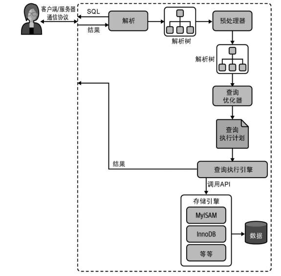

### SQL 执行过程

SQL 查询语句执行过程：

1. 客户端给服务器发送一条SQL查询语句。
2. 服务器端进行SQL语句解析、预处理，再由优化器生成对应的执行计划。
3. MySQL根据优化器生成的执行计划，调用存储引擎的API来执行查询。
4. 将结果返回给客户端

### MySQL的客户端/服务器通信协议

MySQL的客户端/服务器通信协议是半双工的。

但是，这个通信协议存在以下缺点：

- 没法进行流量控制。一旦一端开始发送消息，另一端要接收完整个消息才能响应它。
- 服务端资源紧张。MySQL通常需要等 所有的数据都已经发送给客户端才能释放这条查询所占用的资源，所以接收全部结果并缓 存通常可以减少服务器的压力，让查询能够早点结束、早点释放相应的资源。

### 语法解析器和预处理

语法解析器使用 **MySQL 语法规则**验证和解析查询

预处理器检查生成的解析树，以查找解析器**无法解析的其他语义**，例如，这里将检 查数据表和数据列是否存在，还会解析名字和别名，看看它们是否有歧义。

### 查询优化器

一条查询可以有很多种执行方式，最后都返回相同的结果。优化器的作用就是找到这其中最好的执行计划。

可以通过查询当前会话的 `Last_query_cost` 的值来得知MySQL 计算的当前查询的成本。

查询优化器依旧难以找到最好的优化计划，存在以下局限性：

- 统计信息不准确。MySQL服务器依赖存储引擎提供的统计信息来评估成本，但是 有的存储引擎提供的信息是准确的，有的偏差可能非常大。
- **成本指标并不完全等同于运行查询的实际成本**，因此即使统计数据是准确的，查询 的成本也可能超过或者低于MySQL估算的近似值。例如，有时候某个执行计划虽 然需要读取更多的页面，但是它的成本却更低。因为如果这些页面都是顺序读或者 这些页面都已经在内存中的话，那么它的访问成本将很低。MySQL并不知道哪些 页面在内存中、哪些在磁盘中，所以查询在实际执行过程中到底需要多少次物理 I/O是无法得知的。

### 查询执行引擎

在解析和优化阶段，MySQL将生成查询对应的执行计划，MySQL的查询执行引擎会根据 这个执行计划来完成整个查询。这里的执行计划是一个数据结构，而不是和很多其他的关 系数据库那样生成对应的可执行的字节码。

### 将结果返回给客户端

执行查询的最后一个阶段是将结果返回给客户端。即使查询不需要给客户端返回结果集， MySQL仍然会返回这个查询的一些信息，如该查询影响到的行数。