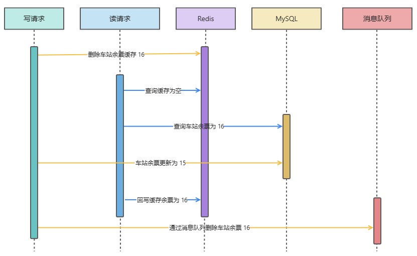
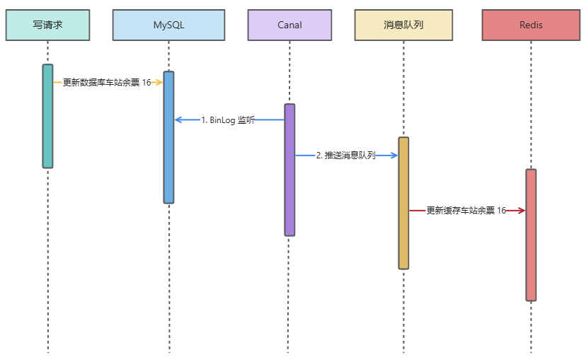

##  常用的技术方案

### 技术方案

列举常见的技术方案：

- 缓存双删：先删除缓存再写数据库，再删除缓存
- 先写数据库再删除缓存
- binlog 异步更新缓存

### 如何选择合适的方案

如果缓存实时性要求较高，考虑

### 重要细节

**只要保证缓存和数据库的最终一致性即可**。

如果追求强一致性，必须要求所有更新操作完成之前期间，不能有「任何请求」进来。但是，这种使用分布式锁实现的方式代价较高，可能超出 redis 带来的性能提升。

## 缓存双删（不建议）

缓存双删指的是先删除缓存再写数据库，再删除缓存

### 理想情况

**在理想的情况下，读请求回写缓存在写请求第二次删除缓存之前**。此时，缓存双删保证一致性，技术具体过程如下：

从图中可以看出，读请求第二次回写缓存余票为 15， Redis 和 MySQL 中保存的值最后都是 15，满足最终一致性。

### 普通情况

为了保证这一方案能够在普通情况下运行，解决方案为延迟双删。

延迟双删：**保证第二次删除缓存在读请求回写缓存之后，使用消息队列进行延迟操作**。

### 存在问题

由于**延迟双删的延迟时间难以确定**，推荐用「先更新数据库，再删除缓存」的方案。

## 先写数据库在删除缓存

### 具体方案

读请求第一次查询时，会查询到一个错误的数据，因为写请求还没有更新到缓存，写请求写入 MySQL 成功后会删除缓存中的历史数据。后续读请求查询缓存没有值就会再请求数据库 MySQL 进行重新加载，并将正确的值放到缓存中。

### 存在问题

这种模型会**存在一个很小周期的缓存与数据库不一致的情况**，不过对于绝大多数的情况来说，是可以容忍的。除去一些电商库存、列车余票等对数据比较敏感的情况，比较适合绝大多数业务场景。

在下图中，第一次查询到的缓存就与数据库不一致。

该模型还存在**缓存失效**的问题。

为了保证删除缓存这个步骤一定执行，可以**使用消息队列来进行异步重试**。

## binlog 异步更新缓存

订阅变更日志的思想，本质是把权威数据源（例如 MySQL）当做 leader 副本，让其它异质系统（例如 Redis / Elasticsearch）成为它的 follower 副本，通过同步变更日志的方式，保证 leader 和 follower 之间保持一致

### 订阅变更日志工具

订阅变更日志 binlog 比较成熟的工具有阿里的 canal 。

### 具体方案

当一条数据发生修改时，MySQL 就会产生一条变更日志（Binlog），我们可以订阅这个日志，拿到具体操作的数据，然后再根据这条数据，去删除对应的缓存。

### 参考资料

[缓存与数据库一致性如何解决？ (yuque.com)](https://www.yuque.com/magestack/12306/wocbrht50ctg14nv#NZlgQ)

[缓存和数据库一致性问题，看这篇就够了 (qq.com)](https://mp.weixin.qq.com/s?__biz=MzIyOTYxNDI5OA==&mid=2247487312&idx=1&sn=fa19566f5729d6598155b5c676eee62d&chksm=e8beb8e5dfc931f3e35655da9da0b61c79f2843101c130cf38996446975014f958a6481aacf1&scene=178&cur_album_id=1699766580538032128#rd)

[Redis常见面试题总结(下) | JavaGuide](https://javaguide.cn/database/redis/redis-questions-02.html#如何保证缓存和数据库数据的一致性)

