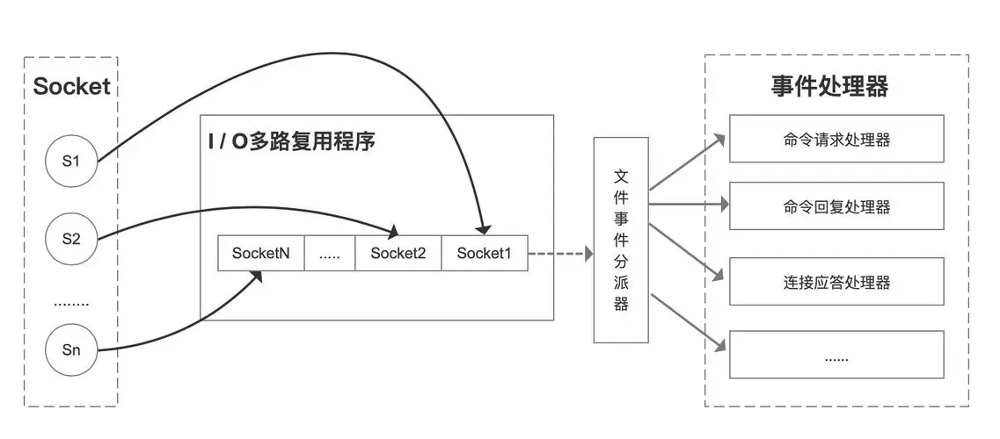

### 为什么 Redis 这么快

- 内存。缓存（尤其是CPU缓存和内存）通常比硬盘（无论是HDD还是SSD）快 **数百到数千倍**。
- Redis 基于 Reactor 模式设计开发了一套高效的**事件处理模型**，主要是单线程事件循环和 **IO 多路复用**（Redis 线程模式后面会详细介绍到）；
- 优化的数据类型。

### Redis 怎么实现 I/O 多路复用

这里“多路”指的是多个网络连接客户端,，“复用“指的是复用同一个线程(单进程)。  I/O 多路复用其实是使用一个线程来检査多个 Socket 的就绪状态，在单个线程中通过记录跟踪每一个socket( I/O 流)的状态来管理处理多个 I/O 流。

### redis 和 mysql 并发量

如果缓存命中的话，4 核心 8g 内存的配置，redis 可以支撑 10w 的 qps

如果缓存没有命中的话，4 核心 8g 内存的配置，mysql 只能支持 5000 左右的 qps

### 参考资料

[Redis 为什么这么快？](https://javaguide.cn/database/redis/redis-questions-01.html#redis-为什么这么快)