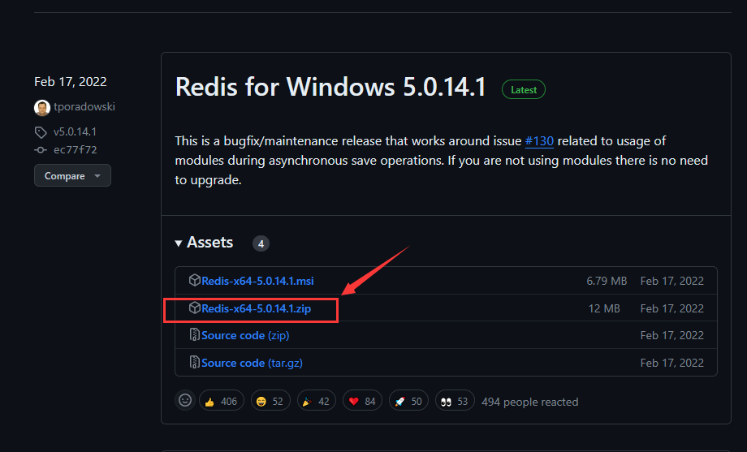
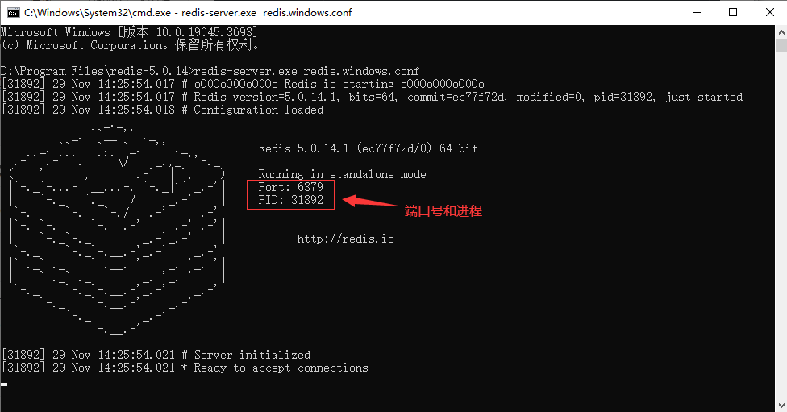
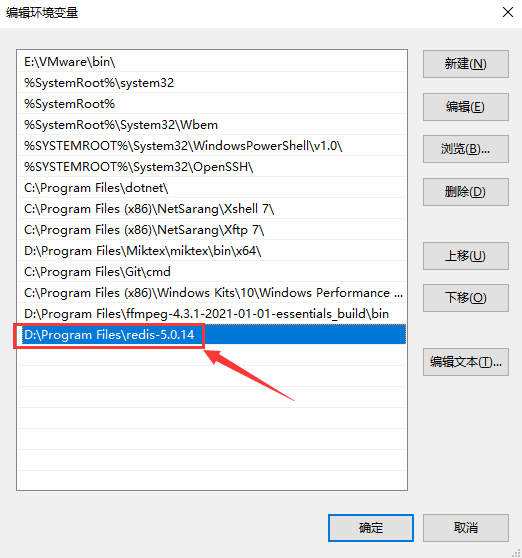
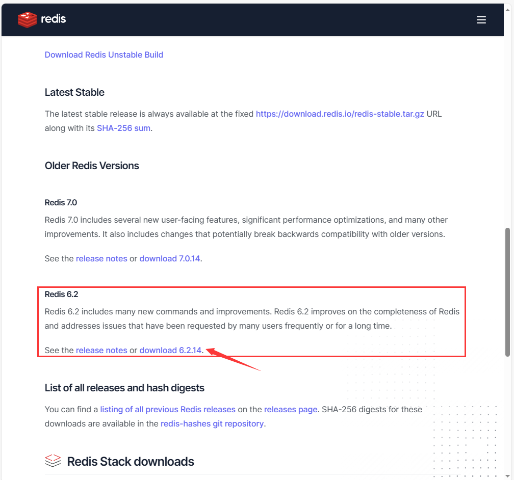

[TOC]

# 一、Windows环境下安装 Redis

windows系统环境下，redis安装方式主要有：

- zip压缩包方式    https://redis.io/download 或者 https://github.com/tporadowski/redis/releases
- msi压缩包方式   https://github.com/tporadowski/redis/releases

> 需要注意的是， https://redis.io/download 官网并不支持 windows版本

本文选择zip压缩包方式来进行安装。


## 1.1 下载Redis

在[Releases · tporadowski/redis (github.com)](https://github.com/tporadowski/redis/releases)下载 `Redis-x64-5.0.14.1.zip` 这个版本。然后，将压缩包解压缩到指定的目录里面（比如`D:\Program Files\redis-5.0.14`）




## 1.2 启动redis服务器

在Redis的安装目录（`D:\Program Files\redis-5.0.14`）下打开cmd窗口，然后执行命令来启动服务：

```
redis-server.exe redis.windows.conf
```

命令里面的 `redis.windows.conf` （windows环境的redis配置文件）**可以省略**。省略后，使用`redis-server.exe`命令会使用默认的配置。


启动成功的界面如下：



> 注意，启动 Redis 服务器后，不能关闭窗口，否则客户端将无法连接。
>
> 6979 是 Redis 的默认端口号


## 1.3 启动redis客户端

在Redis的安装目录（`D:\Program Files\redis-5.0.14`）下打开cmd窗口，然后执行命令来启动redis客户端：

```
redis-cli.exe -h 127.0.0.1 -p 6379
```

其中，127.0.0.1 表示IP地址（即本机），6379表示端口号。


 然后，输入ping命令来检测redis服务器与redis客户端的连通性：

```
ping
```

运行界面如下：


## 1.4 配置环境变量

为了方便，将Redis路径（`D:\Program Files\redis-5.0.14`）配置到系统变量Path值中



现在，可以在任意目录下，直接输入以下命令来启动redis服务器

```
redis-server
```


# 二、Linux环境下安装redis

## 2.1 下载redis

在[redis官网](https://redis.io/download)下载 `redis-6.2.14` 这个版本。然后，将压缩包解压缩到指定的目录里面（比如`D:\Program Files\redis-6.2.14`）




# 三、Docker 安装并部署 Redis

首先，从 Docker Hub 下载 

```
docker pull redis
```

然后，在 Docker 容器中运行：

```
docker run -p 6379:6379 --name redis  -d redis redis-server --requirepass "123456"
```

相关参数含义：

| 参数                                  | 说明                                                         |
| ------------------------------------- | ------------------------------------------------------------ |
| `docker run`                          | 运行容器命令                                                 |
| `-p 6379:6379`                        | 将宿主机的 6379 端口映射到容器内的 6379 端口                 |
| `--name redis`                        | 指定容器的名称为 `redis`                                     |
| `-d`                                  | 在后台运行容器                                               |
| `redis`                               | 指定要使用的 Docker 镜像，即 Redis 镜像                      |
| `redis-server --requirepass "123456"` | 指定了容器启动时要执行的命令，这里是启动 Redis 服务器，并设置连接密码为 "123456" |


# 参考资料

[Window下Redis的安装和部署详细图文教程（Redis的安装和可视化工具的使用）_redis windows-CSDN博客](https://blog.csdn.net/weixin_44893902/article/details/123087435)

[redis 中文社区](http://www.redis.cn/download.html)

