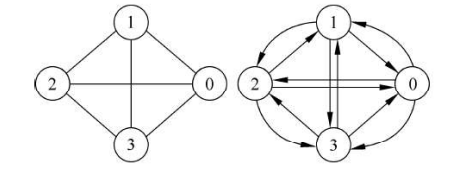

## 一、图的基本概念

#### 度

在无向图中，一个顶点所关联的边的数目为顶点的度。

在有向图中，顶点的度分为入度和出度。

- **入度（In-degree）**：一个节点的入度指的是**有多少条边指向该节点**。

- **出度（Out-degree）**：一个节点的出度指的是**有多少条边从该节点出发指向其他节点**。

#### 完全图

若无向图中的每两个顶点之间都存在着一条边, 有向图中的每两个顶点之间都存在着方向相反的两条边, 则称此图为**完全图(completed graph)**。显然,无向完全图包含有 $n(n-1)/2$ 条边,有向完全图包含有 $n(n-1)$ 条边。

两个具有 4 个顶点的完全图如下如所示。

#### 稠密图和稀疏图

当一个图接近完全图时,称为稠密图(dense graph)。

相反,当一个图含有较少的边数(如 $e<nlog_{2}n$ )时,则称为稀疏图(sparse graph)。

#### 联通、联通图和联通分量

这些术语与**无向图**的连通性相关：

- **连通**指的是图中任意两个顶点之间都存在一条路径。换句话说，从一个顶点可以通过边到达另一个顶点。

- **连通图**是指无向图中的所有顶点都是连通的，即任意两个顶点之间都有一条路径。整个图的所有顶点形成一个连通的整体。

- **连通分量**是指图中的一个最大连通子图。也就是说，连通分量是图的一个子集，其中所有顶点都是连通的，但与该子集之外的其他顶点不连通。

显然，连通图的联通分量只有一个（即本身），而非连通图有多个连通分量。

在一个有 **n** 个顶点的**无向连通图**中，至少需要 **n-1** 条边才能保证图是连通的。

完全图一定是联通的。

若无向图 G 中含 7 个顶点，则保证图 G 在任何情况下都是连通的，则需要的边数最少是 15

要保证无向图G在任何情况下都是连通的，即任意变动图G中的边，G始终保持连通。考虑极端情况， 首先需要G的任意6个结点构成完全连通子图G1，需15条边，然后再添一条边将第7结点与G1连接起来，共需16条边。

#### 强连通图和强连通分量

这些术语与**有向图**的连通性相关：

- **强连通图**是指，对于有向图中任意两个顶点 `u` 和 `v`，都存在从 `u` 到 `v` 的**有向路径**，并且从 `v` 到 `u` 也有**有向路径**。

- **强连通分量**是有向图中的一个最大强连通子图。在这个子图内，所有顶点之间都是强连通的（即每对顶点都可以双向到达）。

显然，强连通图的强联通分量只有一个（即本身），而非强连通图有多个强连通分量。

对于一个有 **n** 个顶点的强连通有向图，至少需要 **n** 条边来保证图的强连通性，通常是通过形成一个**有向环**来实现的。

## 二、图的存储结构

### 邻接矩阵

邻接矩阵是一个 **n × n** 的二维数组（或矩阵），其中 **n** 是图中顶点的数量。矩阵的行和列分别代表图中的顶点。矩阵的每个元素 `A[i][j]` 代表顶点 **i** 和顶点 **j** 之间的连接关系。

邻接矩阵适合场景：

- 需要提取边权值
- 存储边的数目较多的稠密图

### 邻接表

邻接表是一种顺序与链式存储相结合的存储方法。对于含有 $n$ 个顶点的图，每个顶点建立一个单链表，第 $i$ ($0$ ~ $n - 1$ )  个单链表中的结点表示关联于顶点 $i$ 的边。

## 三、Leetcode 题目

[Leetcode 题目](https://leetcode.cn/studyplan/graph-theory/) 总结了图论的基础知识，如标准遍历、广度优先搜索、01矩阵、矩阵图、图论、并查集、拓扑排序、Dijkstra 算法和最小生成树等内容。