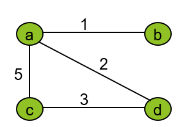

## 一、 贪心法

### 1.1 定义

贪婪法：通过一系列步骤来构造问题的解，每一步对目前构造的部分解做一个扩展，直到获得问题的完整解为止

- **可行的**：必须满足问题的约束
- **局部最优**：是当前步骤中所有可行选择中最佳的局部选择
- **不可取消**：选择一旦做出，在算法的后面步骤中就无法改变


### 1.2 贪心算法基本要素

#### 1.2.1 贪心选择性质

所谓**贪婪选择性质**是指所求问题的**整体最优解**可以通过一系列**局部最优**的选择，即贪婪选择来达到。

这是贪婪算法可行的第一个基本要素，也是<font color="red">**贪婪算法与动态规划算法的主要区别**</font>。  

- 动态规划算法通常以**自底向上**的方式解各子问题，而贪婪算法则通常以**自顶向下**的方式进行，以迭代的方式作出相继的贪心选择，每作一次贪心选择就将所求问题简化为规模更小的子问题
- **贪心算法**通常不需要保存先前的结果，仅依赖于当前状态。**动态规划**需要保存已经解决的子问题的结果，以便在后续计算中使用。

对于一个具体问题，要确定它是否具有贪婪选择性质，**必须证明每一步所作的贪婪选择最终导致问题的整体最优解**。


#### 1.2.2 最优子结构性质

 当一个问题的最优解包含其子问题的最优解时，称此问题具有**最优子结构性质**。

问题的最优子结构性质是该问题可用动态规划算法或贪心算法求解的关键特征。


### 1.3 贪心技术有效性

- 的确存在某类问题：一系列局部最优选择对于它们的每一个实例都能够产生一个最优解
- 或者我们关心的是**近似解**，或者只能满足于近似解


## 三、 常见题目

### 3.1 背包问题

#### 3.1.1 问题定义

**问题描述：**已知有$n$种物品和一个可容纳$W$重量的背包，每种物品$i$的重量为$w_i$，假定将物品$i$的某一部分$x_i$放入背包就会得到$p_i x_i$的效益($0≤x_i≤1, p_i>0$, $p_i$表示单位重量价值) ，采用怎样的装包方法才会使装入背包物品的总效益为最大呢？


#### 3.1.2 解决思路

**用贪婪算法解背包问题的基本步骤：**

首先计算每种物品单位重量的价值$v_i/w_i$，然后，依贪婪选择策略，将尽可能多的<font color="red">**单位重量价值最高**</font>的物品装入背包。若将这种物品全部装入背包后，背包内的物品总重量未超过C，则选择单位重量价值次高的物品并尽可能多地装入背包。依此策略一直地进行下去，直到背包装满为止。


#### 3.1.3 补充

0-1背包问题 和 背包问题 类似， 都具有 **最优子结构**性质。

但背包问题可以用贪心算法求解，而0-1背包问题却不能用贪心算法求解

对于0-1背包问题，贪婪选择之所以不能得到最优解， 是因为在这种情况下，它**无法保证最终能将背包装满**，部分闲置的背包空间使每公斤背包空间的价值降低了。事实上，在考虑0-1背包问题时，应比较选择该物品和不选择该物品所导致的最终方案，然后再作出最好选择。由此就导出许多互相重叠的子问题。这正是该问题可用**动态规划算法**求解的另一重要特征。


### 3.2 最小生成树

给定n个点，把它们按照一种成本最低的方式连接起来，使得每一对点之间都有一条路径。这个问题可以表示成最小生成树问题。

> 最小生成树问题就是求给定的加权连通图的最小生成树问题




#### 3.2.1 Prim算法

- 从图的顶点集合$V$中任选一个单顶点，作为序列中的初始子树。
- 每一次迭代时，<font color="red">**以一种贪婪的方式来扩张当前的生成树**</font>，即简单地把不在树中的最近顶点添加到树中（以一条权重最小的边和树中的顶点相连，树的形状是无所谓的）
- 当图的所有顶点都包含在所构造的树中以后，算法停止：每次只对树扩展一个顶点


**伪代码**

```
算法 Prim(G){//构造最小生成树
//输入：加权连通图G=<V,E>
//输出：ET组成最小生成树的边的集合
 VT={v0}; ET=Ø;
 for(i=1;i<|V|;i++){
  在所有的边(v,u)中,求权重最小的边e*=(v*,u*),使
   得v在VT中,而u在V-VT中；
   if (不致使最小树生成环){
   		VT ∪= {u*};
        ET ∪={e*};
   }
 }
 return ET; 
} 
```


#### 3.2.2  Kruskal算法

Kruskal算法把一个加权连通图$G=<V,E>$的最小生成树看作是一个具有$|V|-1$条边的无环子图，并且边的权重和是最小的。

该算法通过对子图的一系列扩展来构造一棵最小生成树，这些子图总是无环的，但在算法的中间阶段，并不一定是连通的。


**具体操作流程：**

- 首先，按照权重的非递减顺序对图中的边进行排序
- 然后，从一个空子图开始，扫描有序列表，试图把列表中的下一条边加到当前的子图中。（必须保证该添加不会导致一个回路）
- 直到添加的边的数量等于 $|V|-1$


**伪代码：**

```
算法  Kruskal(G){//构造最小生成树
//按照边的权重w(ei1)≤…≤ w(ei(E))排序
	ET=Ø;num=0; //初始化边的集合和集合的规模
	k=0; //初始化已处理的边的数量
	while(num<|V|-1){
		k++; 
		if(ET∪{eik}无回路){
			 ET∪= {eik}；num++；
		}		
	}
	return ET;	
}	
```


### 3.3 最短路径Dijkstra算法

> 最短路径还可以用 Floyd算法求出

Dijkstra算法（迪杰斯特拉算法）是典型的最短路径算法，用于**计算一个节点到其他节点的最短路径**


**符号设置：**

设置 visit 数组表示节点是否已被访问

dist数组 表示 起始节点到其他节点的最短距离（即邻接顶点记为其权值，不相邻的顶点记为∞）


**基本思想：**

Dijkstra算法的基本思想是：

（1） 我们采用二维数组邻接矩阵的形式储存图并将图初始化；
（2）选择其中一个顶点作为计算最短路径的起点。
（3） 构造一个d一维数组dist[n]，其中n是顶点个数，dis用来记录最短路径距离。初始化dis，其值为图中各点到起点的直接距离（即邻接顶点记为其权值，不相邻的顶点记为∞）；
（4） 每次中dist数组中找出最小值，该值就是起点到该点的最短路径距离，（可以将该点加一个标志位已记录该点路径已确定，即设置visit[i]=1）；
（5） 在加入了一个新的确定了点之后, 就更新dis数组，看其余点能否通过这个确定的点到达起始点且距离能够更短。
（6）重复4、5步，直到所有点都找到了最短路径。


### 3.4 哈夫曼树和哈夫曼编码

#### 3.4.1 最优树定义

- **结点的路径长度**：从根结点到该结点的路径上分支的数目
- **树的路径长度**：树中每个结点的路径长度之和
- **树的带权路径长度：** 树中所有 叶子结点的带权路径长度之和


在所有含 *n* 个叶子结点、并带相同权值的 m 叉树中，必存在一棵其**带权路径长度取最小值**的树，称为“**最优树**”

> **在最优树中，权值越大的结点离根越近**


#### 3.4.2 哈夫曼树

利用哈夫曼算法可以构造最优树，以二叉树为例，算法流程如下：

(1) 根据给定的  n  个权值  $\left\{w_{l}, w_{2}, \ldots, w_{n}\right\}$ , 构造  n  棵二叉树的集合

$$
F=\left\{\mathrm{T}_{1}, \mathrm{~T}_{2}, \ldots, \mathrm{T}_{\mathrm{n}}\right\}
$$
其中每棵二叉树中均只含一个带权值为  $w_{i}$  的根结点，其左、右子树为空树；

(2) 在  F  中选取其**根结点的权值为最小**的两棵二叉树，分别作为左、 右子树构造一棵新的二叉树，并 置这棵新的二叉树根结点的权值为其左、右子树根结点的权值之和；

(3) 从  F  中删去这两棵树，同时加入刚生成的新树；
(4)重复 (2) 和 (3) 两步，直至  F  中只 含一棵树为止。


例如：已知权值 $W= \{ 5, 6, 2, 9, 7 \}$


