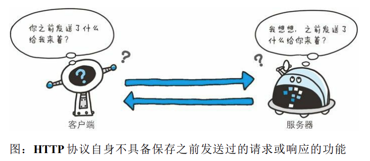
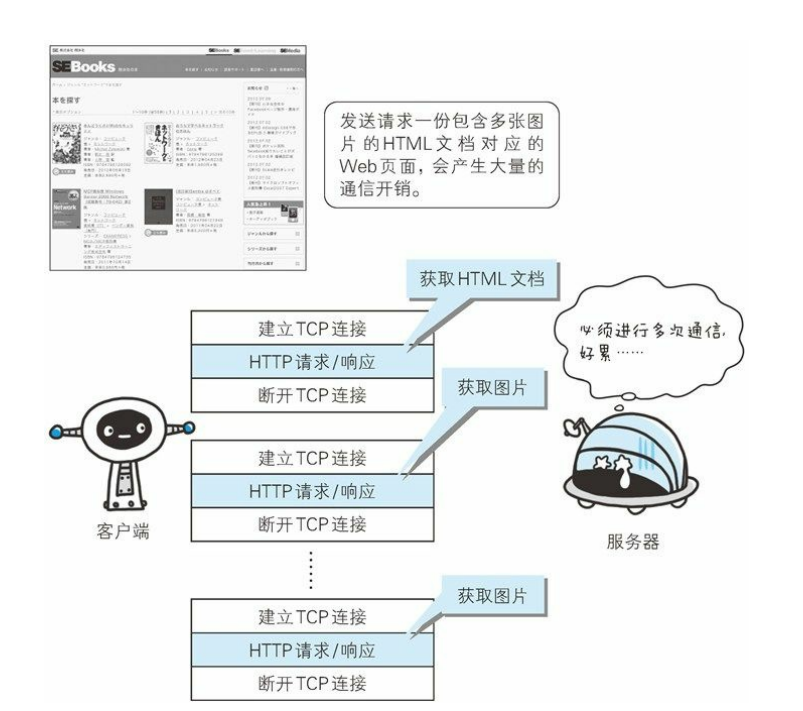
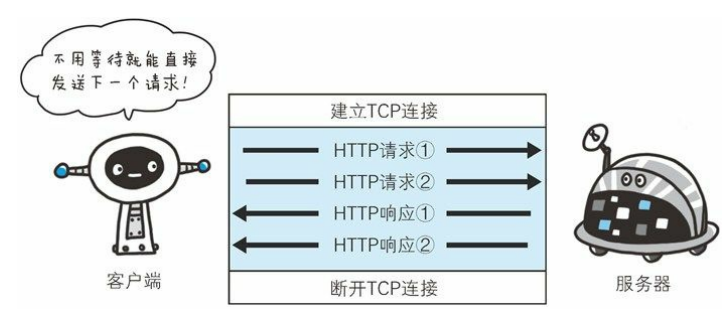

## 一、HTTP协议

### 什么是 HTTP 协议

HTTP（HyperText Transfer Protocol，超文本传输协议）是一种用于在Web浏览器和服务器之间传输数据的协议，定义了浏览器（即万维网客户进程）怎样向万维网服务器请求万维网文档，以及服务器怎样把文档传送给浏览器。


### HTTP 协议历史版本

HTTP协议：无状态， 明文传输， 不安全

HTTP/1.1 协议 ： 将短连接替换成长连接； 管线化，解决请求的对头阻塞。

HTTP/2： 加入了 SSL/TLS 安全协议， 服务器主动推送资源。

HTTP/3


具体细节查看 [3.1 HTTP 常见面试题 | 小林coding (xiaolincoding.com)](https://xiaolincoding.com/network/2_http/http_interview.html#http-2-做了什么优化)


### HTTP 协议优缺点

优点：

- **简单灵活易扩展**
- **应用广泛、环境成熟**

因为 HTTP 协议本身不属于一种语言，它并不限定某种编程语言或者操作系统，所以天然具有**跨语言、跨平台**的优越性。而且，因为本身的简单特性很容易实现，所以几乎所有的编程语言都有 HTTP 调用库和外围的开发测试工具。

- **无状态**


**缺点：**

- **无状态**
- **明文**
- **性能**


## 二、HTTP 协议特点

### 2.1 无状态协议

HTTP 是一种不保存状态，即<font color="red">**无状态（stateless）协议**</font>。HTTP 协议自身不对请求和响应之间的通信状态进行保存。也就是说在 HTTP 这个级别，**协议对于发送过的请求或响应都不做持久化处理**。

也就是说，同一个客户第二次访问同一个服务器上的页面时，服务器的响应与第一次被访问时的相同（假定现在服务器还没有把该页面更新)，因为服务器并不记得曾经访问过的这个客户，也不记得为该客户曾经服务过多少次。**HTTP的无状态特性简化了服务器的设计，使服务器更容易支持大量并发的HTTP请求**。



但是，可是，随着 Web 的不断发展，因无状态而导致业务处理变得棘手的情况增多了。比如，用户登录到一家购物网站，即使他跳转到该站的其他页面后，也需要能继续保持登录状态。针对这个实例，**网站为了能够掌握是谁送出的请求，需要保存用户的状态**。

<font color="red">HTTP/1.1 虽然是无状态协议，但为了实现期望的保持状态功能，于是引入了 Cookie 技术。</font>有了 Cookie 再用 HTTP协议通信，就可以管理状态了。


### 2.2 持续连接节省通信量

**（1）持续连接**

**HTTP 协议的初始版本中，每进行一次 HTTP 通信就要断开一次 TCP 连接**。以当年的通信情况来说，因为都是些容量很小的文本传输，所以即使 这样也没有多大问题。可随着 HTTP 的普及，文档中包含大量图片的 情况多了起来。当万维网服务器要同时服务于大量客户的请求时，这种<font color="blue">**非持续连接**</font>会使万维网服务器的负担很重。



为解决上述 TCP 连接的问题，HTTP/1.1 和一部分的 HTTP/1.0 想出了 <font color="blue">**持续连接**</font>（HTTP Persistent Connections，也称为 HTTP keep-alive 或 HTTP connection reuse）的方法。持续连接的特点是，只要任意一端 没有明确提出断开连接，则保持 TCP 连接状态。持续连接的好处在于**减少了 TCP 连接的重复建立和断开所造成的额外开销**，减轻了服务器端的负载。另外，减少开销的那部分时间，使 HTTP 请求和响应能够更早地结束，这样 Web 页面的显示速度也就相 应提高了。

> 在 HTTP/1.1 中，所有的连接默认都是持久连接，但在 HTTP/1.0 内并 未标准化。


HTTP/1.1协议的持续连接有两种工作方式：

- **非流水线方式**(without pipelining)。非流水线方式的特点是客户在收到前一个响应后才能发出下一个请求。因此，在 TCP连接已建立后，客户每访问一次对象都要用去一个往返时间RTT。这比非持续连接要用去两倍RTT的开销，节省了建立TCP连接所需的一个 RTT时间。但非流水线方式还是有缺点的，因为服务器在发送完一个对象后，其TCP连接就处于空闲状态，浪费了服务器资源。
- **流水线方式**(with pipelining)。流水线方式的特点，是客户在收到 HTTP 的响应报文之前就能够接着发送新的请求报文。于是一个接一个的请求报文到达服务器后，服务器就可连续发回响应报文。因此，使用流水线方式时，客户访问所有的对象只需花费一个RTT时间。流水线工作方式使TCP连接中的空闲时间减少，提高了下载文档效率。

> 如果对于节省RTT时间这部分不太懂的话，可以看一下 计算机网络（第7版）- 谢希仁 该书的 6.4.3节


**（2） 管线化**

持久连接使得多数请求以管线化（pipelining）方式发送成为可能。从 前发送请求后需等待并收到响应，才能发送下一个请求。管线化技术 出现后，**不用等待响应亦可直接发送下一个请求**。

> 管线化（pipelining）方式 其实也就是  流水线方式

这样就能够**做到同时并行发送多个请求**，而不需要一个接一个地等待响应了。



### 2.3 灵活性

HTTP 允许传输任意类型的数据对象。正在传输的类型由 Content-Type 加以标记。

```
content-length: 2
Content-Type: text/plain; charset=utf-8
```


## 三、HTTP 协议缓存

HTTP缓存可以减少网络请求，常用的缓存控制头部字段有 Cache-Control、Expires、ETag等。


**缓存类型**

- 强制缓存指的是只要浏览器判断缓存没有过期，则直接使用浏览器的本地缓存
- 协商缓存：当本地缓存中的资源过期后，**客户端与服务端协商，通过协商结果来判断是否使用本地缓存**


[HTTP 缓存 - HTTP | MDN (mozilla.org)](https://developer.mozilla.org/zh-CN/docs/Web/HTTP/Caching) 和 [3.1 HTTP 常见面试题 | 小林coding (xiaolincoding.com)](https://xiaolincoding.com/network/2_http/http_interview.html#http-缓存技术)


## 参考资料

[内容协商 - HTTP | MDN (mozilla.org)](https://developer.mozilla.org/zh-CN/docs/Web/HTTP/Content_negotiation)