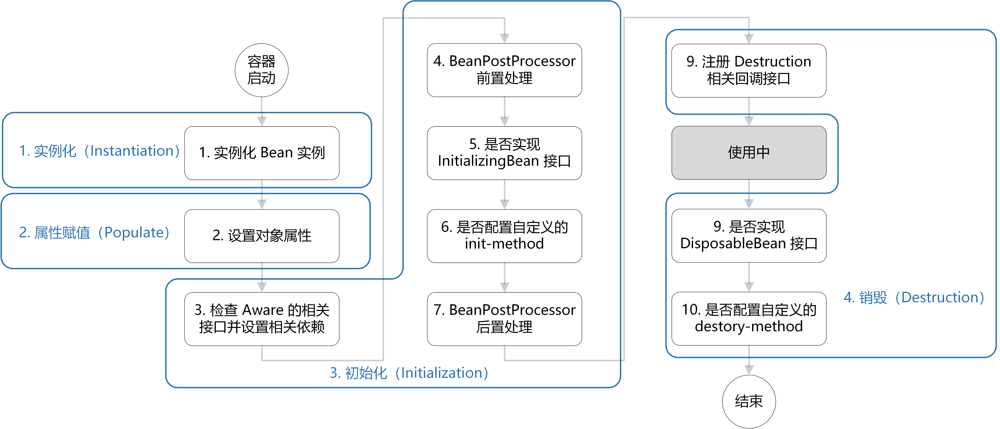

### Bean 的配置元数据

| Property                 | Explained in…                                                |
| :----------------------- | :----------------------------------------------------------- |
| Class                    | [Instantiating Beans](https://docs.spring.io/spring-framework/reference/core/beans/definition.html#beans-factory-class) |
| Name                     | [Naming Beans](https://docs.spring.io/spring-framework/reference/core/beans/definition.html#beans-beanname) |
| Scope                    | [Bean Scopes](https://docs.spring.io/spring-framework/reference/core/beans/factory-scopes.html) |
| Constructor arguments    | [Dependency Injection](https://docs.spring.io/spring-framework/reference/core/beans/dependencies/factory-collaborators.html) |
| Properties               | [Dependency Injection](https://docs.spring.io/spring-framework/reference/core/beans/dependencies/factory-collaborators.html) |
| Autowiring mode          | [Autowiring Collaborators](https://docs.spring.io/spring-framework/reference/core/beans/dependencies/factory-autowire.html) |
| Lazy initialization mode | [Lazy-initialized Beans](https://docs.spring.io/spring-framework/reference/core/beans/dependencies/factory-lazy-init.html) |
| Initialization method    | [Initialization Callbacks](https://docs.spring.io/spring-framework/reference/core/beans/factory-nature.html#beans-factory-lifecycle-initializingbean) |
| Destruction method       | [Destruction Callbacks](https://docs.spring.io/spring-framework/reference/core/beans/factory-nature.html#beans-factory-lifecycle-disposablebean) |

[Bean Overview :: Spring Framework](https://docs.spring.io/spring-framework/reference/core/beans/definition.html)

### Bean 的作用域

Bean 的作用域定义了 Bean 的生命周期和可见性。

| Scope                                                        | Description                                                  |
| :----------------------------------------------------------- | :----------------------------------------------------------- |
| [singleton](https://docs.spring.io/spring-framework/reference/core/beans/factory-scopes.html#beans-factory-scopes-singleton) | (**Default**) Scopes a single bean definition to a single object instance for each Spring IoC container. |
| [prototype](https://docs.spring.io/spring-framework/reference/core/beans/factory-scopes.html#beans-factory-scopes-prototype) | Scopes a single bean definition to any number of object instances. |
| [request](https://docs.spring.io/spring-framework/reference/core/beans/factory-scopes.html#beans-factory-scopes-request) | Scopes a single bean definition to the lifecycle of a single HTTP request. That is, each HTTP request has its own instance of a bean created off the back of a single bean definition. Only valid in the context of a web-aware Spring `ApplicationContext`. |
| [session](https://docs.spring.io/spring-framework/reference/core/beans/factory-scopes.html#beans-factory-scopes-session) | Scopes a single bean definition to the lifecycle of an HTTP `Session`. Only valid in the context of a web-aware Spring `ApplicationContext`. |
| [application](https://docs.spring.io/spring-framework/reference/core/beans/factory-scopes.html#beans-factory-scopes-application) | Scopes a single bean definition to the lifecycle of a `ServletContext`. Only valid in the context of a web-aware Spring `ApplicationContext`. |
| [websocket](https://docs.spring.io/spring-framework/reference/web/websocket/stomp/scope.html) | Scopes a single bean definition to the lifecycle of a `WebSocket`. Only valid in the context of a web-aware Spring `ApplicationContext`. |

作用域可以用 `@scope` 来设置。

无状态的 Bean 的使用 `singleton`,  而有状态的 Bean 使用 `prototype`。注意：有状态单例 Bean 存在线程安全问题。

Spring 中的 Bean 默认都是单例的。

具体细节查看 [Bean Scopes :: Spring Framework](https://docs.spring.io/spring-framework/reference/core/beans/factory-scopes.html#beans-factory-scopes-prototype)

### Bean 的生命周期

Bean 的生命周期概括起来就是 **4 个阶段**：

1. 实例化（Instantiation）：实例化一个 Bean 对象
2. 属性赋值（Populate）：为 Bean 设置相关属性和依赖
3. 初始化（Initialization）： 第 5、6 步为初始化操作，第 3、4 步为在初始化前执行，第 7 步在初始化后执行，该阶段结束，才能被用户使用；
4. 销毁（Destruction）：第8步不是真正意义上的销毁），而是先在使用前注册了销毁的相关调用接口，为了后面第9、10步真正销毁 bean 时再执行相应的方法。

[如何记忆Spring Bean的生命周期 - 草捏子 (chaycao.github.io)](https://chaycao.github.io/2020/02/15/如何记忆Spring-Bean的生命周期.html)

[Customizing the Nature of a Bean :: Spring Framework](https://docs.spring.io/spring-framework/reference/core/beans/factory-nature.html#beans-factory-aware)

为什么了解生命周期？可以使用 `@PostConstruct` 注解指定初始化方法，使用 `@PreDestroy` 注解指定销毁方法。

注意： Spring 只管理单例模式 Bean 的完整生命周期。 对于 prototype 的 Bean，Spring 在创建好交给使用者之后，则不会再管理后续的生命周期

### Bean 的自动装配

[Autowiring Collaborators :: Spring Framework](https://docs.spring.io/spring-framework/reference/core/beans/dependencies/factory-autowire.html)

### Bean 的线程安全问题

无状态单例 Bean 安全。有状态单例 Bean 不安全，存在资源竞争问题。

> 有状态 Bean 是指包含可变的成员变量的对象

对于有状态单例 Bean 的线程安全问题，常见的有两种解决办法：

1. 在 Bean 中尽量避免定义可变的成员变量。
2. 在类中定义一个 `ThreadLocal` 成员变量，将需要的可变成员变量保存在 `ThreadLocal` 中（推荐的一种方式）。

具体细节查看 [Spring常见面试题总结 | JavaGuide](https://javaguide.cn/system-design/framework/spring/spring-knowledge-and-questions-summary.html#bean-是线程安全的吗)

### Bean 的延迟加载

默认情况下，Application ationContext实现急切地创建和配置所有单例bean，作为初始化过程的一部分。通常，这种预实例化是可取的，因为配置或周围环境中的错误会立即被发现，而不是数小时甚至几天后。当这种行为不可取时，您可以通过将bean定义标记为延迟初始化来阻止单例bean的预实例化。延迟初始化的bean告诉IoC容器在第一次请求时创建bean实例，而不是在启动时。

[Lazy-initialized Beans :: Spring Framework](https://docs.spring.io/spring-framework/reference/core/beans/dependencies/factory-lazy-init.html)

### Bean 的实例化和依赖注入

bean 的实例化： [Bean Overview :: Spring Framework](https://docs.spring.io/spring-framework/reference/core/beans/definition.html#beans-factory-class)， 这一部分内容可以理解成 Bean 的声明

bean 的依赖注入： [Dependency Injection :: Spring Framework](https://docs.spring.io/spring-framework/reference/core/beans/dependencies/factory-collaborators.html#beans-setter-injection)