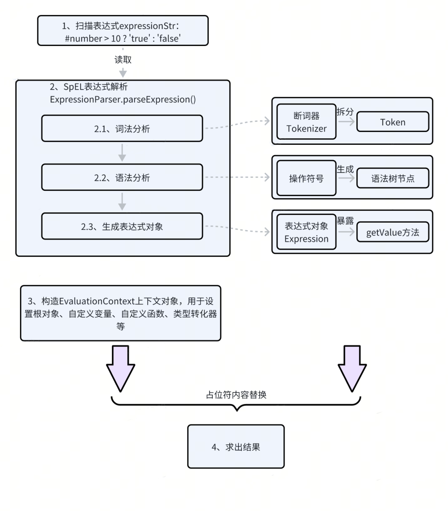

### 什么是 SpEL 表达式

SpEL 可以在运行时评估表达式并生成值。


### 应用场景

- 动态参数配置：可以通过 SpEL 将应用程序中的各种参数配置化，例如配置文件中的数据库连接信息、业务规则等。通过动态配置，可以在运行时根据不同的环境或需求来进行灵活的参数设置。
- 运行时注入：使用SpEL，可以在运行时动态注入属性值，而不需要在编码时硬编码。这对于需要根据当前上下文动态调整属性值的场景非常有用。
- 条件判断与业务逻辑：SpEL支持复杂的条件判断和逻辑计算，可以方便地在运行时根据条件来执行特定的代码逻辑。例如，在权限控制中，可以使用SpEL进行资源和角色的动态授权判断。

- 表达式模板化：SpEL支持在表达式中使用模板语法，允许将一些常用的表达式作为模板，然后在运行时通过填充不同的值来生成最终的表达式。这使得表达式的复用和动态生成更加方便。


### SpEL 表达式语法

**表达式格式**：SpEL 表达式通常以 `#` 开头的引用或以 `${}` 的形式表示。

**引用变量**：使用 `#` 引用上下文中的变量或者 Bean ，例如 `#myVar`。

支持常见的逻辑运算


`T()` 是一个特殊的语法，用于引用类类型。它允许你访问类的静态方法或属性。

```
#{T(java.lang.Math).random()}  // 调用 Java Math 类的 random 方法
```


`StandardEvaluationContext` 允许在表达式中定义和使用变量。你可以将变量添加到上下文中，然后在 SpEL 表达式中引用这些变量。


### SpEL 表达式实战

[SpEL应用实战 (dewu.com)](https://tech.dewu.com/article?id=99)


### 处理过程分析

- 表达式解析：首先，SpEL 对表达式进行解析，将其转换为内部表示形式即抽象语法树（AST）或者其他形式的中间表示。
- 上下文设置：在表达式求值之前，需要设置上下文信息。上下文可以是一个对象，它包含了表达式中要引用的变量和方法。通过将上下文对象传递给表达式求值引擎，表达式可以访问并操作上下文中的数据。
- 表达式求值：一旦表达式被解析和上下文设置完成，SpEL 开始求值表达式。求值过程遵循 AST 的结构，从根节点开始，逐级向下遍历并对每个节点进行求值。求值过程可能涉及递归操作，直到所有节点都被求值。
- 结果返回：表达式求值的结果作为最终结果返回给调用者。返回结果可以是任何类型，包括基本类型、对象、集合等。



```
/**

 * 验证数字是否大于10
 *
 * @param number 数字
 * @return 结果
 */
public String spELSample(int number) {
    // 创建ExpressionParser对象，用于解析SpEL表达式
    ExpressionParser parser = new SpelExpressionParser();
    String expressionStr = "#number > 10 ? 'true' : 'false'";
    Expression expression = parser.parseExpression(expressionStr);

    // 创建EvaluationContext对象，用于设置参数值
    StandardEvaluationContext context = new StandardEvaluationContext();
    context.setVariable("number", number);

    // 求解表达式，获取结果
    return expression.getValue(context, String.class);
}
```


[SpEL应用实战 (dewu.com)](https://tech.dewu.com/article?id=99)