# CSS布局与定位

**页面布局：**

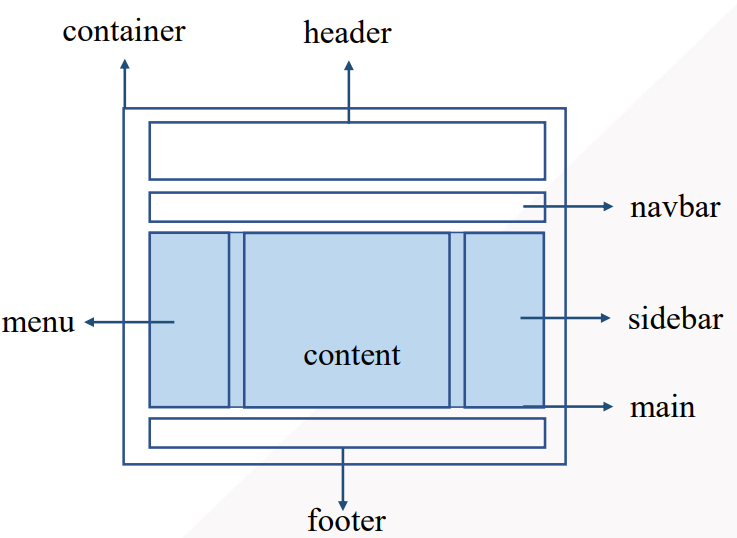


**盒子模型**（元素什么样）：页面元素的大小、边框、与其他元素的距离

**定位机制**（元素放在哪）：文档流、浮动定位、层定位


## 盒子模型

 页面中的所有元素都可以看成一个盒子，占据着一定的页面空间。

在页面上 ， 区域、图片、导航、列表、段落，都可以是盒子


### **盒子模型组成**

盒子中，主要包含content内容、height高度、width宽度、border边框、padding内边距、margin外边距。这些都是是CSS样式的属性


一个盒子的**实际宽度、高度**:content+padding+border+margin。


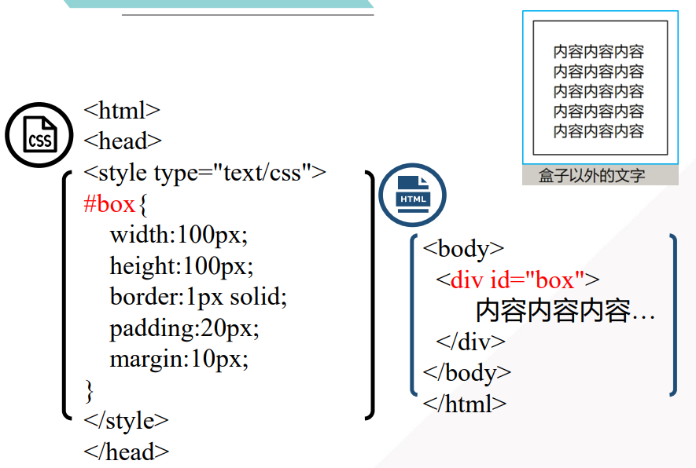


### **overflow属性**

当内容溢出盒子框时，overflow属性取值。


### **border属性**

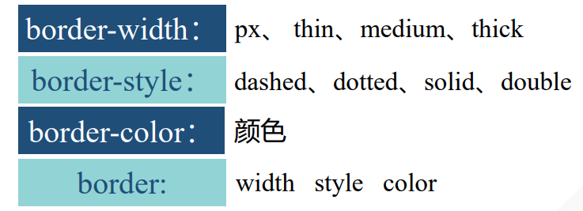


### **边框可以用来设置水平分割线**（特殊技巧）


### padding属性和margin属性

**对浏览器默认的设置清零**

```html
*{
   margin：0；
   padding：0；html
}
```


### **水平居中**

- 图片、文字水平居中： `text-align:center`
- div水平居中：  `margin:0 auto;`  或者 `margin:1 auto;`都可以，主要是通过`auto`来实现水平居中的，第一个数值0或1（即上下外边距）都无所谓，可以用控制垂直方向的居中


### **垂直外边距合并**

margin的合并：垂直方向合并，水平方向不合并

在合并时，外边距取较大的值

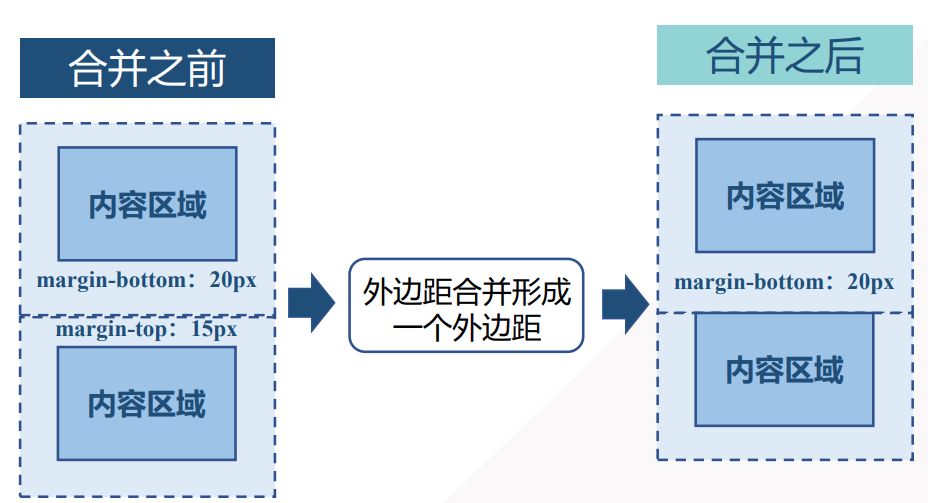


### **取值**

- `margin: 1px;`      等同于  ` margin:1px 1px 1px 1px;`
- `margin: 1px 2px;`      等同于  ` margin:1px 2px 1px 2px;`
- `margin: 1px 2px 3px;`      等同于  ` margin:1px 2px 3px 2px;`
- `margin: :1px 2px 1px 3px;`    注意，这里虽然上下边距都为1px， 但是这里不能缩写。

> margin属性和padding属性取值方向为：top  right   bottom  left（即上右下左， 顺时针方向）


## **CSS布局—定位机制**


文档流flow（默认文档流定位）

有的元素会单独占一行，有的元素会和其他元素共占一行


浮动float

层layer

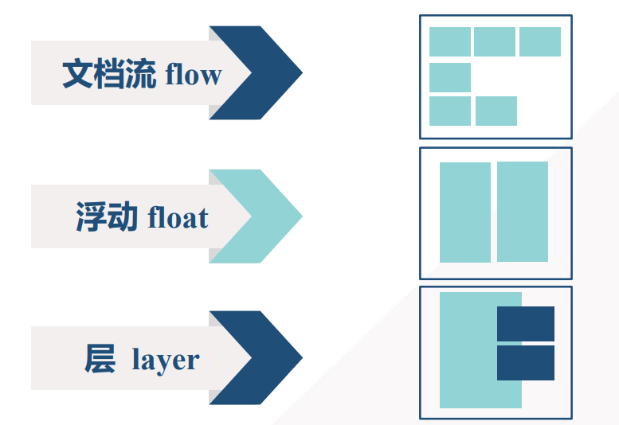


### 文档流定位

除非专门指定，否则所有框都在普通流中定位。普通流中元素框的位置由元素在(X)HTML中的位置决定。

**块级元素**从上到下依次排列，框之间的垂直距离由框的垂直[margin](https://so.csdn.net/so/search?q=margin&spm=1001.2101.3001.7020)计算得到。

**行内元素**在一行中水平排列。

**注意：**

> 行内元素，在水平方向上修改水平尺寸(padding，margin，border)，能产生相应的效果，但修改垂直方向上的元素是无效的。
>
> **行内元素的 width 和 height 属性是无效的，行内元素的宽高是考内容撑起来的。**


具体元素情况如下：

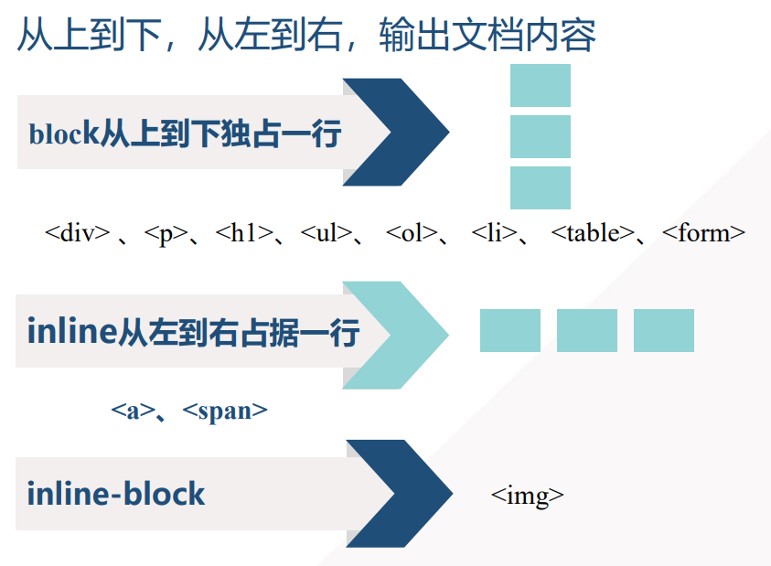


**display属性**

元素类型转换：

- `display: none`   :   元素不会被显示
- `display:block`   :   显示为block元素
- `display:inline`   :   显示为inline元素
- `display：inline-block`   :   显示为inline-block元素


**block元素(块级元素)**

**block元素特点**

- 独占一行
- 元素的height、width、margin、padding都可设置

**常见的block元素**

`<div> 、<p>、<h1>...<h6>、 <ol> 、<ul> 、<table> 、<form>`

**将元素显示为block元素**

```html
<!--将元素显示为block元素 -->
<!--inline元素a转换为block元素,从而使a元素具有块状元素特点。 -->
a{
	display:bolck;
}


```


**inline元素（行内元素）**

**inline元素特点**

- 不单独占用一行
- width、height不可设置
- width就是它包含的文字或图片的宽度，不可改变

**常见的inline元素**

`<span> 、<a>`

**显示为inline元素**

`display:inline;`

注意：inline**元素之间存在一个间距问题**


**inline-block元素**

**inline-block元素特点**

- 不单独占用一行
- 元素的height、width、margin、padding都可设置
- 就是同时具备inline元素、block元素的特点

**常见的inline-block元素**

``

**显示为inline-block元素**

`display:inline-block; `


### 浮动定位

使用情况：布局时候分若干列

float属性设置浮动，clear属性清除浮动


**float属性用处**

- 图文混排：让图片在文字的左边或者右边
- 网页布局


**float属性特点**


**clear属性**


### 层定位

概述：像图像软件中的图层一样可以对每个layer能够精确定位操作

使用情况：网页的元素可以层叠在另外的一个元素上面。

主要是通过**position属性**（**相对与谁定位**）、left属性、right属性、top属性、bottom属性、**z-index属性**来进行控制。

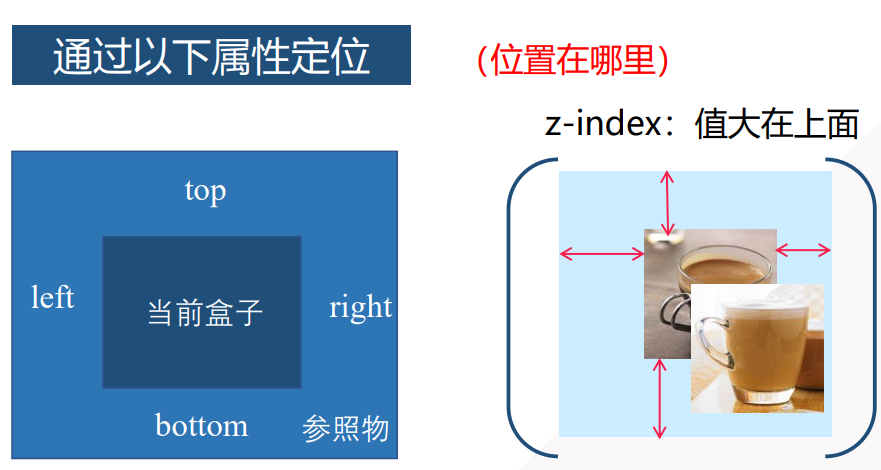


其中，position属性取值情况如下：

| 取值     | 含义     | 描述                                                         |
| -------- | -------- | ------------------------------------------------------------ |
| static   | 默认值   | 没有定位，元素出现在正常的流中<br> top, bottom, left, right ， z-index**无效** |
| fixed    | 固定定位 | 相对于**浏览器窗口**进行定位<br> top, bottom, left, right ， z-index **有效** |
| relative | 相对定位 | 相对于其**直接父元素**进行定位<br>top,bottom,left,right，z-index有效 |
| absolute | 绝对定位 | 相对于 **static 定位以外的第一个父元素** 进行定位<br> top, bottom, left, right ， z-index 有效 |


#### 固定定位position：fixed

不会随浏览器窗口的滚动条滚动而变化

总在视线里的元素,  实际情况如下：

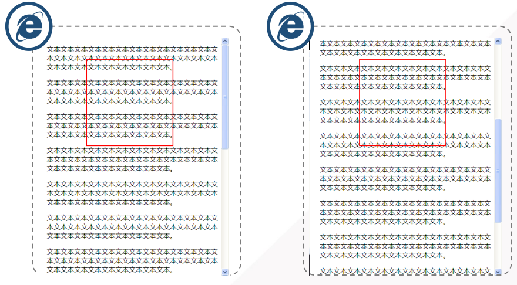

**实例：**

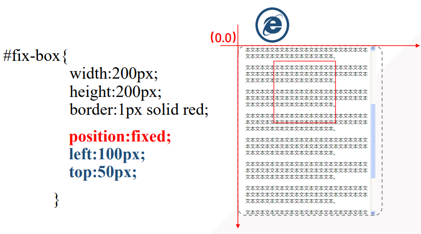


#### 相对定位position:relative

定位为relative的元素脱离正常的文档流中，但其在文档流中的**原位置依然存在**


**案例：**

```css
#box1{
  width:170px;
  height:190px;
  position:relative;
  top:20px;
  left:20px; 
}
```

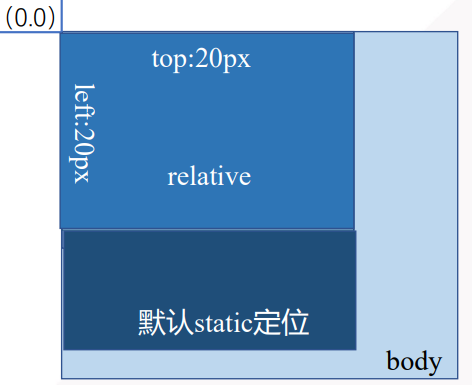

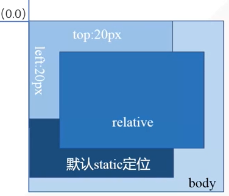


#### 绝对定位position:absolute

对于absolute定位的层总是相对于其 **最近的定义为absolute或relative的父层**，而这个父层并不 一定是其直接父层。

对于absolute定位的层,如果其父层中都未定义absolute或 relative，则其将相对**body**进行定位


定位为absolute的层脱离正常文本流，但与 relative的区别:其在正常流中的**原位置不再存在**


#### relative+absolute

通常，父元素定位方式：`position:relative;`    子元素定位方式：`position:absolute`    。      这样可以使子元素在父元素内移动，同时当父元素移动时子元素跟着移动

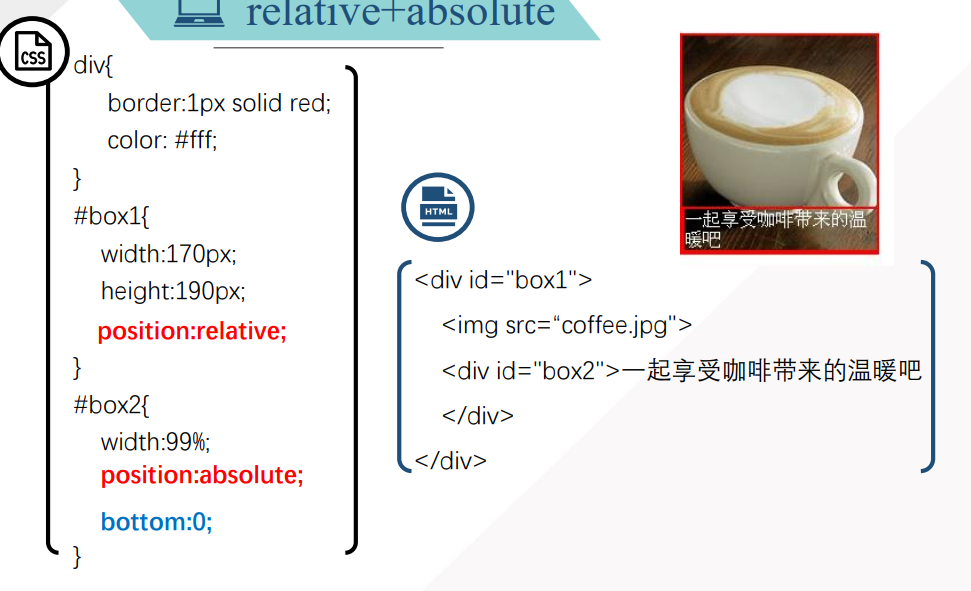


#### 相对定位 vs 绝对定位

|                | 相对定位   | 绝对定位         |
| -------------- | ---------- | ---------------- |
| position取值   | relative   | absolute         |
| 文档流中原位置 | 保留       | 不保留           |
| 定位参照物     | 直接父元素 | 非static的父元素 |


## 弹性盒子布局（Flexbox Layout）

元素可以拉抻以填充额外的空间，收缩以适应更小的空间

主要解决问题：

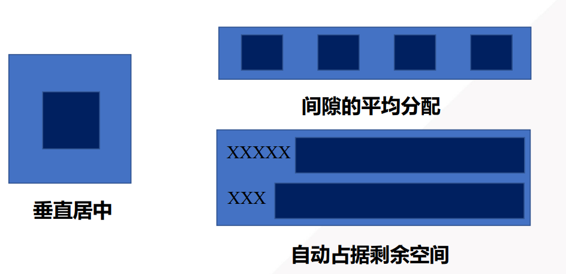


#### 弹性盒子

弹性盒子：一维布局（按行水平布局或者按列垂直布局）

弹性盒子主要包括弹性容器（Flex Container） 、 弹性元素（Flex Item）

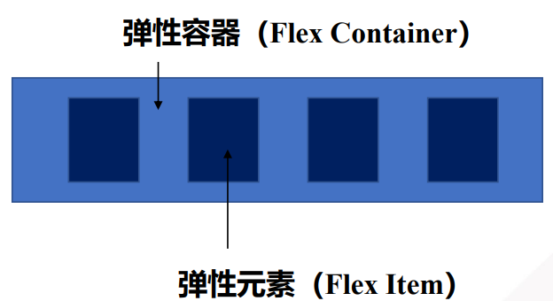


#### 弹性容器样式

| 属性            | 值                                                           | 描述                                                         |
| --------------- | ------------------------------------------------------------ | ------------------------------------------------------------ |
| display         | **flex**                                                     | 定义弹性容器                                                 |
| flex-direction  | row  <br />row-reverse<br> column <br />column -reverse      | row行布局（主轴从左到右）<br /> column表示列布局             |
| flex-wrap       | nowrap <br />wrap<br /> wrap-reverse                         | 当空间不够时，弹性元素是否会折行展示                         |
| flex-flow       | flex-flow: flex-direction flex-wrap                          | 设定元素的排布方式， 包括子属性flex-direction和flex-wrap     |
| justify-content | flex-start <br />center<br /> flex-end <br />space-between  （两端对齐）   space-around（手拉手对齐） | 元素在**主轴**上的对齐方式                                   |
| align-items     | flex-start <br />center<br /> flex-end <br />stretch（去掉元素高度） | 元素在**辅轴**上的对齐方式                                   |
| align-content   | flex-start <br />center<br /> flex-end <br />space-between  （两端对齐）   space-around（手拉手对齐） | 设置**多行元素**在容器中的整体对齐方式<br />只有一行或者一列，该属性不起作用 |


**flex-wrap 属性效果显示**

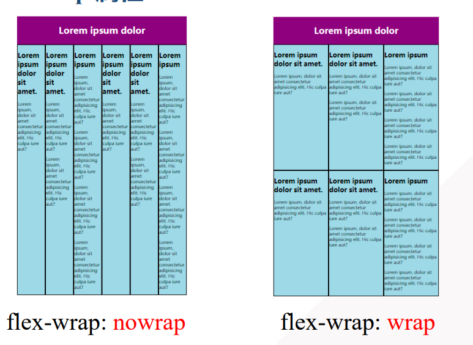


**justify-content属性效果显示**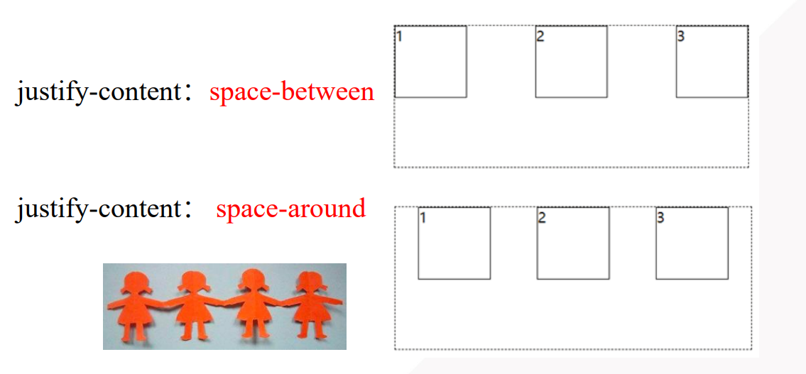


#### 弹性元素样式

| 属性        | 值                                                           | 描述                                                  |
| ----------- | ------------------------------------------------------------ | ----------------------------------------------------- |
| flex-grow   | （1）默认值为0: 元素不占用剩余空间 <br>（2）取值为n: 元素占据剩余空间若干份中的n 份 | 元素被拉大的比例，按比例分配容器剩余空间              |
| flex-shrink | 默认为1，表示弹性元素默认等比例压缩 0则表示不压缩            | 元素被压缩的比例                                      |
| flex-basis  |                                                              | 元素在主轴上的默认尺寸，其优先级高于width属性。       |
| flex        | flex: flex-grow flex-shrink flex-basis;                      | 包含子属性flex-grow、 flex-shrink 、flex-basis        |
| order       |                                                              | 子元素在弹性容器中的排列顺序，数值越小排名越靠前      |
| align-self  | align-self: auto \| flex-start \| flex-end \| center \| baseline \| stretch | 单个弹性元素在辅轴上的对齐方式，align-items是全部元素 |


  **flex-grow属性效果显示**

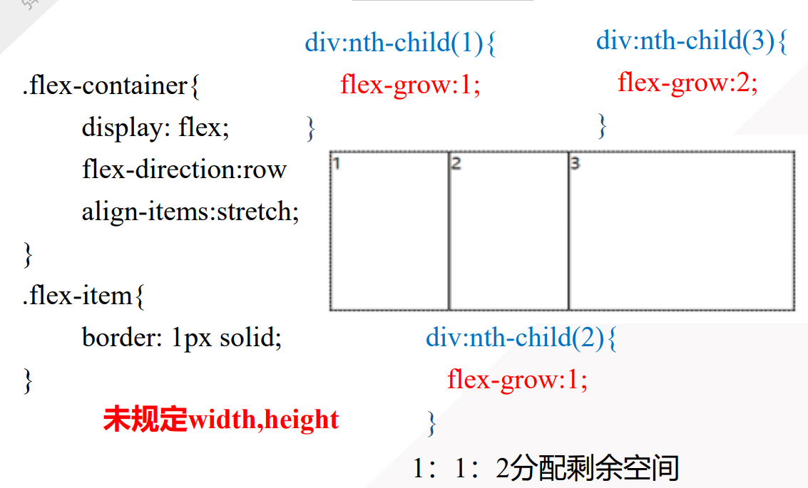


## 网格布局（Grid Layout）

网格布局主要是用于二维布局

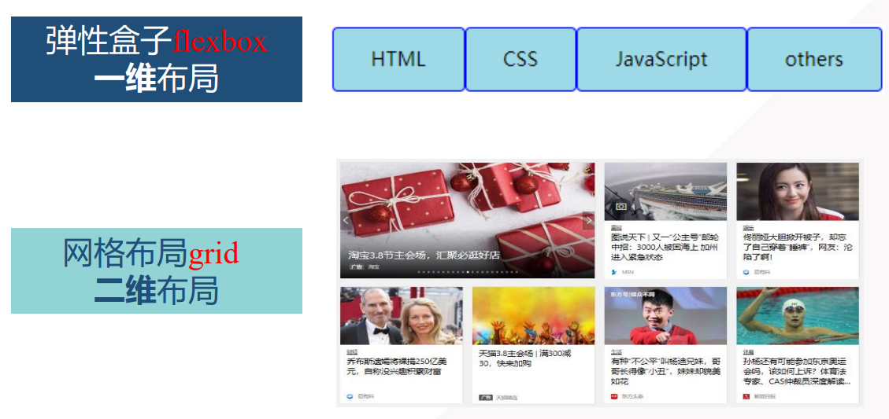


网格主要由网格容器和网格元素组成

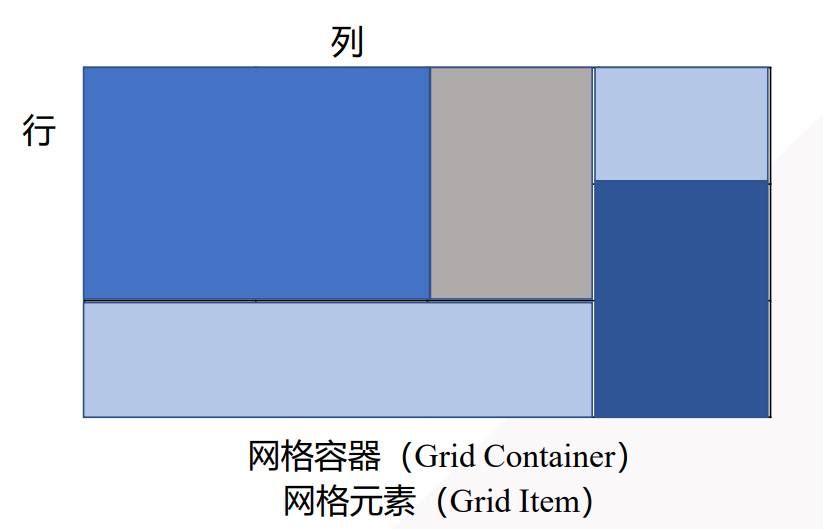


#### 网格容器样式

| 属性                  | 值                                                   | 描述                                         |
| --------------------- | ---------------------------------------------------- | -------------------------------------------- |
| display               | grid                                                 | 定义网格容器                                 |
| grid-template-columns |                                                      | 划分网格的列                                 |
| grid-template-rows    |                                                      | 划分网格的行                                 |
| grid-template-areas   |                                                      | 命名单元格，相同名称的单元格被划分为一个区域 |
| grid-row-gap          |                                                      | 行间距                                       |
| grid-column-gap       |                                                      | 列间距                                       |
| justify-items         |                                                      | 单元格内容的**水平**位置                     |
| align-items           |                                                      | 单元格内容的**垂直**位置                     |
| place-items           | place-items: align-items属性 justify-items属性;      | 包括子属性align-items和justify-items         |
| justify-content       |                                                      | 整个内容区域在容器里面的**水平**位置         |
| align-content         |                                                      | 整个内容区域的**垂直**位置                   |
| place-content         | place-content :justify-content属性 align-content属性 | 包括子属性:justify-content和 align-content   |


 **grid-template-columns和grid-template-rows属性**

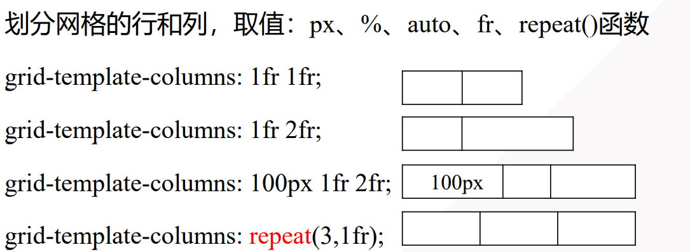

注意：fr 单位是一个自适应单位，fr单位被用于在一系列长度值中分配剩余空间，如果多个已指定了多个部分，则剩下的空间根据各自的数字**按比例分配**。


**grid-template-areas属性**

命名单元格，相同名称的单元格被划分为一个区域

```css
.grid-container{
  display: grid; 
  grid-template-rows:30px 1fr 1fr;
  grid-template-columns:1fr 1fr 1fr;
    /*最上面一行3个单元格为sidebar，第2、3行的第一个单元格集合起来为sidebar，剩下的单元格都为content   */
  grid-template-areas:
  "navbar navbar navbar"
  "sidebar content content"
  "sidebar content content ";
  width: 300px;
  height: 300px;
  border:1px dashed;
}
.grid-item{
  border: 1px solid;
}
.grid-item:nth-child(1){ 
  grid-area : navbar;
}
.grid-item:nth-child(2){
  grid-area : sidebar;
}
.grid-item:nth-child(3){
  grid-area : content;
}
```


```html
<div class="grid-container">
  <div class="grid-item">1</div>
  <div class="grid-item">2</div>
  <div class="grid-item">3</div>
</div>
```

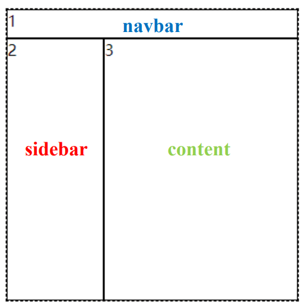


**justify-items、align-items、place-items 属性**

- justify-items:单元格内容的水平位置

​               justify-items : start | end | center | 默认stretch;

- align-items:单元格内容的垂直位置

  ​         align-items : start | end | center | 默认stretch;

- place-items: align-items属性 justify-items属性;

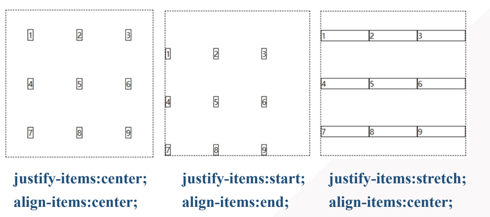


**justify-content、align-content、place-content 属性**

（1）justify-content:整个内容区域在容器里面的水平位置 

​            justify-content: start | end | center | stretch |  space-around | 				space-between | space-evenly; 

（2）align-content:整个内容区域的垂直位置 

​				align-content: start | end | center | stretch |  space-around 					| space-between | space-evenly; 

 （3）place-content :justify-content属性 align-content属性

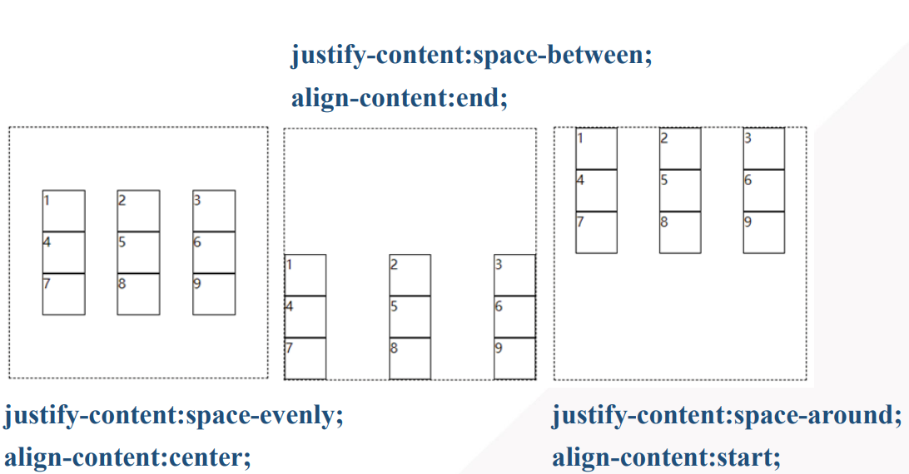


#### 网格元素样式

**1、grid-column-* 、grid-row-*、grid-area属性**

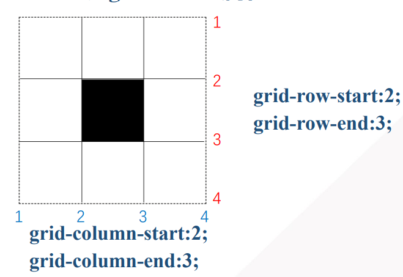

对于该元素，主要有3种表示方式：

```css
.grid-item{
   grid-row-start:2; 
   grid-row-end:3;
   grid-column-start:2;
   grid-column-end:3;
}
```

```css
.grid-item{
  grid-row:2/3;
  grid-column:2/3;
}
```

```css
.grid-item{
   grid-area:2/2/3/3;
}
```


**2、justify-self、align-self、place-self 属性**

单个网格元素的对齐方式 

（1）justify-self属性：单元格内容的水平位置，用法同 justify-items属性。

​			 justify-self: start | end | center | stretch; 

（2）align-self属性:单元格内容的垂直位置，用法同align-items属性。 			align-self: start | end | center | stretch; 

**place-self: align-self属性 justify-self属性;**