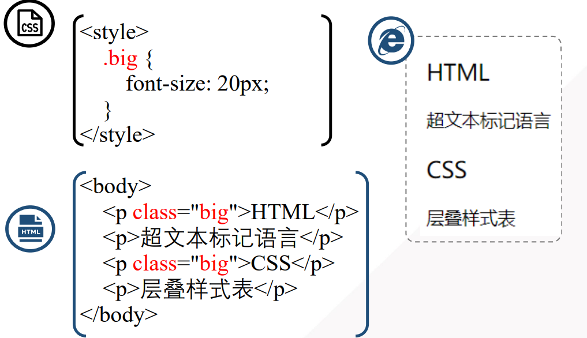
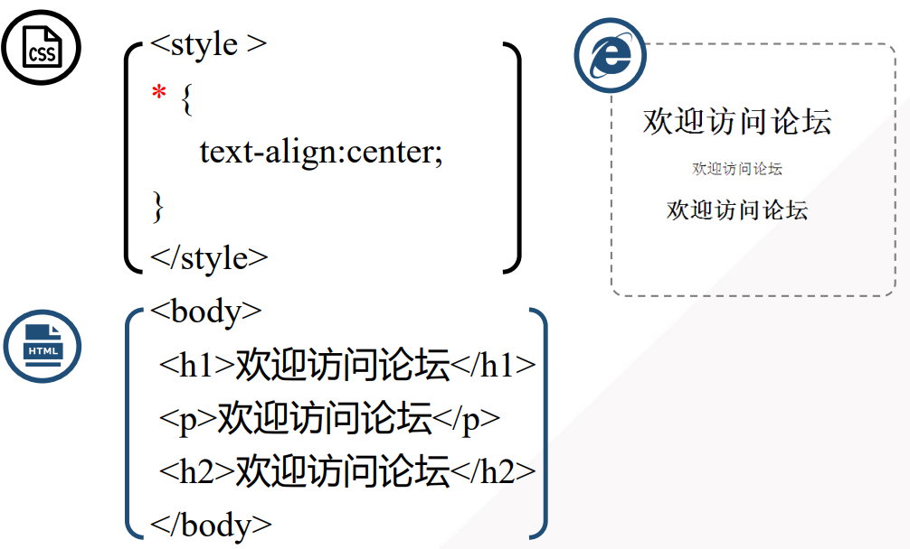
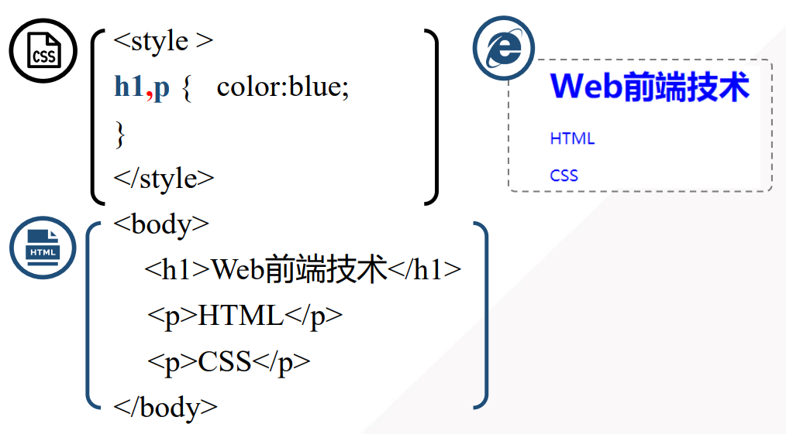
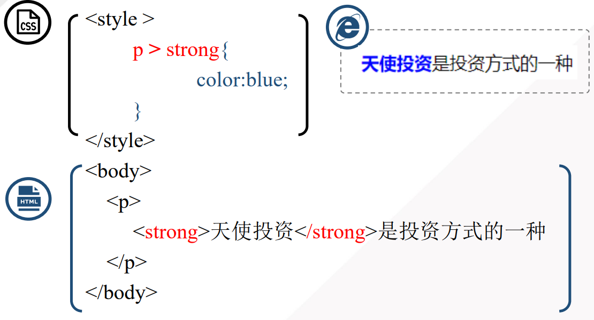
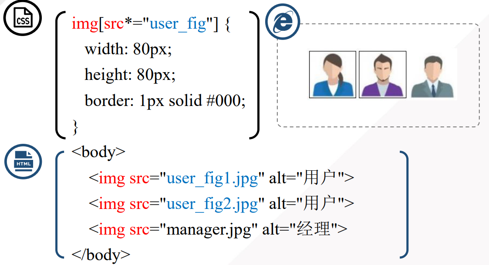
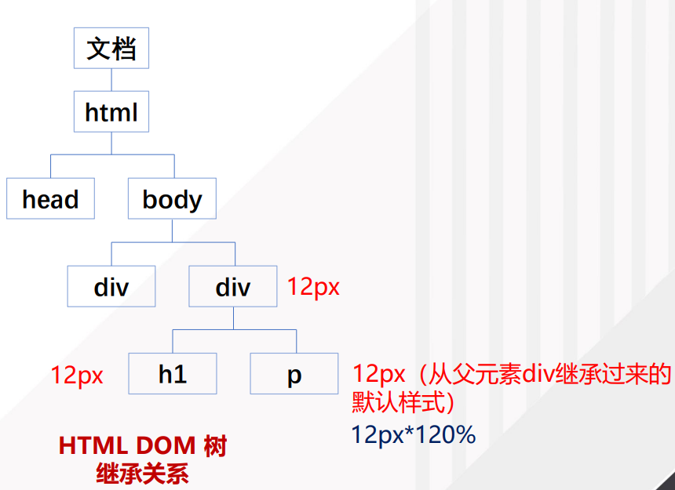
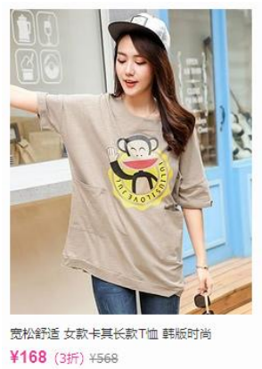
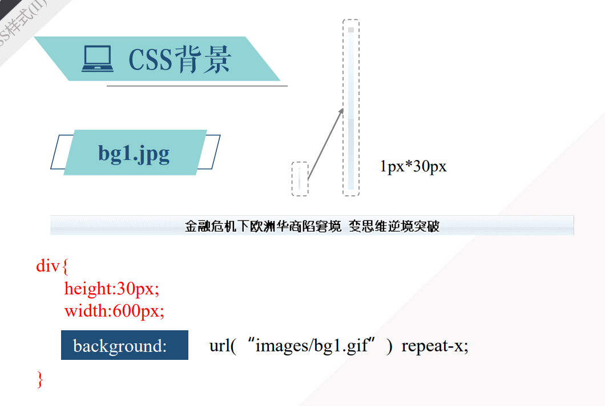
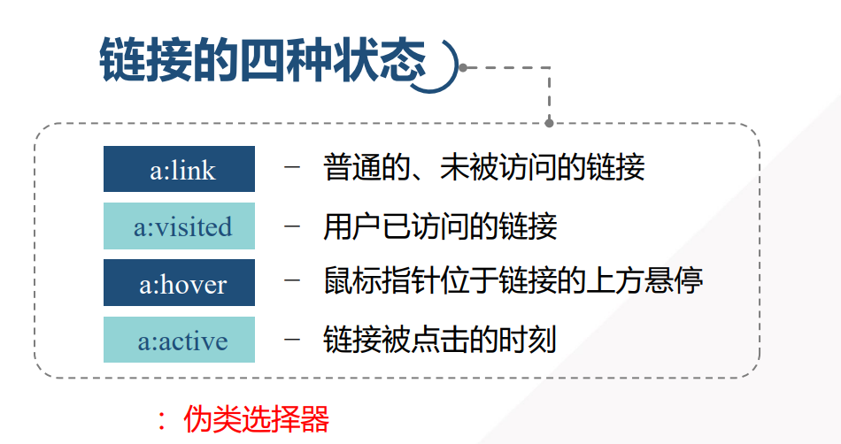
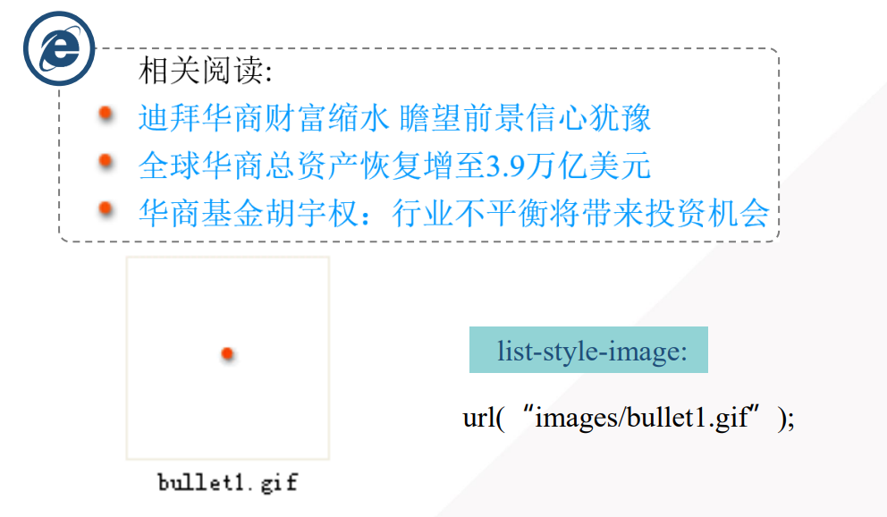

# CSS样式

## CSS概述

层叠样式表CSS （Cascading Style Sheets）主要作用是：**内容和样式相分离，便于修改样式**

CSS 规则由两个主要的部分构成：选择器，以及一条或多条声明。**选择器**通常是前端程序员需要改变样式的 HTML 元素。每条声明由一个属性和一个值组成。属性（property）是您希望设置的样式属性（style attribute）。每个属性有一个值。属性和值被冒号分开。

**基本语法**如下：


在基本语法里，需要注意的是：

- 最后一条声明可以没有分号，但是为了以后修改 方便，一般也加上分号。
- 为了使用样式更加容易阅读，可以将每条代码写 在一个新行内


## CSS添加方法

### 行内样式


```html
<html>
	<head>
		<title>内联定义</title>
	</head>
	<body>
		<p style="color:red">内联定义</p>
		<p style="font-size:12px">内联定义</p>
	</body>
</html>


```


### 内嵌样式

在html文件里添加`<style type="text/css"></style>`

注意：需要将样式放入`<head></head>`中

```html
<html>
	<head>
		<style type="text/css">
			p
			{
				color:red;
			}
        </style>
	</head>
	<body>
		<p>链入内部css</p>
	</body>
</html>


```


```html
在css中,id前面是要加一个# ,    class前面要加一个.

<html>
	<head>
		<title>链入内部css</title>
		<style type="text/css">
			#myid
			{
				width:200px;
				height:300px;
				color:red;
			}
			.myclass
			{
				width:200px;
				height:300px;
				color:red;
			}
		</style>
	</head>
	<body>
		<p id="myid">链入内部css</p>
		<p class="myclass">链入内部css</p>
		
	</body>
</html>


```

**注意：**

- 即使有公共CSS代码，也是每个页面都要定义的
- 适合文件很少，CSS代码也不多的情况
- 如果一个网站有很多页面，每个文件都会变大，后期维护难度也大


### 单独文件（链接式link和导入式@report）

创建css样式表如style.css，再在HTML头部中的<head>标签里链接此style.css样式表。

主要通过`<link type="text/css" rel="stylesheet" href="style.css"/> `来实现的

```html
<html>
	<head>
		<title>链入外部css</title>
        <!-- style.css和html文件在同一个文件夹，这一行代码可以利用”link:CSS“扩展快速生成 -->
		<link type="text/css" rel="stylesheet" href="style.css"/>
	</head>
	<body>
		<p id="p1">链入外部css</p>
		<p id="p2">链入外部css</p>
		<p class="p3">链入外部css</p>
	</body>
</html>


```


```html
<!DOCTYPE html>
<html lang="en">
<head>
    <meta charset="UTF-8">
    <title>外联式css样式03</title>
    <!-- 引入外部的css样式表
        引入css样式表有两种方式:(面试)
        1.link标签引入  推荐使用
        2.@import引入
    -->
    <!-- 
        link标签引入,该标签写在head标签里(与文档配置有关,不需显示)
    -->
      <link rel="stylesheet" href="style.css">
    <!-- 
        @import引入,需要写在style标签里
    -->
    <style typle="text/css">
        @import url(style.css)
    </style>
    <!-- link与import的区别:
        1.link是html语法,import是css语法.
        2.link是在html文档加载时同时开始加载对应的css文件:@import是在html文档加载完成后才开始加载对应的css文件.
        3.link可以引入任何类型的文件,而import只能引入css文件.
        4.使用link方式引入的css样式我们在后期可以使用js的方式进行修改,但是import不可以.

        我们以后使用link

        当一个网站有多个文档时,建议使用外联式.

     -->
</head>
<body>
    <div>lalala</div>
</body>
</html>


```


**主要优点：**

- 页面结构HTML代码与样式CSS代码的完全分离
- 维护方便
- 如果需要改变网站风格，只需要修改公共CSS文件
- 可以在同一个 HTML 文档内部引用多个外部样式表


### 添加方式优先级

- 多重样式可以**层叠**，可以**覆盖**

- 样式的优先级按照“**就近原则**”：**行内样式> 内嵌样式> 链接样式**>浏览器默认样式


## CSS选择器

严格来讲，选择器的种类可以分为三种：标签名选择器、类选择器和ID选择器。而所谓的后代选择器和群组选择器只不过是对前三种选择器的扩展应用。而在标签内写入 style="" 的方式，应该是 CSS 的一种引入方式，而不是选择器，因为根本就没有用到选择器。而一般人们将上面这几种方式结合在一起，所以就有了5种或6种选择器了。

最基本的选择器是元素选择器(比如 div),ID 选择器(比如 #header)还有类选择器(比如.tweet)。一些的不常见的选择器包括伪类选择器 (:hover)，很多复杂的 CSS3 和正则选择器，比如：first-child，class ^= “grid-”。CSS选择器具有高效的继承性，引用 Steve Souders 的话， CSS 选择器效率从高到低的排序如下：

| 选择器       | 用法                  |
| ------------ | --------------------- |
| id选择器     | #myid                 |
| 类选择器     | .myclassname          |
| 标签选择器   | div,h1,p              |
| 相邻选择器   | h1+p                  |
| 子选择器     | ul > li               |
| 后代选择器   | li a                  |
| 通配符选择器 | *                     |
| 属性选择器   | a[rel="external"]     |
| 伪类选择器   | a:hover, li:nth-child |

纵使ID选择器很快、高效，但是它也仅仅如此。从 Steve Souders 的 CSS Test 我们可以看出ID选择器和类选择器在速度上的差异很小很小。

### 元素选择器（标签选择器）

标签选择器是指用HTML标记名称作为选择器，按标记名称分类，为页面中某一类标签指定统一的CSS样式。

基本语法格式：标签名{ 属性1：属性值1；属性2：属性值2；}

所有的HTML标记名都可以作为标签选择器，例如a、body、p、h1等等。用标签选择器定义的样式对页面中该类型的所有标签都有效。

标签选择器最大的优势是能快速为页面中同类型的标签统一样式，同时这也是它的缺点，不能设计差异化样式。


### 类选择器

基本语法格式：.类名{ 属性1：属性值1；属性2：属性值2；}

该语法中，**类名即为HTML元素的class属性值**，大多数HTML元素都可以定义class属性。

类选择器最大的优点是可以为元素对象定义单独或相同的样式，而且多个标记可以使用同一个类名，可以实现为**不同类型的标记指定相同的样式**。同时，**一个HTML元素也可以应用多个class类**，设置多个样式，此时多个类名之间需要用空格隔开。



### ID选择器

基本语法格式：#id名{ 属性1：属性值1；属性2：属性值2；}

该语法中，id名即为HTML元素的id属性值，大多数HTML元素都可以定义id属性，**元素的id值是唯一的**，只能对应于文档中某一个具体的元素。

注意：同一个id不允许应用于多个标记，虽然很多浏览器并不会报错，但JavaScript等脚本语言调用id时会出错。另外，id选择器不支持像类选择器那样定义多个值。


### 类选择器与元素选择器


### 多类选择器


### 通用选择器（通配符选择器）

通配符选择器常用 **‘\*’** 号表示，它是所有选择器里作用范围最广的，能**匹配页面中所有的元素**。

基本语法格式：*{ 属性1：属性值1；属性2：属性值2；}

使用该选择器定义样式，清除所有HTML标记的默认边距。但实际开发中**不建议使用通配符选择器**，因为它设置的样式对所有的HTML标记都生效，不管标记是否需要该样式，反而降低了代码的执行速度。




### 选择器分组




### 后代选择器

后代选择器也称包含选择器，用来选择特定元素的后代。如.asideNav li{ }，表示先匹配第二个选择器的元素，并属于第一个选择器内。

语法格式（标签名称1与标签名称2之间有一个空格）：
标签名称1 标签名称2{ 属性1：属性值1；属性2：属性值2；}


### 子元素选择器

子代选择器使用**‘>’**表示，如ul>li{ }，表示匹配第二个选择器，且为第一个选择器的元素的后代。

语法格式：
标签名称1>标签名称2{ 属性1：属性值1；属性2：属性值2；}

注意：
1、只会查找儿子，不会查找其他被嵌套的标签。
2、子元素选择器也可以用其他的id和class选择器来进行查找。
3、子元素选择器也可以通过>符号一直延续下去。




### 相邻兄弟选择器

相邻兄弟选择器使用+号表示，如p+a{ }，表示匹配紧跟第一个选择器并匹配第二个选择器的元素，如紧跟p元素后的a的元素。
如果需要选择紧接在另一个元素后的元素，而且二者有相同的父元素，可以使用相邻兄弟选择器。

语法格式：标签名称1+标签名称2 { 属性1：属性值1；属性2：属性值2；}

兄弟只会影响下面的p标签的样式，不影响上面兄弟的样式。
注意这里的’+’的意义跟’and’意义不一样，兄弟选择器的样式是应用在兄弟元素上，跟参照的元素样式无关，如上例只影响p元素的样式，而不影响h1标签的样式。


### 属性选择器

属性选择器可以**为拥有指定属性的 HTML 元素设置样式**，而不仅限于 class 和 id 属性。

语法格式：[标签名称] { 属性1：属性值1；属性2：属性值2；}

注意：只有在规定了 !DOCTYPE 时，IE7 和 IE8 才支持属性选择器。在 IE6 及更低的版本中，不支持属性选择。

CSS 选择器参考手册：

| **选择器**         | **描述**                                                   |
| ------------------ | ---------------------------------------------------------- |
| [attribute]        | 用于选取带有指定属性的元素                                 |
| [attribute=value]  | 用于选取带有指定属性和值的元素                             |
| [attribute~=value] | 用于选取属性值中包含指定词汇的元素                         |
| [attributeI=value] | 用于选取带有以指定值开头的属性值的元素，该值必须是整个单词 |
| [attribute^=value] | 匹配属性值以指定值开头的每个元素                           |
| [attribute$=value] | 匹配属性值以指定值结尾的每个元素                           |
| [attribute*=value] | 匹配属性值中包含指定值的每个元素                           |




### 混合

- 多个class选择器混用，用空格分开
- id和class混用
- id选择器不可以多个同时使用


## CSS样式


| 单   位 |                             描述                             |
| :-----: | :----------------------------------------------------------: |
|   px    |                    绝对长度单位<br />像素                    |
|   em    | 相对长度单位<br />1em —— 1个字符             2em —— 2个字符                  自动适应用户所使用的字体 |
|    %    |                            百分比                            |


|      颜色       | 描述                                                         |
| :-------------: | :----------------------------------------------------------- |
| red,blue,green  | 颜色名     http://www.w3school.com.cn/ cssref/css_colors_legal.asp |
|   rgb(x,x,x)    | RGB 值  <br /> 每个颜色分量取值**0-255** <br /> 红色：rgb(255,0,0)<br /> 灰色：rgb(66,66,66) |
| rgb(x%, x%, x%) | RGB 百分比值 **0%-100%** <br />红色：rgb(100%,0%,0%)         |
|  rgba(x,x,x,x)  | RGB 值，透明度<br /> a值：0.0（完全透明）与 1.0（完全不透明） <br />红色半透明：rgba(255,0,0,0.5) |
|    \#rrggbb     | 十六进制数 <br />红色： #ff0000 <br />红色： #f00 去掉重复位 |


em的值并不是固定的，会继承父级元素的字体大小（参考物是父元素的font-size）




### 文本样式


| 属性            |   描述   | 取值                                                 |
| :-------------- | :------: | ---------------------------------------------------- |
| color           | 文本颜色 | red #f00  <br /> rgb(255,0,0)                        |
| letter-spacing  | 字符间距 | 2px    -3px                                          |
| line-height     |   行高   | 14px   1.5em   120%                                  |
| text-align      |   对齐   | center left right   justify                          |
| text-decoration |  装饰线  | none       overline <br />underline     line-through |
| text-indent     | 首行缩进 | 2em                                                  |


**行高line-height**

line-height是行高的意思，它决定了**元素中文本内容的高度**，height则是定义**元素自身的高度**。

- **height：行高**。“行高”顾名思意指一行文字的高度。具体来说是指两行文字间基线之间的距离。
- **line-height：表示  每行文字所占的高度** 


**把line-height值设置为height一样大小的值可以实现单行文字的垂直居中**


**装饰线text-decoration**

去掉超链接下划线

淘宝购物图片中的删除线




### 字体样式


| 属性        | 描述                           | 取值                                                         |
| ----------- | ------------------------------ | ------------------------------------------------------------ |
| font        | 在一个声明中设置所有的字体属性 | font: bold 18px '幼圆'                                       |
| font-family | 字体系列                       | 网页安全字体<br /> font-family: "Hiragino Sans GB", "Microsoft  YaHei", sans-serif; |
| font-size   | 字号                           | 14px 120%                                                    |
| font-style  | 斜体                           | italic                                                       |
| font-weight | 粗体                           | bold                                                         |


**font属性简化的使用方法**

- font: 斜体 粗体 字号/行高 字体
- font: italic bold 16px/1.5em '宋体'；


### 背景





### CSS超链接

**链接的四种状态**




**鼠标悬停放大字体（动画效果）**


### 列表


| 属性                | 描述                                |
| ------------------- | ----------------------------------- |
| list-style          | 所有用于列表的属性 设置于一个声明中 |
| list-style-image    | 为列表项标志设置图像                |
| list-style-position | 标志的位置                          |
| list-style-type     | 标志的类型                          |





### 表格


**隔行设置不同颜色（奇偶选择器）**

odd表示奇数，even表示偶数


