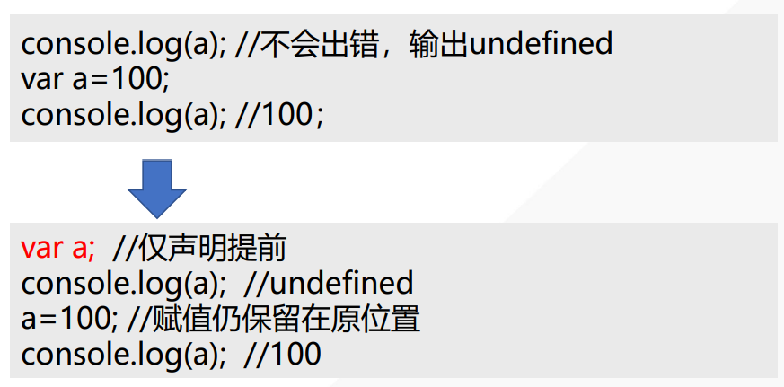

## 一、JavaScript 语法规范

### 1.1 语句

- 允许被 JavaScript 引擎所解释的代码
- 使用 分号 来表示结束，例如`console.log();` 、  `document.write();`
- 大小写敏感。 `console.log();` 正确示范 、  ``Console.log();``错误示范
- 英文标点符号
- 由表达式、关键字、运算符 组成


### 1.2 注释

- 单行注释 ：  `//` 

- 多行注释:     `/* */`


## 二、变量

### 2.1 什么是变量

就是内存中的一段存储空间 

变量的名：内存空间的别名，可以自定义 

变量的值：保存在 内存空间中的数据


### 2.2 变量命名规范

1. 不允许使用JS的关键字和保留关键字
2. 由字母、数字、下划线以及$组成
3. 不能以数字开头
4. 尽量见名知意
5. 可以采用"驼峰命名法”


### 2.3 变量的声明

**声明**：`var 变量名;`    或者 `let 变量名；`

**赋值**：变量名 = 值;

> 声明过程中，**尽量不要省略 var 关键字，否则声明的 是"全局变量"**

**一次性声明多个变量并赋值**:var 变量名1,变量名2,...变量名n;

ex:  `var stuName=“PP.XZ",stuAge=25, stuHeight;`


var 和 let 的区别查看 [如何存储你需要的信息——变量 - 学习 Web 开发 | MDN (mozilla.org)](https://developer.mozilla.org/zh-CN/docs/Learn/JavaScript/First_steps/Variables)

- `let` 是在现代版本中的 JavaScript 创建的一个新的关键字，用于创建与 `var` 工作方式有些不同的变量，解决了过程中的问题。
- 在初始化一个变量之后用 `var` 声明它，它仍然可以工作。但是这个肯定不符合规范的。
- 在初始化一个变量之后用 `let` 声明它，程序将不会报错，更加符合逻辑和规范。


### 2.4 变量的初始化

变量声明后，从未赋值，称之为 **未经初始化变量**

变量未被定义过，直接打印或使用,`console.log(stuHeight);` 结果为错误


**变量的存取操作**：

1、获取变量的值-GET操作

```javascript
var userPwd = '123456' ;
console.log( userPwd );
document.write( userPwd );

// 创建新变量，赋值为已有变量的值
var newPwd = userPwd;
```

2、保存(设置)变量的值 - SET操作

```javascript
var oldPwd = '123' ;
oldPwd = '456' ;

//这条语句对于变量newPwd是GET操作；对于变量oldPwd是SET操作
oldPwd = newPwd;
```


## 三、数据类型

数据类型主要分为：**基本类型** 、 **引用类型**

### 3.1 基本类型

| 类型          | 说明                             | 特点/举例                                                    |
| ------------- | -------------------------------- | ------------------------------------------------------------ |
| 数字类型      | 表示整数和浮点数                 | 支持 32 位整数（4 字节）和 64 位浮点数（8 字节），如 `42`, `3.14` |
| 字符串类型    | 表示文本字符数据                 | Unicode 编码，每个字符占 2 字节，如 `"Hello"`, `"张"`        |
| 布尔类型      | 表示逻辑条件的结果               | 只有 `true` 和 `false`，可参与运算：`true = 1`, `false = 0`  |
| 空值 (`null`) | 表示对象未赋值或显式地表示“无值” | 例如：`let obj = null;`                                      |
| 未定义        | 变量未赋值或访问不存在的属性     | 例如：`let a; console.log(a); // undefined`                  |


### 3.2 数据类型转换

**(1) 隐式转换**

JavaScript 在运算过程中自动进行的类型转换，无需开发者干预。

相关函数有：

- typeof() 或 typeof

- **isNaN**(数据) : 判断 数据是否为非数字


**（2）显式转换(强制转换)**

| 函数           | 作用                       | 特点                                                         |
| -------------- | -------------------------- | ------------------------------------------------------------ |
| `toString()`   | 将任意数据类型转换为字符串 | 不会影响原数据。                                             |
| `parseInt()`   | 提取字符串的**整数部分**   | 从左到右解析，遇到首个非数字字符停止，若首字符非法，结果为 `NaN`。 |
| `parseFloat()` | 将字符串转换为**浮点数**   | 同 `parseInt()`，但会保留小数部分。                          |
| `Number()`     | 将数据转换为数字类型       | 如果包含非法字符，返回 `NaN`。                               |


## 四、运算符和表达式

运算符：能够完成数据计算的一组符号 比如：+,-,*,/

表达式： 由运算符和操作数所组成的式子叫作表达式， 每个表达式都有自己的值

#### 4.1 算数运算符

| 运算符 | 描述         |
| :----- | :----------- |
| +      | 加法         |
| -      | 减法         |
| *      | 乘法         |
| /      | 除法         |
| %      | 取模（余数） |
| ++     | 递加         |
| --     | 递减         |


#### 4.2 关系运算符

判断数据之间的大小关系，关系表达式的运算结果为 boolean类型(true 或 false)

| 运算符/函数       | 作用                          | 特点                                                         |
| ----------------- | ----------------------------- | ------------------------------------------------------------ |
| `>` `<` `>=` `<=` | 比较大小关系                  | 返回布尔值：`true` 或 `false`。                              |
| `==` `!=`         | 判断相等或不等                | **不比较数据类型**，只比较数值。                             |
| `===` `!==`       | 判断全等或不全等              | **同时比较数据类型和数值**，只有完全一致时才为 `true`。      |
| `isNaN(数据)`     | 判断数据是否为非数字（`NaN`） | **忽略数据类型**：数字类型返回 `false`，非数字类型返回 `true`。 |


#### 4.3 逻辑运算符

逻辑与 : &&    逻辑或 : ||    逻辑非 : !

表达式1 ? 表达式2 : 表达式3;


## 五、字符串

### 5.1 模板字面量

使用反引号声明的字符串是一种特殊字符串，被称为[*模板字面量*](https://developer.mozilla.org/zh-CN/docs/Web/JavaScript/Reference/Template_literals)。模板字面量是一种更强大的字符串创建方式，允许嵌入表达式和多行字符串。它使用反引号（ `` `）而不是单引号或双引号来定义字符串。

`${}` 是模板字面量（Template Literals）的一部分，用于**字符串插值**。


## 六、程序结构

### 6.1 顺序结构

常用的语句默认为顺序执行


### 6.2 分支结构

[JavaScript Switch 语句](https://www.w3school.com.cn/js/js_switch.asp)


### 6.3 循环结构

[JavaScript For 循环](https://www.w3school.com.cn/js/js_loop_for.asp)


## 七、数组

### 7.1 索引数组(下标为数字的数组)

**创建空数组**（使用时机: 在创建数组时，还不知道数组中的元素内容时），主要有两种创建方式：

-  数组直接量:` var arr=[];`
-  用`new: var arr=new Array();`


**创建数组同时初始化**

- 数组直接量: var arr=[元素1,元素2,...];
- 用 new: var arr=new Array(元素1,元素2,...);


**数组的length属性:** 

记录了数组中理论上的元素个数 length属性的值永远是最大下标+1

```javascript
var arr5 = [ ]; //长度为0
arr5[0] = 87; //长度变为1
arr5[3] = 98; //长度变为4
```


**特殊：**

- 不限制数组的元素个数:**长度可变**

- 不限制**下标越界**: 

  > 获取元素值: **不报错**！返回undefined 
  >
  > 修改元素值: **不报错**! 自动在指定位置创建新元素，并且自动修改length属性为最大下标+1 
  >
  > 如果下标不连续的数组——稀疏数组

- 不限制元素的**数据类型**


### 7.2 **关联数组（可自定义下标名称的数组）**

索引数组中的数字下标没有明确的意义。

但是，关联数组可自定义下标名称的数组，使每个元素都有专门的名称（即明确的意义）


创建流程（2步）：

1. 创建空数组

2. 向空数组中添加新元素，并自定义下标名称

```javascript
var bookInfo = [ ];
bookInfo['bookName'] = '西游记' ;
bookInfo['price'] = 35.5 ;
```


由于关联数组的 length 属性值无法获取其中元素的数量，所以遍历关联数组**只能使用 for..in 循环**

```javascript
for(var key in hash){
    key				//只是元素的下标名
    hash[key]		//当前元素值
}
```


### 7.3 索引数组与关联数组的对比


### 7.4 数组API

| **操作**       | **方法**                               | **描述**                                                     | **示例**                                                     |
| -------------- | -------------------------------------- | ------------------------------------------------------------ | ------------------------------------------------------------ |
| **转字符串**   | `String(arr)`                          | 将数组转为字符串，元素间用逗号分隔                           | `String([1, 2, 3])` → `"1,2,3"`                              |
| **连接字符串** | `arr.join("连接符")`                   | 将数组中的每个元素转为字符串，用自定义的连接符连接           | `["H", "e", "l", "l", "o"].join("")` → `"Hello"`             |
| **拼接**       | `arr.concat(值1, 值2, arr2, 值3, ...)` | 拼接两个或多个数组，返回新的数组，数组元素会被打散再拼接     | `[90, 91].concat(80, 81, [70, 71])` → `[90, 91, 80, 81, 70, 71]` |
| **选取子数组** | `arr.slice(start, end)`                | 返回数组中从 `start` 到 `end`（不包含`end`）的子数组         | `[10, 20, 30, 40, 50].slice(1, 4)` → `[20, 30, 40]`          |
| **删除元素**   | `arr.splice(start, n)`                 | 删除数组中从 `start` 开始的 `n` 个元素，修改原数组并返回删除的元素组成的新数组 | `let arr = [10, 20, 30, 40]; arr.splice(1, 2)` → `[20, 30]`, `arr` becomes `[10, 40]` |
| **插入元素**   | `arr.splice(start, 0, 值1, 值2, ...)`  | 在 `start` 位置插入新值，原有元素顺移                        | `let arr = [10, 20, 30]; arr.splice(1, 0, 15)` → `arr` becomes `[10, 15, 20, 30]` |
| **替换元素**   | `arr.splice(start, n, 值1, 值2, ...)`  | 删除数组中 `start` 开始的 `n` 个元素，并插入新元素           | `let arr = [10, 20, 30]; arr.splice(1, 1, 15, 16)` → `arr` becomes `[10, 15, 16, 30]` |
| **颠倒顺序**   | `arr.reverse()`                        | 颠倒数组中所有元素的顺序，修改原数组                         | `[1, 2, 3].reverse()` → `[3, 2, 1]`                          |
| **排序**       | `arr.sort()`                           | 将数组元素按字典顺序排序，如果是数字，会被转为字符串排序     | `[3, 1, 2].sort()` → `[1, 2, 3]`                             |
|                | `arr.sort((a, b) => a - b)`            | 使用自定义比较器函数对数组进行排序，适用于数字排序           | `[3, 1, 2].sort((a, b) => a - b)` → `[1, 2, 3]`              |


## 八、函数

函数(function)，也可以被称之为方法(method),或者 过程(procedure)    ，是一段**预定义好**，并可以被**反复使用**的**代码块**。其 中可以包含多条可执行语句

> 预定义好:事先声明好，但不被执行 
>
> 反复使用：允许被多个地方(元素，函数中)所应用 
>
> 代码块：允许包含多条可执行的代码 函数本质上是功能完整的对象


### 8.1 函数定义

```
function functionName(parameters) {
   要执行的代码
}
```

值得注意的是，函数是对象，  `typeof` 运算符会为函数返回 "`function`"


### 8.2 函数调用

执行函数中的内容 任何 JS 的合法位置处，都允许调用函数 

语法：函数名称();


### 8.3 作用域

作用域就是变量或函数的可访问范围。它控制着变量或函 数的可见性和生命周期。

- 函数作用域，只在当前函数内可访问
- 全局作用域，一经定义，代码的任何位置都可以方式


### 8.3 声明提前

JS在正式执行之前，会将所有var声明的变量和function声明的函数，预读到所在作用域的顶部 但是，对变量的赋值，还保留在原来的位置处




## 参考资料

[什么是 JavaScript？ - 学习 Web 开发 | MDN](https://developer.mozilla.org/zh-CN/docs/Learn/JavaScript/First_steps/What_is_JavaScript)

[JavaScript 教程](https://www.w3school.com.cn/js/index.asp)