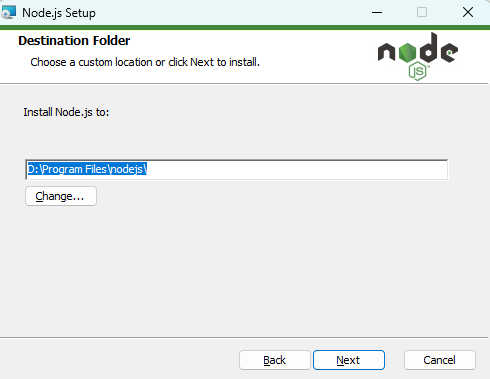
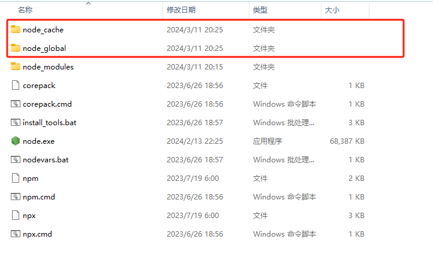

## 一、Node.js  下载和安装

### 1.1 下载 Node.js

打开 [Node.js — Download (nodejs.org)](https://nodejs.org/en/download)， 选择合适的版本。


### 1.2 安装 Node.js

双击 `node-v20.11.1-x64.msi`，安装 Node.js （自定义安装目录，我的修改为 `D:\Program Files\nodejs\`）




在安装完成过程中，如果点击安装 chocolatey 等必要的工具(默认目录为 `C:\ProgramData\chocolatey` )，Node.js 还会再 Windows Powershell 里面运行脚本，远程获取必要的文件。部分运行日志如下:

```shell
Forcing web requests to allow TLS v1.2 (Required for requests to Chocolatey.org)
Getting latest version of the Chocolatey package for download.
Not using proxy.                                                                                                        Getting Chocolatey from https://community.chocolatey.org/api/v2/package/chocolatey/2.4.1.                               Downloading https://community.chocolatey.org/api/v2/package/chocolatey/2.4.1 to C:\Users\zouhu\AppData\Local\Temp\chocolatey\chocoInstall\chocolatey.zip                                                                                        Not using proxy.                                                                                                        Extracting C:\Users\zouhu\AppData\Local\Temp\chocolatey\chocoInstall\chocolatey.zip to C:\Users\zouhu\AppData\Local\Temp\chocolatey\chocoInstall
Installing Chocolatey on the local machine
Creating ChocolateyInstall as an environment variable (targeting 'Machine')
  Setting ChocolateyInstall to 'C:\ProgramData\chocolatey'
WARNING: It's very likely you will need to close and reopen your shell
  before you can use choco.
Restricting write permissions to Administrators
We are setting up the Chocolatey package repository.
The packages themselves go to 'C:\ProgramData\chocolatey\lib'
  (i.e. C:\ProgramData\chocolatey\lib\yourPackageName).
A shim file for the command line goes to 'C:\ProgramData\chocolatey\bin'
  and points to an executable in 'C:\ProgramData\chocolatey\lib\yourPackageName'.

Creating Chocolatey CLI folders if they do not already exist.

chocolatey.nupkg file not installed in lib.
 Attempting to locate it from bootstrapper.
PATH environment variable does not have C:\ProgramData\chocolatey\bin in it. Adding...
警告: Not setting tab completion: Profile file does not exist at
'D:\dell\Documents\WindowsPowerShell\Microsoft.PowerShell_profile.ps1'.
Chocolatey CLI (choco.exe) is now ready.
You can call choco from anywhere, command line or powershell by typing choco.
Run choco /? for a list of functions.
You may need to shut down and restart powershell and/or consoles
 first prior to using choco.
Ensuring Chocolatey commands are on the path
Ensuring chocolatey.nupkg is in the lib folder
Chocolatey v2.4.1
Upgrading the following packages:
python;visualstudio2019-workload-vctools
By upgrading, you accept licenses for the packages.
python is not installed. Installing...
Downloading package from source 'https://community.chocolatey.org/api/v2/'
Progress: Downloading chocolatey-compatibility.extension 1.0.0... 100%

...
```

这个安装过程比较久，需要花费10分钟左右。安装完后，`C:\ProgramData\chocolatey\bin` 添加到 “系统环境变量” 的 `Path` 里面。


### 1.3 检查 Node.js

由于`node-v20.11.1-x64.msi` 安装包已经自动将 Node.js 的安装路径(我的为 `D:\Program Files\nodejs\`)添加到 “系统环境变量” 的 `Path` 里面，我们可以在 cmd 里面使用  Node.js 的可执行程序。

打开 cmd 窗口，  输入 `node -v`  和 `npm -v`  分别查看安装软件版本：

```shell
C:\Users\username>node -v
v20.11.1

C:\Users\username>npm -v
10.2.4
```


## 二、模块安装路径配置

### 2.1 创建文件夹并配置相应路径

在node.js的安装目录 `D:\Program Files\nodejs` 中，新建两个文件夹 `node_global` 和 `node_cache`，分别用来存放安装的全局模块和全局缓存信息。另外，`node_modules` 和 `node_global` 是 Node.js 环境中两个不同的概念，它们的主要区别如下

- node_modules 用于项目级别的依赖管理，确保每个项目有自己独立的依赖环境。
- 全局安装（node_global）用于安装需要在整个系统范围内使用的工具或命令行工具

> 如果不进行该配置，Node.js安装的包将会安装到默认路径 `C:\Users\username\AppData\Roaming\npm`)里面



然后，使用管理员权限打开 cmd 窗口， 输入以下命令：

```
# 设置全局模块安装路径
npm config set prefix "D:\Program Files\nodejs\node_global"
  
# 设置全局缓存存放路径
npm config set cache "D:\Program Files\nodejs\node_cache"
```

```
npm config set prefix "D:\Enviroment\frontend\nodejs-14.21.3\node_global"
npm config set cache "D:\Enviroment\frontend\nodejs-14.21.3\node_cache"
```


### 2.2 创建环境变量

**(1) 新增系统变量**

Node 安装包自带 nodejs 目录的变量。

在系统变量中， 新建变量 `NODE_PATH`， 变量值为  `D:\Program Files\nodejs\node_global\node_modules`

这里说明一下，`NODE_PATH` 就是 `Node.js` 中用来寻找模块所提供的路径注册环境变量

> 如果输入变量值之后没有自动创建【node_modules】文件夹，就在【node_global】下手动创建一个【node_modules】文件夹

**(2) 修改用户变量**

打开用户变量的 PATH， 将  `C:\Users\zouhu\AppData\Roaming\npm`  修改成 `D:\Program Files\nodejs\node_global`


### 2.3 设置安装镜像

```shell
# 设置镜像源
$ npm config set registry https://registry.npmmirror.com

# 查看镜像源
$ npm config get registry
https://registry.npmmirror.com
```


### 2.3 测试是否安装成功

配置完成后，利用管理员权限打开 cmd， 安装 express 模块进行测试。

```shell
C:\Windows\System32>npm install express -g

added 64 packages in 19s

12 packages are looking for funding
  run `npm fund` for details
npm notice
npm notice New minor version of npm available! 10.2.4 -> 10.5.0
npm notice Changelog: https://github.com/npm/cli/releases/tag/v10.5.0
npm notice Run npm install -g npm@10.5.0 to update!
npm notice
```

其中，`npm install express -g` 的 `-g` 表示全局模块


在 `D:\Program Files\nodejs\node_global\node_modules` 目录里面，我们可以看到新安装的 express 模块


### 2.4 取消管理员权限(必须)

[nodejs修改npm全局安装位置后出现权限问题——超详细已解决_node只能在管理员里可以运行-CSDN博客](https://blog.csdn.net/m0_56253302/article/details/130111914)

一定要取消管理员权限，尤其是文件夹 件夹 `node_global` 和 `node_cache` 的管理员权限。否则会出现部分依赖安装不成功的现象。

如果可以的话，将nodejs 相关的全都取消管理员权限吧。


同时，安装依赖的时候，如果还出现问题，可以尝试删除 package-lock.json 文件。


## 总结

将 nodejs 安装在 C 盘 吧，不要安装在其他的目录，否则会出现稀奇古怪的问题。

不要配置任何东西


## 参考资料

[NodeJs 的安装及配置环境变量_nodejs配置环境变量-CSDN博客](https://blog.csdn.net/zimeng303/article/details/112167688)

