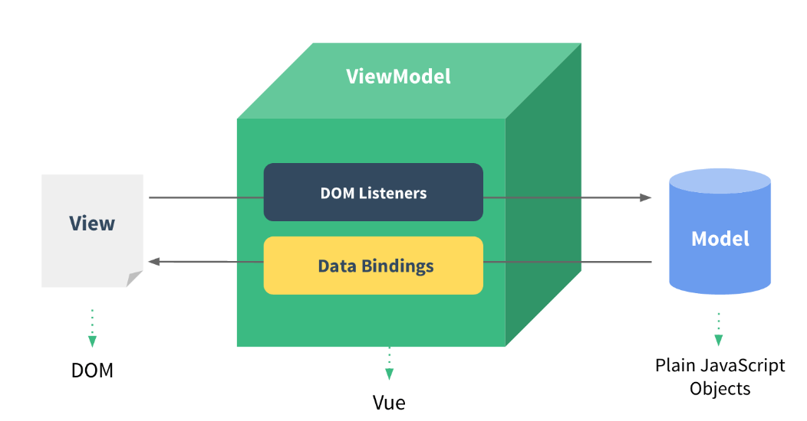

## 一、Vue 概述

### 1.1 什么是 Vue

Vue (发音为 /vjuː/，类似 **view**) 是一款用于构建用户界面的 JavaScript 框架。它基于标准 HTML、CSS 和 JavaScript 构建，并提供了一套声明式的、组件化的编程模型，帮助你高效地开发用户界面。


### 1.2 Vue 核心功能

Vue 的两个核心功能：

- **声明式渲染**：Vue 基于标准 HTML 拓展了一套模板语法，使得我们可以声明式地描述最终输出的 HTML 和 JavaScript 状态之间的关系。
- **响应性**：Vue 会自动跟踪 JavaScript 状态并在其发生变化时响应式地更新 DOM。

#### 1.2.1 声明式渲染

声明式渲染是 Vue.js 的核心特性之一，它意味着开发者只需要专注于描述**最终的 UI 状态**，而<font color="red">**无需手动操作 DOM 来实现视图的更新和管理**</font>。

命令式渲染需要开发者显式地操作 DOM 元素，例如使用 `document.querySelector`、`innerHTML` 等来更新页面内容。

#### 1.2.2 响应性

**响应性**是指数据状态的变化会**自动触发视图更新**的机制。Vue 会追踪应用中依赖的数据，当这些数据发生变化时，它会高效地更新与之关联的 DOM，使得数据与视图之间保持同步。


### 1.3 


## 二、Vue 架构

### 2.1 Vue 框架采用 MVMM 设计模式




### 2.2 系统架构图

Vue 框架的系统架构图如下所示：

```mermaid
graph LR
A[用户界面] --> B(模板)
A --> C(指令)
A --> D(组件)
B --> E(编译器)
D --> E
C --> E
E --> F(虚拟DOM)
F --> G(渲染)
G --> H(真实DOM)
```

在底层机制中，Vue 会将[模板](https://cn.vuejs.org/guide/essentials/template-syntax.html)编译成高度优化的 JavaScript 代码。结合响应式系统，当应用状态变更时，Vue 能够智能地推导出需要重新渲染的组件的最少数量，并应用最少的 DOM 操作。


## 三、Vue 优点

没有 Vue 框架，使用原生的 JavaScript 代码或其他简单的 DOM 操作库，开发者需要手动管理页面的更新和状态变化，这可能会导致以下几个问题和挑战：

1. **DOM 操作繁琐**：
   - 使用原生 JavaScript 进行 DOM 操作通常需要编写大量的代码来处理页面元素的创建、更新和删除。这些操作可能会导致代码复杂化和可维护性降低。
2. **数据与视图的同步问题**：
   - 在没有数据绑定机制的情况下，开发者需要手动将数据更新反映到页面上，这可能导致数据与视图的同步问题，特别是在复杂的应用中。
3. **复杂的状态管理**：
   - 随着应用的复杂性增加，状态管理变得更加困难。开发者需要实现自己的状态管理逻辑，包括数据的响应式更新、组件之间的通信等。
4. **组件化和模块化**：
   - Vue 框架提供了组件化的能力，使得开发者可以将界面拆分为独立、可重用的组件。没有 Vue 框架时，开发者需要自己实现组件化的架构，这可能会增加开发成本和复杂度。
5. **开发效率**：
   - Vue 框架通过其简洁的语法和丰富的功能库，提升了开发效率。没有 Vue 框架，开发者需要更多的时间和精力来实现相同的功能，可能会增加开发周期。
6. **生态系统的缺失**：
   - Vue 框架拥有一个庞大的生态系统，包括官方和社区维护的插件、组件库、工具等。缺少 Vue 框架意味着失去了这些生态系统的支持和优势。


### 3.1 避免操作繁琐

（1）JavaScript 代码

当没有使用像 Vue 这样的框架时，通过原生 JavaScript 进行 DOM 操作可能会显得比较繁琐和复杂。以下是一个简单的例子，展示如何使用原生 JavaScript 来创建一个简单的列表，并在用户点击按钮时向列表中添加新的项目：

```html
<!DOCTYPE html>
<html lang="en">
<head>
  <meta charset="UTF-8">
  <meta name="viewport" content="width=device-width, initial-scale=1.0">
  <title>DOM 操作示例</title>
</head>
<body>
  <div id="app">
    <h2>Todo List</h2>
    <ul id="todo-list">
      <li>Learn JavaScript</li>
      <li>Build a project</li>
    </ul>
    <input type="text" id="new-task" placeholder="Enter a new task">
    <button onclick="addTask()">Add Task</button>
  </div>

  <script>
    function addTask() {
      const newTaskInput = document.getElementById('new-task');
      const taskText = newTaskInput.value;
      const todoList = document.getElementById('todo-list');

      if (taskText.trim() !== '') {
        const newTaskItem = document.createElement('li');
        newTaskItem.textContent = taskText;
        todoList.appendChild(newTaskItem);
        newTaskInput.value = '';
      } else {
        alert('Please enter a task.');
      }
    }
  </script>
</body>
</html>

```


（2）Vue 简化后的代码

`<div id="app"> `是 Vue 应用的挂载点，Vue 实例将控制这个元素及其子元素。

```html
<!DOCTYPE html>
<html lang="en">
<head>
  <meta charset="UTF-8">
  <meta name="viewport" content="width=device-width, initial-scale=1.0">
  <title>Vue 示例</title>
  <script src="https://cdn.jsdelivr.net/npm/vue@2"></script>
</head>
<body>
  <div id="app">
    <h2>Todo List</h2>
    <ul>
      <li v-for="task in tasks">{{ task }}</li>
    </ul>
    <input type="text" v-model="newTask" placeholder="Enter a new task">
    <button @click="addTask">Add Task</button>
  </div>

  <script>
    new Vue({
      el: '#app',
      data: {
        tasks: ['Learn JavaScript', 'Build a project'],
        newTask: ''
      },
      methods: {
        addTask() {
          if (this.newTask.trim() !== '') {
            this.tasks.push(this.newTask);
            this.newTask = '';
          } else {
            alert('Please enter a task.');
          }
        }
      }
    });
  </script>
</body>
</html>
```


## 参考资料

[简介 | Vue.js (vuejs.org)](https://cn.vuejs.org/guide/introduction.html)

[Vue.js-CSDN博客](https://blog.csdn.net/m0_63977330/article/details/139750647)

[VUE框架系统架构图_mob64ca12e36a1d的技术博客_51CTO博客](https://blog.51cto.com/u_16213377/7323124)