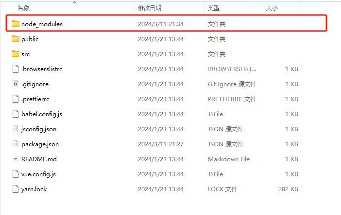

## 一、yarn 安装

建议通过 [npm 包管理器](http://npmjs.org/) 安装 Yarn，当你在系统上安装 Yarn 时，它会与 [Node.js](https://nodejs.cn/) 打包在一起。

```
npm install --global yarn
```

通过运行以下命令检查 Yarn 是否已安装：

```
yarn --version
```


在系统环境变量里面，PATH 里面新建`D:\frontend\nodejs\node_global\node_modules\yarn\bin`


## 二、yarn 使用方法

## 2.1 安装依赖

`yarn install` 安装的文件存放位置取决于你当前执行 `yarn install` 命令的位置以及项目中的配置。

1. **本地安装**：如果你在项目根目录执行 `yarn install` 命令，那么安装的依赖项将存放在项目根目录下的 `node_modules` 目录中。
2. **全局安装**：如果你使用 `-g` 或 `--global` 标志在全局范围内执行了 `yarn install` 命令，那么安装的依赖项将存放在全局配置的目录中。

举个例子，我在 console-vue 项目里面安装依赖：

```
D:\Learning\project\12306\console-vue>yarn install
yarn install v1.22.22
[1/4] Resolving packages...
[2/4] Fetching packages...
[3/4] Linking dependencies...
.........
```

可以看到，项目里面多了 `node_moudles` 文件夹




## 2.2 项目初始化

[用法 | Yarn 中文网 (nodejs.cn)](https://yarn.nodejs.cn/en/docs/usage)


## 2.3 项目启动

```
yarn serve 
```

启动成功后，会出现以下信息：

