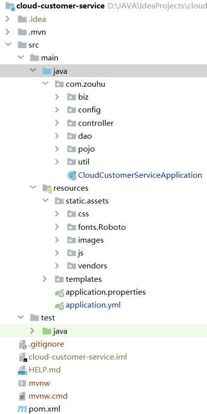

## 一、Spring Boot项目结构

### 1.1 代码层结构

**根目录：src/main/java**

> 入口启动类及程序的开发目录。在这个目录下进行业务开发、创建实体层、控制器层、数据连接层等。

- 启动类CloudCustomerServiceApplication.java推荐放在src/main/java/com.user下

- 数据库实体层pojo

> model层即**数据库实体**层，也被称为entity层，pojo层。
> 一般数据库一张表对应一个实体类，类属性同表字段一一对应.
> 模型通常认为是视图的内核，何谓之视图？我们正在与之交互的网站的界面就是视图，而模型是指他的内核：数据。

- 数据持久层dao

> dao(Data Access Object)层即数据持久层，也被称为mapper层。
> dao层的作用为访问数据库，向数据库发送sql语句，完成**数据的增删改查任务**。
> 通常我们在DAO层里面写接口，里面有与数据打交道的方法。SQL语句通常写在mapper文件里面的。
> 结构清晰，Dao层的数据源配置以及相关的有关数据库连接的参数都在Spring配置文件中进行配置。

- 数据服务接口层service

> service层即业务逻辑层，**主要负责业务逻辑应用设计**。
> 首先也要设计接口，然后再设计其实现该接口的类(serviceImpl)。这样我们就可以在应用中调用service接口进行业务处理。
> service层调用dao层接口，接收dao层返回的数据，完成项目的基本功能设计。

- 控制器层controller

> controller层即控制层.**主要负责具体业务模块流程的控制**，。
> controller层的功能为请求和响应控制。
> controller层负责前后端交互，接受前端请求，调用service层，接收service层返回的数据，最后返回具体的页面和数据到客户端。

- 工具类库utils

- 配置类config

- 数据传输对象dto

> 数据传输对象`Data Transfer Object`用于封装多个实体类`domain`之间的关系，不破坏原有的实体类结构

- 视图包装对象vo

>视图包装对象View Object用于封装客户端请求的数据，防止部分数据泄露如：管理员ID，保证数据安全，不破坏 原有的实体类结构

### 1.2 资源目录结构

**资源文件根目录：src/main/resources**

> 主要用来存放静态文件和配置文件

- 项目配置文件：resources/application.yml

> 用于配置项目运行所需的配置数据，也可以是resources/application.properties

- 静态资源目录：resources/static/

>  用于存放静态资源，如css、js、图片、音频等资源
>
>  注意：static目录下的静态资源可以直接访问。

- 视图模板目录：resources/templates/

>  - 用于存放html、jsp、thymeleaf等模板文件
>
>  - 注意：**templates目录里存放的html页面，不能通过url直接访问（被websecurity权限控制），需跳转后台（通过Controller，即走控制器–服务–视图解析器这个流程）才能访问，同时还要引入thymeleaf模板引擎  ； 或者配置静态资源路径\  。**
>
>  - html静态页面放置在templates目录原因：
>    templates目录下的html页面不能直接访问，需要通过服务器内部进行访问，可以避免无权限的用户访问到隐私页面，造成信息泄露。

- mybatis映射文件：resources/mappers/

- mybatis配置文件：resources/spring-mybatis.xml

### 1.3 测试测序目录结构

**测试文件根目录：src/test/java**

# 二、项目结构示例

# 参考资料

[SpringBoot项目目录结构（工程结构）](https://blog.csdn.net/qq_39615545/article/details/90172038)

[静态资源相关文件参考](https://blog.csdn.net/qq_34357018/article/details/109777607)

