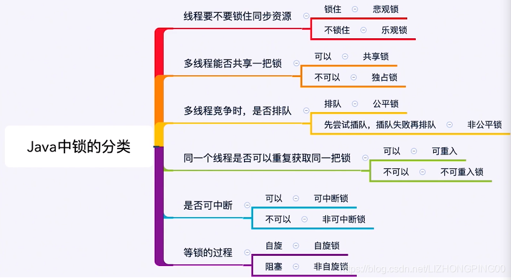

# 一、锁的分类

## 1.1 悲观锁和乐观锁

乐观锁：

- 定义: 假设在绝大多数情况下，对共享资源的访问是不会发生冲突的,所以不会对资源上锁。

- 实现方式：当线程要对资源进行更新时，它会**先获取资源的版本号或者标识符**，并在执行更新操作前不会对资源进行加锁。当线程完成更新操作后，会尝试提交(或者说乐观地认为)这次更新，如果在提交时发现资源的版本号已经发生了变化，说明其他线程已经对资源进行了修改，此时需要执行相应的**冲突处理策略**(例如重试、回滚等)。
- 使用场景：乐观锁通常适用于读操作多于写操作的场景，可以提高系统的并发性能。（因为在并发操作中，读操作一般不会导致冲突。）

悲观锁：

- 定义：假设在绝大多数情况下，对共享资源的访问都会发生冲突，因此在访问资源之前就会对资源进行加锁。

- 使用场景: 适用于写操作频繁的场景。

  

## 1.2 共享锁和独占锁

共享锁

独占锁(X锁，写锁/排他锁)

# 参考资料

[【锁】2 最全的锁分类_锁的分类-CSDN博客](https://blog.csdn.net/LIZHONGPING00/article/details/113963573)