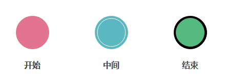
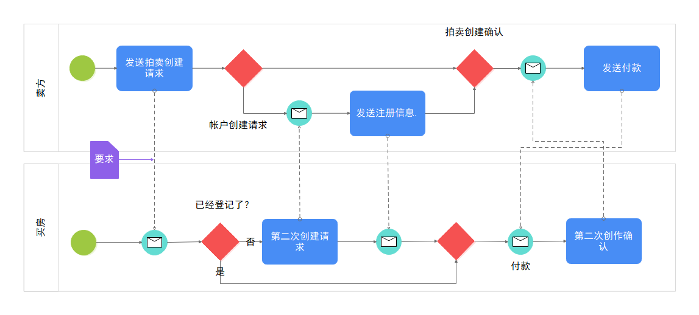
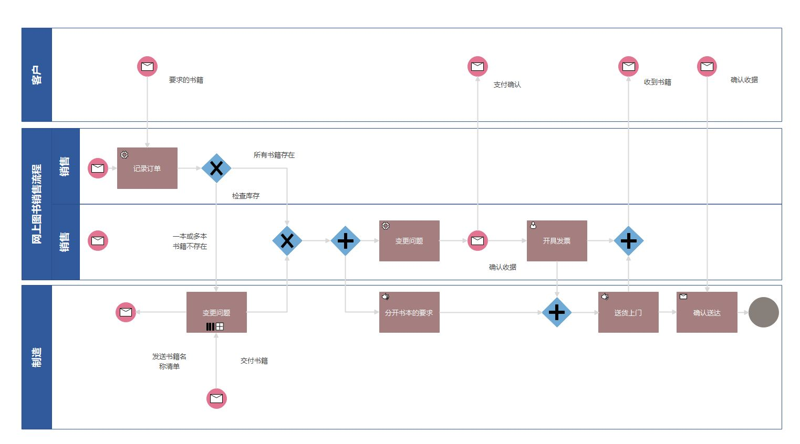

> [BPMN（业务流程建模符号）入门到掌握，这一篇就够了 - 知乎 (zhihu.com)](https://zhuanlan.zhihu.com/p/365967273)
>
> 转载该文章

## 一、BPMN定义

BPMN（Business Process Modeling Notation，即业务流程建模符号），是一种流程建模的通用和标准语言，用来绘制业务流程图，以便更好地让各部门之间理解业务流程和相互关系。

> BPMN 1.0 规范由标准组织BPMI（后并入到OMG）于2004年5月发布；
> BPMN 2.0 标准由OMG于2011年推出。

# 二、BPMN基础元素

BPMN的核心主要是以下四类基础元素：

- 流对象
- 数据
- 连接对象
- 泳道

## 2.1 流对象(**Flow Objects**)

**流对象（Flow Objects）**：是定义业务流程的主要图形元素，包括三种：事件、活动、网关

**(1)事件（Events）**：指的是在业务流程的运行过程中发生的事情，分为：

- 开始：表示一个流程的开始
- 中间：发生的开始和结束事件之间，影响处理的流程
- 结束：表示该过程结束

在flowable框架的流程BPMN 2.0 XML文件中，开始 是 startEvent ， 结束 是 endEvent

**(2)活动（Activities）：**包括任务和子流程两类。子流程在图形的下方中间外加一个小加号（+）来区分。

在flowable框架的流程BPMN 2.0 XML文件中， 自动活动一般是 **serviceTask**，  人工活动则是 **userTask**

**(3)网关（Gateways）**：用于表示流程的分支与合并。

- 排他网关：只有一条路径会被选择
- 并行网关：所有路径会被同时选择
- 包容网关：可以同时执行多条线路，也可以在网关上设置条件
- 事件网关：专门为中间捕获事件设置的，允许设置多个输出流指向多个不同的中间捕获事件。当流程执行到事件网关后，流程处于等待状态，需要等待抛出事件才能将等待状态转换为活动状态。

## 2.2 数据(Data)

**数据（Data）**：数据主要通过四种元素表示

- 数据对象（Data Objects）
- 数据输入（Data Inputs）
- 数据输出（Data Outputs）
- 数据存储（Data Stores）

## 2.3 连接对象(**Connecting Objects**)

**连接对象（Connecting Objects）**：流对象彼此互相连接或者连接到其他信息的方法主要有三种

- 顺序流：用一个带实心箭头的实心线表示，用于指定活动执行的顺序

- 信息流：用一条带箭头的虚线表示，用于描述两个独立的业务参与者（业务实体/业务角色）之间发送和接受的消息流动

- 关联：用一根带有线箭头的点线表示，用于将相关的数据、文本和其他人工信息与流对象联系起来。用于展示活动的输入和输出

## 2.4 泳道(**Swimlanes**)

**泳道（Swimlanes）**：通过泳道对主要的建模元素进行分组，将活动划分到不同的可视化类别中来描述由不同的参与者的责任与职责。

## 三、BPMN实例

**实例1**：拍卖服务BPMN模板

**实例2**：书籍销售流程 BPMN

# 参考资料

[官方网址](https://www.bpmn.org/)