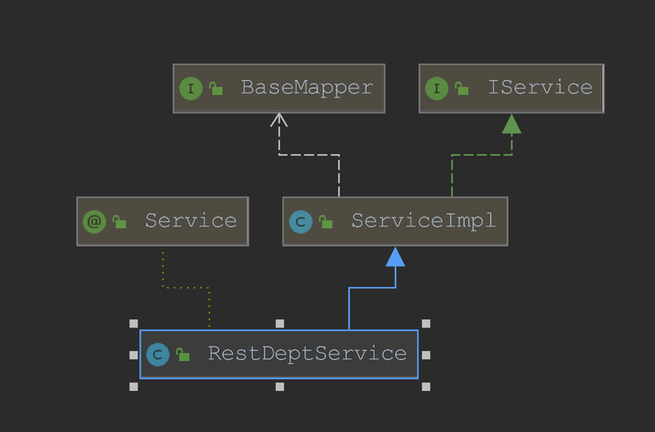

# 一、CRUD 接口

mybatis-plus 提供两种包含预定义增删改查操作的接口：

- **Mapper CRUD**： com.baomidou.mybatisplus.core.mapper.**BaseMapper**
- **Service CRUD** ： com.baomidou.mybatisplus.extension.service.**IService** ：

Mapper CRUD 接口 和  Service CRUD 接口



## Mapper CRUD 接口使用


```
package com.idealzouhu.reggie.mapper;

import com.baomidou.mybatisplus.core.mapper.BaseMapper;
import com.idealzouhu.reggie.entity.Dish;
import org.apache.ibatis.annotations.Mapper;

@Mapper
public interface DishMapper extends BaseMapper<Dish> {
}
```


## Service CRUD 接口使用

> 注意：主要使用到了 Mybatis 提供的 IService、ServiceImpl
>
> 另外，我们在 DishService 接口里面可以定义自己的方法

使用 MyBatis-Plus 的对应实现方法：

1. **定义 Service 接口**：定义一个 Service 接口，包含了常见的 CRUD 操作方法。

   ```
   public interface UserService extends IService<User> {
   }
   ```

2. **使用 MyBatis-Plus 实现 Service 接口**：继承 `ServiceImpl` 类，并指定实体类和对应的 Mapper 接口。

   ```
   import com.baomidou.mybatisplus.extension.service.impl.ServiceImpl;
   import org.springframework.stereotype.Service;
   
   @Service
   public class UserServiceImpl extends ServiceImpl<UserMapper, User> implements UserService {
   }
   ```

   通过使用 MyBatis-Plus 的 `ServiceImpl` 类，你无需手动编写常见的 CRUD 操作，MyBatis-Plus 会根据指定的实体类和 Mapper 接口自动生成对应的 SQL。这样可以大大简化代码，提高开发效率。


以实体 Dish 类为例， 首先定义接口 DishService，该接口继承 IService

```
package com.idealzouhu.reggie.service;

import com.baomidou.mybatisplus.extension.service.IService;
import com.idealzouhu.reggie.dto.DishDto;
import com.idealzouhu.reggie.entity.Dish;
import org.springframework.stereotype.Service;

@Service
public interface DishService extends IService<Dish> {
    /**
     * 新增菜品，同时插入菜品对应的口味数据，需要操作两张表： dish 、dish_flavor
     * @Param dishdto
     */
    public void saveWithFlavor(DishDto dishdto);

    /**
     * 根据 id 查询菜品和菜品口味信息
     * @param id
     * @return
     */
    public DishDto getByIdWithFlavor(Long id);

    /**
     * 更新菜品信息，同时菜品口味信息
     * @param dishDto
     */
    public void updateWithFlavor(DishDto dishDto);
}
```


然后，给出该接口的实现类DishServiceImpl， 并继承 ServiceImpl， 

```
package com.idealzouhu.reggie.service.impl;

import com.baomidou.mybatisplus.core.conditions.query.LambdaQueryWrapper;
import com.baomidou.mybatisplus.extension.service.impl.ServiceImpl;
import com.idealzouhu.reggie.dto.DishDto;
import com.idealzouhu.reggie.entity.Dish;
import com.idealzouhu.reggie.entity.DishFlavor;
import com.idealzouhu.reggie.mapper.DishMapper;
import com.idealzouhu.reggie.service.DishFlavorService;
import com.idealzouhu.reggie.service.DishService;
import org.springframework.beans.BeanUtils;
import org.springframework.beans.factory.annotation.Autowired;
import org.springframework.stereotype.Service;
import org.springframework.transaction.annotation.Transactional;

import java.util.List;
import java.util.stream.Collectors;

@Service
public class DishServiceImpl extends ServiceImpl<DishMapper, Dish> implements DishService {

    @Autowired
    private DishFlavorService dishFlavorService;

    /**
     * 新增菜品，同时保存对应的口味数据
     * @param dishdto
     */
    @Transactional
    @Override
    public void saveWithFlavor(DishDto dishdto) {
        // 保存菜品信息
        this.save(dishdto);  // 为什么这个实体还包括了其他信息，却不会报错

        // 保存菜品口味信息
        Long dishId = dishdto.getId();
        List<DishFlavor> dishFlavorList = dishdto.getFlavors();
        dishFlavorList.stream().map((item)->{
            item.setDishId(dishId);
            return item;
        }).collect(Collectors.toList());
        dishFlavorService.saveBatch(dishFlavorList);

    }

    /**
     * 根据id 查询 菜品和菜品口味信息
     * @param id
     * @return
     */
    @Override
    public DishDto getByIdWithFlavor(Long id) {
        // 查询菜品基本信息，从 dish表查询
        Dish dish = this.getById(id);

        // 查询当前菜品对应的口味信息，从 dish_flavor 表查询
        LambdaQueryWrapper<DishFlavor> lambdaQueryWrapper = new LambdaQueryWrapper<>();
        lambdaQueryWrapper.eq(DishFlavor::getDishId, dish.getId());
        List<DishFlavor> dishFlavorList = dishFlavorService.list(lambdaQueryWrapper);

        // 将查询信息合并成 DishDto
        DishDto dishDto = new DishDto();
        BeanUtils.copyProperties(dish, dishDto);
        dishDto.setFlavors(dishFlavorList);

        return dishDto;
    }

    /**
     * 更新菜品信息，同时菜品口味信息
     * @param dishDto
     */
    @Override
    @Transactional
    public void updateWithFlavor(DishDto dishDto) {
        // 更新 dish表 基本信息
        this.updateById(dishDto);

        // 清理 dish_flavor表 信息 —— delete
        LambdaQueryWrapper<DishFlavor> lambdaQueryWrapper = new LambdaQueryWrapper<>();
        lambdaQueryWrapper.eq(DishFlavor::getDishId, dishDto.getId());
        dishFlavorService.remove(lambdaQueryWrapper);

        // 添加当前提交过来的菜品口味数据 —— insert
        Long dishId = dishDto.getId();
        List<DishFlavor> dishFlavorList = dishDto.getFlavors();
        dishFlavorList.stream().map((item)->{
            item.setDishId(dishId);
            return item;
        }).collect(Collectors.toList());
        dishFlavorService.saveBatch(dishFlavorList);

    }
}
```


## Mapper CRUD 接口 和 Service CRUD 接口的区别

Mybatis-plus提供了2个接口的区别 ：

- BaseMapper 接口针对 dao 层的方法封装 CRUD； IService<T> 接口针对业务逻辑层的封装， 需要指定 Dao 层类和对应的实体类， 是在BaseMapper基础上的加强

- **Service是对 Mapper 的扩充**

- Service CRUD 提供批处理操作，Mapper CRUD 没有。
- Mappe 接口的操作都能在 Service 接口里面找到 ，名字有一点点改变，比如 BaseMapper 里面叫 insert() 的方法，在 IService 里面叫 save()。

除此之外还有就是 IService 依赖于 Spring 容器，而 BaseMapper 不依赖


# 二、CRUD 接口使用案例

## Service CRUD 接口使用案例

使用条件构造器

```
// 根据菜品分类 CategoryId 查询符合的菜品数据集合
        LambdaQueryWrapper<Dish> lambdaQueryWrapper = new LambdaQueryWrapper<>();
        lambdaQueryWrapper.eq(dish.getCategoryId() != null, Dish::getCategoryId, dish.getCategoryId());
        lambdaQueryWrapper.eq(Dish::getStatus, 1);  // 只显示启售状态的菜品
        lambdaQueryWrapper.orderByAsc(Dish::getSort).orderByAsc(Dish::getUpdateTime);
        List<Dish> list = dishService.list(lambdaQueryWrapper);
```

不使用条件构造器

```
userService.save(user);
```


## Mapper CRUD 接口使用案例

```
 userReuseMapper.delete(Wrappers.update(new UserReuseDO(username)));
```


