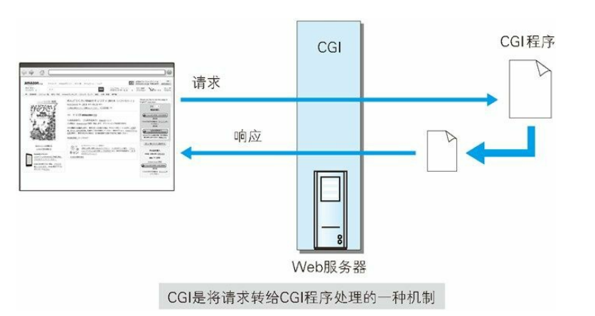
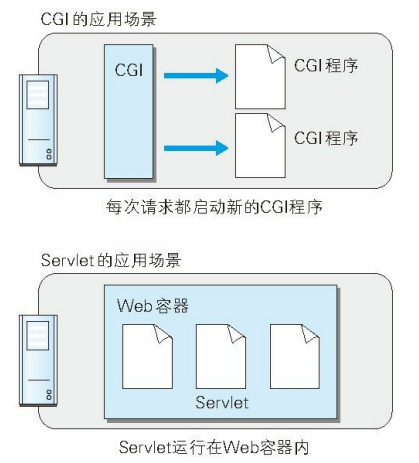
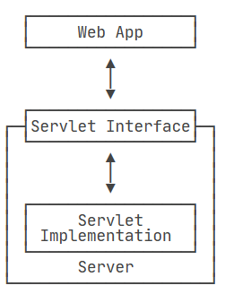
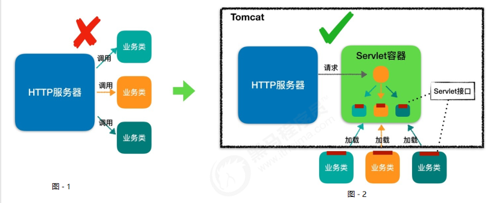
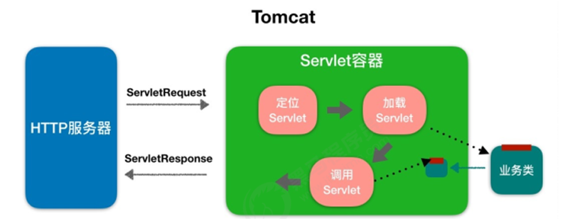

# 一、Servlet概述

## 1.1 与Web服务器及程序协助的CGI

CGI（Common Gateway Interface，通用网关接口）是指 **Web 服务器在接收到客户端发送过来的请求后转发给程序的一组机制**。在 CGI 的 作用下，程序会对请求内容做出相应的动作，比如创建 HTML等动态内容。

使用 CGI 的程序叫做 CGI 程序，通常是用 Perl、PHP、Ruby 和 C 等 编程语言编写而成。

## 1.2 为什么引入 Servlet

之前提及的 CGI，由于每次接到请求，程序都要跟着启动一次。因此一旦访问量过大，Web 服务器要承担相当大的负载。而 Servlet 常驻内存，运行在与 Web 服务器相同的进程中。在每次请求时，可启动相对进程级别更为轻量的Servlet，程序的执行效率从而变得更高。因此，采用Servlet的Web服务器 受到的负载较小。**Servlet 作为解决 CGI 问题的对抗技术 ，随 Java 一起得到了普及**。

 **Servlet 是一种能在服务器上生成动态Web内容的程序。**Servlet 是用 Java 语言实现的一个接口，属于面向企业级 Java（JavaEE，Java Enterprise Edition）的一部分。

>  Servlet全称 Java Servlet，未有中文译文。其中，Servlet=Server +  Applet，表示 轻量服务程序

狭义的 Servlet 是指 Java 语言实现的一个接口(可以理解为规范或者协议)， 广义的 Servlet 是指任何实现了这个Servlet 接口的类。一般情况下，人们将 Servlet 理解为后者。

## 1.3 Servlet 容器详细描述

Servlet 的运行环境叫做  **Servlet 容器**（也称为Web 容器或者Servlet引擎）。由于 Servlet 没有 main 方法，不能独立运行，它必须被部署到Servlet容器中，由容器来实例化和调用 Servlet 的方法，Servlet 容器在 Servlet 的生命周期内包容和管理Servlet。

在java web应用中，常见的Servlet 容器主要有Tomcat、[Jetty](https://eclipse.dev/jetty/)、[GlassFish](https://javaee.github.io/glassfish/)、[Undertow](https://undertow.io/)。同时，Tomcat也是web服务器。Tomcat 提供了一个运行环境，用于加载、初始化和管理 Servlet，同时处理客户端的请求并将结果返回给客户端。它是 Java Web 应用程序的部署平台，负责管理 Servlet 的生命周期、处理并发请求、维护会话状态等。

## 1.4  Servlet 规范

一个Java Web App通常打包为`.war`文件，并且可以部署到Tomcat、Jetty等多种Web服务器上。**为什么一个Java Web App基本上可以无修改地部署到多种Web服务器上呢？原因就在于Servlet规范。**

Servlet 规范是 Java Servlet API 的规范，用于定义 Web 服务器如何处理 HTTP 请求和响应。Servlet 规范有一组接口，对于Web App来说，操作的是接口，而真正对应的实现类，则由各个Web Server实现，这样一来，Java Web App实际上编译的时候仅用到了Servlet规范定义的接口，只要每个Web服务器在实现Servlet接口时严格按照规范实现，就可以保证一个Web App可以正常运行在多种Web服务器上：

> 换个角度理解，servlet是jvm上j2ee定义的web容器协议，tomcat是jvm上servlet 协议的实现，

# 二、Java Servlet代码解析

Java Servlet是运行在带有支持 Java Servlet 规范的解释器的 web 服务器上的 Java 类， 其实现代码包含在java企业版里面。

> 我们平常使用的java SE并不包含Java Servlet实现代码

本文将以Java(TM) EE 7 Specification APIs为例进行阐述，其官方API文档路径为[Overview (Java(TM) EE 7 Specification APIs) (oracle.com)](https://docs.oracle.com/javaee/7/api/toc.htm)

## 1.2 Servlet API概述

Servlet API 包含以下4个Java包：

1.javax.servlet   其中包含定义servlet和servlet容器之间契约的类和接口。

2.javax.servlet.http   其中包含定义HTTP Servlet 和Servlet容器之间的关系。

3.javax.servlet.annotation   其中包含标注servlet，Filter,Listener的标注。它还为被标注元件定义元数据。

4.javax.servlet.descriptor，其中包含提供程序化登录Web应用程序的配置信息的类型。

## 1.5 相关术语

在 Servlet 里面，许多容易混淆。这里将会统一列举出来：

- **Servlet接口**是Java Servlet API规范定义的一部分，规定了Servlet类必须实现的接口。这个接口提供了Servlet的生命周期方法，是Servlet类的基础。

- **Servlet**是实现了Servlet接口的Java类，它包含了处理HTTP请求和生成HTTP响应的逻辑。Servlet通过Servlet容器运行，容器负责管理Servlet的生命周期和调用相应的方法。

- **Servlet容器**是一个独立的服务器软件，负责运行和管理Servlet。它提供了Servlet的环境和支持，处理Servlet的生命周期、请求和响应，可以作为独立的Web服务器或集成到其他服务器中。

# 三、Servlet 容器工作流程

## 3.1 请求流程

图1 ， 表示HTTP服务器直接调用具体业务类，它们是紧耦合的。

 图2，HTTP服务器不直接调用业务类，而是把请求交给容器来处理，容器通过 Servlet接口调用业务类。因此Servlet接口和Servlet容器的出现，达到了 HTTP服务器与 业务类解耦的目的。而Servlet接口和Servlet容器这一整套规范叫作Servlet规范。 Tomcat按照Servlet规范的要求实现了Servlet容器，同时它们也具有HTTP服务器的功 能。作为Java程序员，如果我们要实现新的业务功能，只需要实现一个Servlet，并把它 注册到Tomcat（Servlet容器）中，剩下的事情就由Tomcat帮我们处理了。

## 3.2 工作流程

1. **客户端发送请求：**
   - 用户在浏览器中输入URL或进行其他操作，触发HTTP请求。
2. **连接器接收请求：**
   - 连接器（Connector）负责监听和接收来自客户端的请求。Tomcat支持多种连接器，其中包括HTTP连接器和AJP连接器等。
3. **请求对象创建：**
   - 当连接器接收到请求时，它会创建一个`HttpServletRequest`对象，用于封装客户端的HTTP请求信息。这个请求对象包含了请求的URL、方法、头部信息等。
4. **选择合适的上下文（Context）：**
   - Servlet容器根据请求的URL和配置的上下文，选择合适的Web应用程序（Context）。每个上下文代表一个独立的Web应用程序。
5. **选择合适的Servlet：**
   - 在选择了正确的上下文之后，Servlet容器根据请求的URL，选择合适的Servlet进行处理。这个过程通常是通过匹配URL映射规则实现的。
6. **Servlet生命周期调用：**
   - 如果Servlet还没有被实例化，容器会创建Servlet的实例，并调用其生命周期方法，包括`init()`方法用于初始化，然后调用`service()`方法来处理请求。
7. **请求处理：**
   - 在Servlet的`service()`方法中，开发者编写的业务逻辑被执行，根据请求的类型（GET、POST等）进行相应的处理。Servlet可以读取请求参数、执行业务逻辑、访问数据库等。
8. **创建响应对象：**
   - 在处理请求的过程中，Servlet容器创建一个`HttpServletResponse`对象，用于封装响应信息，包括响应的状态码、头部信息等。
9. **生成响应内容：**
   - Servlet通过`HttpServletResponse`对象生成要返回给客户端的响应内容，这可以是HTML、JSON、XML等类型的内容。
10. **返回响应：**
    - 容器将生成的响应内容发送回连接器。
11. **连接器发送响应：**
    - 连接器将响应发送给客户端，完成整个请求-响应周期。
12. **Servlet销毁（可选）：**
    - 在Servlet容器关闭或Web应用程序被卸载时，Servlet容器会调用Servlet的`destroy()`方法，执行一些清理操作。

# 参考资料

[Servlet 简介 | 菜鸟教程 (runoob.com)](https://www.runoob.com/servlet/servlet-intro.html)

[什么是Servlet？有什么作用？ - 知乎 (zhihu.com)](https://zhuanlan.zhihu.com/p/625617649)

[tomcat与servlet - 知乎 (zhihu.com)](https://zhuanlan.zhihu.com/p/465936851)

[Servlet规范 - 廖雪峰的官方网站 (liaoxuefeng.com)](https://www.liaoxuefeng.com/wiki/1545956031987744/1545956220731425)

[Tomcat专题 - 黑马程序员 bilibili](https://www.bilibili.com/video/BV1dJ411N7Um?p=1&vd_source=52cd9a9deff2e511c87ff028e3bb01d2)