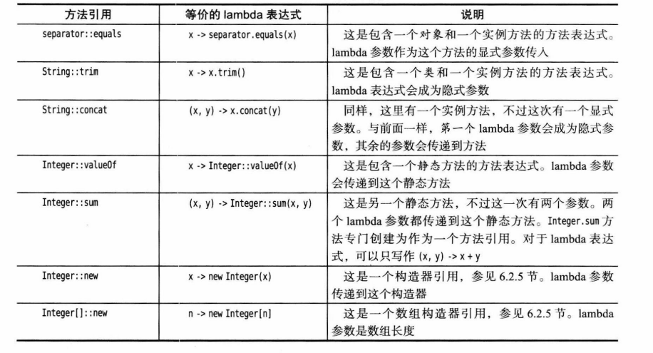

# 四、方法引用

## 4.1 什么是方法引用

方法引用是 Lambda 表达式的一种简写形式，用于表示**已有方法的直接引用**。

> 类似于lambda表达式，方法引用也不是一个对象。不过，为一个类型为函数式接口的变量赋值时会生成一个对象。

考虑以下的例子，假设有一个字符串列表，我们希望将列表中的每个字符串映射成其长度。

```java
List<String> strings = Arrays.asList("apple", "banana", "orange");

// Lambda 表达式实现
List<Integer> lengths = strings.stream()
                              .map(s -> s.length())
                              .collect(Collectors.toList());

// 使用方法引用
List<Integer> lengths = strings.stream()
                              .map(String::length)
                              .collect(Collectors.toList());

```

在这个例子中，`String::length` 是一个方法引用，它指向字符串的 `length` 方法。通过使用方法引用，我们避免了显式地编写 Lambda 表达式，使代码更为简洁。

方法引用的使用并不仅限于实例方法，还可以用于静态方法和构造函数。总体而言，方法引用提供了一种更为简洁、清晰的方式来表达某些场景下的代码逻辑。


## 4.2 方法引用的语法规则

方法引用的语法规则相对简单，要用 **`::`运算符分隔方法名与对象或类名**，可以分为3种主要的形式：

```
1.  object::instanceMethod   //  对象引用，引用特定对象的实例方法。
2.  Class::instanceMethod    //  类引用，  引用特定类的实例方法。
3.  Class::staticMethod      //  类引用，  引用特定类的静态方法。
4.  super::instanceMethod
```

在第1种情况下，方法引用等价于向方法传递参数的lambda表达式。对于`System.out::println`，对象是`System.out`，所以方法表达式等价于`x ->System.out.println(x)`
对于第2种情况，第1个参数会成为方法的隐式参数。例如，`String::.compareToIgnoreCase` 等同于 `(x,y) ->x.compareToIgnoreCase(y)`。
在第3种情况下，所有参数都传递到静态方法 `Math::pow` 等价于 `(x， y) ->Math.pow(x，y)`


注意，只有当lambda表达式的体只调用一个方法而不做其他操作时，才能把 lambda表达式重写为方法引用。考虑以下lambda表达式:

```java
s -> s.length( ) == 0
```

这里有一个方法调用。但是还有一个比较，所以这里不能使用方法引用。


## 4.3 方法引用的简单案例




## 4.4 构造器引用

构造器引用与方法引用很类似，只不过方法名为new。

- **类构造器引用：** `类名::new`

  ```
  // Lambda 表达式
  Supplier<List<String>> lambda = () -> new ArrayList<>();
  
  // 类构造器引用
  Supplier<List<String>> constructorRef = ArrayList::new;
  ```

  

- **数组构造器引用：** `类型[]::new`

  ```
  // Lambda 表达式
  Function<Integer, int[]> lambda = size -> new int[size];
  
  // 数组构造器引用
  IntFunction<int[]> arrayConstructorRef = int[]::new;
  ```


Java有一个限制，**无法构造泛型类型T的数组**。数组构造器引用对于克服这个限制很有用。表达式new T[n]会产生错误，因为这会改为new Object[n]。

流库利用构造器引用解决了这个问题。举个例子，存在Person类， 可以把Person[]: :new传入toArray方法:

```
Person[] people = stream.toArray(Person[] : : new);
```


