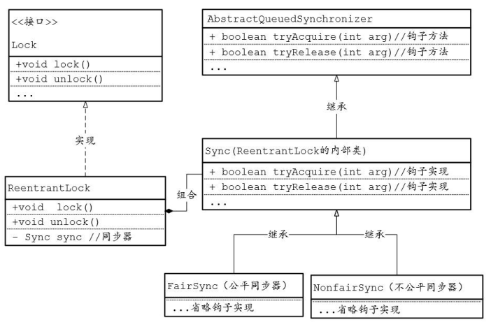

### 什么是 ReentrantLock 

`ReentrantLock` 实现了 `Lock` 接口，是一个可重入且独占式的锁。`ReentrantLock` 更灵活、更强大，增加了轮询、超时、**中断**、**公平锁**和非公平锁等高级功能。

```java
public class ReentrantLock implements Lock, java.io.Serializable {
	
	abstract static class Sync extends AbstractQueuedSynchronizer {
	}
	
	static final class FairSync extends Sync {
	}
	
	static final class NonfairSync extends Sync {
	}
	 
}
```

`ReentrantLock` 和 AQS 之间的关系为组合关系， 并利用模板模式来实现。




### 公平锁和非公平锁的设置方式

`ReentrantLock` 通过构造方法来配置锁的公平性，并通过内部的  `Sync`  类来实现不同的锁获取策略。

```java
 private final Sync sync;
 
 // 默认构造函数，使用非公平锁
 public ReentrantLock() {
        sync = new NonfairSync();
 }
 
 // fair 决定是使用公平锁还是非公平锁
 public ReentrantLock(boolean fair) {
        sync = fair ? new FairSync() : new NonfairSync();
 }
 
```


### 公平锁的实现方式

在获取公平锁和非公平锁的源代码里面， 唯一区别在于公平锁中多了限制条件  `!hasQueuedPredecessors()`。

```java
static final class NonfairSync extends Sync {
	
	// 获取非公平锁
	 protected final boolean tryAcquire(int acquires) {
            if (getState() == 0 && compareAndSetState(0, acquires)) {
                setExclusiveOwnerThread(Thread.currentThread());
                return true;
            }
            return false;
     }
}

static final class FairSync extends Sync {
	// 获取公平锁
	protected final boolean tryAcquire(int acquires) {
            if (getState() == 0 && !hasQueuedPredecessors() &&
                compareAndSetState(0, acquires)) {
                setExclusiveOwnerThread(Thread.currentThread());
                return true;
            }
            return false;
   }
}
```

`hasQueuedPredecessors()` 的作用是用于**检查当前线程是否有其他线程在其之前进入了等待队列**。

```java
    public final boolean hasQueuedPredecessors() {
        Thread first = null; 
        Node h, s;
        if ((h = head) != null && ((s = h.next) == null ||
                                   (first = s.waiter) == null ||
                                   s.prev == null))
            first = getFirstQueuedThread(); // retry via getFirstQueuedThread
        return first != null && first != Thread.currentThread();
    }
```


### 可重入锁的实现方式

在 `ReentrantLock` 中，**可重入性** 是通过维护一个 **计数器 `state`** 和一个 **当前持有锁的线程引用** 来实现的。

其工作原理如下：

1. **初次获取锁**：
   - 当一个线程第一次获取 `ReentrantLock` 时，锁被这个线程持有。此时，内部的计数器 `state`（表示锁的持有次数）被设为 `1`，并且将当前持有锁的线程记录为这个线程。
2. **再次获取锁（重入）**：
   - 如果同一个线程再次请求获取该锁，`ReentrantLock` 会检查当前持有锁的线程是否是请求获取锁的线程。因为是同一个线程，它不会被阻塞，而是允许获取锁，同时将计数器 `state` 增加 `1`。这就是 **可重入性** 的含义：同一个线程可以多次获取锁。
3. **释放锁**：
   - 每当线程调用 `unlock()` 方法时，计数器 `state` 会减少 `1`。当计数器 `state` 归零时，表示该线程已经完全释放了锁。此时，锁被释放，允许其他线程获取该锁。

这里需要注意，**获取多少次就要释放多么次**，这样才能保证 `state` 最后为 0。


### 独占锁的实现方式

Sync 类实现了 AQS 中的钩子方法，提供了独占锁的实现方式。

```java
  protected final boolean tryRelease(int releases) {
            int c = getState() - releases;
            if (getExclusiveOwnerThread() != Thread.currentThread())
                throw new IllegalMonitorStateException();
            boolean free = (c == 0);
            if (free)
                setExclusiveOwnerThread(null);
            setState(c);
            return free;
   }
```


### 注意事项

在使用多线程时，正确做法是**在类级别声明一个 ReentrantLock 实例**， 这样可以确保所有调用 add 方法的线程都能正确地获取并释放同一个锁，从而避免数据竞争。

```java
public class SafeAccumalatorOne {
    private int sum = 0;
    private Lock lock = new ReentrantLock();

    public void add(int value) {
        lock.lock();
        try {
            sum += value;
        } finally {
            lock.unlock();
        }
    }

    public int getSum() {
        return sum;
    }
}
```


如果在方法里面创建了一个新的 ReentrantLock 实例，这意味着每个调用实际上都在使用不同的锁。这导致了锁失去了它原本的作用——即保护共享资源免受多个线程同时访问。

```java
public class SafeAccumalatorOne {
    private int sum = 0;

    public void add(int value) {
        Lock lock = new ReentrantLock(); // 会出现线程安全问题
        lock.lock();
        try {
            sum += value;
        } finally {
            lock.unlock();
        }
    }

    public int getSum() {
        return sum;
    }
}
```


### 参考资料

[Java并发常见面试题总结（中） | JavaGuide](https://javaguide.cn/java/concurrent/java-concurrent-questions-02.html#reentrantlock-是什么)