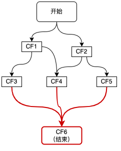

### 什么是 CompletableFuture

`CompletableFuture` 实现了两个接口：

- `Future` 表示异步计算的结果。
- `CompletionStage` 用于表示异步执行过程中的一个步骤（Stage），这个步骤可能是由另外一个CompletionStage 触发的，随着当前步骤的完成，也可能会触发其他一系列CompletionStage的执行。从而我们可以根据实际业务对这些步骤进行多样化的编排组合。

```java
public class CompletableFuture<T> implements Future<T>, CompletionStage<T> {
    ...
}
```

CompletableFuture对Future进行了扩展，可以通过设置回调的方式处理计算结果，同时也支持组合操作，支持进一步的<font color="red">**异步任务编排**</font>，同时**一定程度解决了回调地狱的问题**。


### CompletableFuture 的使用

使用CompletableFuture也是构建依赖树的过程。一个CompletableFuture的完成会触发另外一系列依赖它的CompletableFuture的执行：


如上图所示，这里描绘的是一个业务接口的流程，其中包括CF1\CF2\CF3\CF4\CF5共5个步骤，并描绘了这些步骤之间的依赖关系，每个步骤可以是一次RPC调用、一次数据库操作或者是一次本地方法调用等，在使用CompletableFuture进行异步化编程时，图中的<font color="red">**每个步骤都会产生一个CompletableFuture对象，最终结果也会用一个CompletableFuture来进行表示**</font>。


#### 零依赖：CompletableFuture的创建


接口接收到请求后，首先发起两个异步调用CF1、CF2，主要有三种方式：

```java
ExecutorService executor = Executors.newFixedThreadPool(5);

// 1、使用runAsync或supplyAsync发起异步调用
CompletableFuture<String> cf1 = CompletableFuture.supplyAsync(() -> {
  return "result1";
}, executor);

// 2、CompletableFuture.completedFuture()直接创建一个已完成状态的CompletableFuture
CompletableFuture<String> cf2 = CompletableFuture.completedFuture("result2");

// 3、先初始化一个未完成的CompletableFuture，然后通过complete()、completeExceptionally()，完成该CompletableFuture
CompletableFuture<String> cf = new CompletableFuture<>();
cf.complete("success");
```


#### 一元依赖：依赖一个CF


对于单个CompletableFuture的依赖可以通过thenApply、thenAccept、thenCompose等方法来实现

```java
CompletableFuture<String> cf3 = cf1.thenApply(result1 -> {
  //result1 为 CF1 的结果
  //......
  return "result3";
});

CompletableFuture<String> cf5 = cf2.thenApply(result2 -> {
  //result2为CF2的结果
  //......
  return "result5";
});
```


#### 二元依赖：依赖两个CF


CF4 同时依赖于两个 CF1 和 CF2，这种二元依赖可以通过 thenCombine 等回调来实现

```java
CompletableFuture<String> cf4 = cf1.thenCombine(cf2, (result1, result2) -> {
  //result1和result2分别为cf1和cf2的结果
  return "result4";
});
```


#### 多元依赖：依赖多个CF



整个流程的结束依赖于三个步骤CF3、CF4、CF5，这种多元依赖可以通过`allOf`或`anyOf`方法来实现，区别是当需要多个依赖全部完成时使用`allOf`，当多个依赖中的任意一个完成即可时使用`anyOf`，如下代码所示：

```java
CompletableFuture<Void> cf6 = CompletableFuture.allOf(cf3, cf4, cf5);
CompletableFuture<String> result = cf6.thenApply(v -> {
  //这里的join并不会阻塞，因为传给thenApply的函数是在CF3、CF4、CF5全部完成时，才会执行 。
  result3 = cf3.join();
  result4 = cf4.join();
  result5 = cf5.join();
  //根据result3、result4、result5组装最终result;
  return "result";
});
```


## CompletableFuture 常见操作


### 创建 CompletableFuture

| API                                          | 描述                                                 |
| -------------------------------------------- | ---------------------------------------------------- |
| `supplyAsync(Supplier<U> supplier)`          | 异步执行任务并返回结果。                             |
| `runAsync(Runnable runnable)`                | 异步执行一个任务，不返回结果。                       |
| `completedFuture(T value)`                   | 返回一个已完成的 `CompletableFuture`，结果为给定值。 |
| `completedFutureExceptionally(Throwable ex)` | 返回一个已完成的 `CompletableFuture`，带有异常。     |


### 处理 CompletableFuture  结果（一元依赖）

以下函数的返回值都是 `CompletableFuture` 对象。

| API                                                          | 描述                                                         |
| ------------------------------------------------------------ | ------------------------------------------------------------ |
| `thenApply(Function<? super T,? extends U> fn)`              | 异步任务完成时，对结果进行转换，并返回新的 `CompletableFuture`。 |
| `thenAccept(Consumer<? super T> action)`                     | 异步任务完成时，消费结果，不返回新的 `CompletableFuture`。   |
| `thenRun(Runnable action)`                                   | 异步任务完成时，执行一个新的任务，不关心异步任务的结果。     |
| `thenCompose(Function<? super T,? extends CompletionStage<U>> fn)` | 异步任务完成时，将结果转换为另一个异步操作，并返回其结果。   |
| `exceptionally(Function<Throwable,? extends T> fn)`          | 异步任务完成时，如果遇到异常，则处理异常并返回默认值。       |
| `handle(BiFunction<? super T,Throwable,? extends U> fn)`     | 异步任务完成时，处理结果或异常。                             |


###  组合多个 CompletableFuture（多元依赖）

| API                                                          | 描述                                                         |
| ------------------------------------------------------------ | ------------------------------------------------------------ |
| `thenCombine(CompletionStage<? extends U> other, BiFunction<? super T,? super U,? extends V> fn)` | 当两个异步任务都完成时，组合它们的结果。                     |
| `thenAcceptBoth(CompletionStage<? extends U> other, BiConsumer<? super T,? super U> action)` | 当两个异步任务都完成时，消费它们的结果。                     |
| `allOf(CompletableFuture<?>... cfs)`                         | 当所有给定的 `CompletableFuture` 都完成时，返回一个新的 `CompletableFuture`。 |
| `anyOf(CompletableFuture<?>... cfs)`                         | 当任意一个给定的 `CompletableFuture` 完成时，返回一个新的 `CompletableFuture`。 |


### 阻塞和获取结果

| API                                | 描述                                                       |
| ---------------------------------- | ---------------------------------------------------------- |
| `join()`                           | 等待异步任务完成并返回结果，如果有异常会抛出未检查的异常。 |
| `get()`                            | 阻塞等待异步任务完成并返回结果，可能抛出已检查异常。       |
| `get(long timeout, TimeUnit unit)` | 阻塞等待异步任务完成并返回结果，超时后抛出异常。           |


## CompletableFuture 原理


观察者模式

被观察者： 每个CompletableFuture都可以被看作一个被观察者，其内部有一个Completion类型的链表成员变量stack，用来存储注册到其中的所有观察者。当被观察者执行完成后会弹栈stack属性，依次通知注册到其中的观察者。

观察者： 被观察者CF中的result属性，用来存储返回结果数据。


CompletableFuture中包含两个字段：**result**和**stack**。result用于存储当前CF的结果，stack（Completion）表示当前CF完成后需要触发的依赖动作（Dependency Actions），去触发依赖它的CF的计算，依赖动作可以有多个（表示有多个依赖它的CF），以栈（[Treiber stack](https://en.wikipedia.org/wiki/Treiber_stack)）的形式存储，stack表示栈顶元素。

依赖动作（Dependency Action）都封装在一个单独Completion子类中， 即观察者


## 参考资料

[CompletableFuture原理与实践-外卖商家端API的异步化 - 美团技术团队 (meituan.com)](https://tech.meituan.com/2022/05/12/principles-and-practices-of-completablefuture.html)

