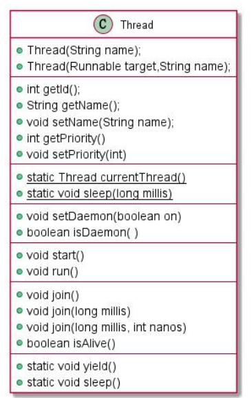

## 线程 Thread类

### Thread 类

一个线程在Java中使用一个Thread实例来描述。Thread类是 Java语言一个重要的基础类，位于java.lang包中，用于存储和操作线程的描述信息。

```java
public class Thread implements Runnable {

}
```


### 常用方法

以下是 Java 中 [`Thread`](https://docs.oracle.com/en/java/javase/17/docs/api/java.base/java/lang/Thread.html#nested-class-summary) 类的常用属性和方法的列表




## 线程状态概述

### 线程状态

在 Java 中，[`Thread.State`](https://docs.oracle.com/en/java/javase/17/docs/api/java.base/java/lang/Thread.State.html) 枚举类定义了线程的几种状态。

```java
public enum State {
	NEW,			// 新建
	RUNNABLE,		// 可执行：包含系统的就绪、运行两种状态
	BLOCKED,		// 阻塞
	WAITING,		// 等待
	TIMED_WAITING,	// 计时等待
	TERMINATED;		// 终止
}
```

以下是各个线程状态的详细解释：

- **NEW**：线程尚未启动。
- **RUNNABLE**：线程处于可运行状态，正在Java虚拟机中执行，但可能正在等待操作系统提供的资源，如处理器。
- **BLOCKED**：线程处于阻塞状态，正在等待监视器锁，以进入或重新进入同步块/方法
- **WAITING**：线程处于等待状态，由于调用了Object.wait()、Thread.join()或LockSupport.park()等方法，正在等待其他线程执行特定操作。
- **TIMED_WAITING**：线程处于定时等待状态，由于调用了带有等待时间的Thread.sleep()、Object.wait()、Thread.join()或LockSupport.parkNanos()等方法，正在等待一段时间或其他线程的操作。
- **TERMINATED**：线程已经终止执行。

在Thread.State定义的6种状态中，有4种是比较常见的状态，它们是：NEW（新建）状态、 RUNNABLE（可执行）状态、TERMINATED（终止）状态、TIMED_WAITING（限时等待）状态。


### JVM 线程状态和操作系统对应关系

JVM 的幕后工作和操作系统的线程调度有关。Java中的线程管理是通过 JNI 本地调用的方式， 委托操作系统的线程管理 API 完成的。当 Java 线程的 Thread 实例的 start() 方法被调用后，操作系统中的对应线程进入的并不是运行状态，而是就绪状态，而 Java 线程并没有这个就绪状态。


### 线程状态变化


### 测试案例

```java
public class State {
    public static void main(String[] args) {
        Thread thread = new Thread(() -> {
            try {
                Thread.sleep(1000);
                System.out.println("Thread is running");
            } catch (InterruptedException e) {
                e.printStackTrace();
            }
        });

        System.out.println("State before start: " + thread.getState()); // NEW

        thread.start();
        System.out.println("State after start: " + thread.getState()); // RUNNABLE

        try {
            Thread.sleep(500);
            System.out.println("State after sleeping: " + thread.getState()); // TIMED_WAITING
            thread.join();
            System.out.println("State after join: " + thread.getState()); // TERMINATED
        } catch (InterruptedException e) {
            e.printStackTrace();
        }
    }
}
```


## 线程中断 

`interrupt()` 方法是 Java 中用于中断线程的一种机制。它并不会直接终止线程，而是设置一个中断标志位，通知目标线程它被请求中断了。具体来说，线程通过检查自身的中断状态来响应这个中断请求。


### interrupt()  方法

`interrupt()` 不会直接停止线程的执行，而是设置线程的中断标志位，告知线程它应该注意自身是否应该停止执行。

```java
 	// 表示线程的中断状态，true 表示线程已被标记为中断， false 表示未被中断
	private volatile boolean interrupted;

	/**
     * 中断当前线程。
     * 
     * 1. 检查当前线程是否是调用此方法的线程，如果不是则进行访问权限检查。
     * 2. 如果线程被某个对象阻塞（如I/O操作），则调用阻塞对象的中断方法。
     * 3. 设置线程的中断状态为true，并通知虚拟机中断该线程。
     */
    public void interrupt() {
        // 检查当前线程是否是调用此方法的线程
        if (this != Thread.currentThread()) {
            checkAccess();

            // 线程可能被阻塞在I/O操作或其他等待操作中
            synchronized (blockerLock) {
                Interruptible b = blocker;
                if (b != null) {
                    interrupted = true;
                    interrupt0();  // 通知虚拟机中断线程
                    b.interrupt(this);
                    return;
                }
            }
        }
        interrupted = true;
        // 通知虚拟机中断线程，并没有直接中断线程执行
        interrupt0();
    }
```

`interrupt()`  对不同类型的线程的执行结果如下：

- **非阻塞线程**： 对于非阻塞的线程，`interrupt()` 仅仅是将线程的中断状态置为 `true`。如果线程不检查这个状态，它将继续运行。

- **阻塞线程**： 对于处于等待、睡眠或阻塞状态的线程，调用 `interrupt()` 会让线程抛出 `InterruptedException`，这也是阻塞状态下唯一响应中断的方法。例如，在调用 `Thread.sleep()`、`Object.wait()`、`BlockingQueue.take()` 等方法时，如果线程被中断，将抛出 `InterruptedException`


### isInterrupted() 方法

`isInterrupted()` 检查当前线程是否被中断，并返回一个布尔值。

```java
    public static boolean interrupted() {
        Thread t = currentThread();
        boolean interrupted = t.interrupted;
        // We may have been interrupted the moment after we read the field,
        // so only clear the field if we saw that it was set and will return
        // true; otherwise we could lose an interrupt.
        if (interrupted) {
            t.interrupted = false;
            clearInterruptEvent();
        }
        return interrupted;
    }
```


## join 方法

`join()` 方法是 Java 中用于线程同步的一个方法。当一个线程(当前线程)调用另一个线程（目标线程）的 `join()` 方法时，当前线程会被阻塞（进入 **WAITING** 状态），直到目标线程结束执行（即目标线程进入 **TERMINATED** 状态），当前线程才会恢复运行。

通俗地理解，当前线程**“加入(join)”**目标线程的执行过程，直到它完成。

例如，

```java
public class JoinExample {
    public static class MyThread extends Thread {
        @Override
        public void run() {
            for (int i = 0; i < 5; i++) {
                System.out.println(Thread.currentThread().getName() + " - " + i);
                try {
                    Thread.sleep(1000);  // 模拟耗时操作
                } catch (InterruptedException e) {
                    e.printStackTrace();
                }
            }
        }
    }

    public static void main(String[] args) throws InterruptedException {
        MyThread t1 = new MyThread();
        MyThread t2 = new MyThread();

        t1.start(); // 启动第一个线程
        t1.join(); // 主线程等待 t1 线程执行完毕
        System.out.println("t1 has finished.");

        t2.start(); // 启动第二个线程
        t2.join(); // 主线程等待 t2 线程执行完毕
        System.out.println("t2 has finished.");

        System.out.println("All threads have finished.");
    }
}
```

其中，启动 `t1` 线程，并使用 `t1.join()` 等待 `t1` 完成。当 `t2` 完成后，主线程打印 `"Both threads have finished."`。


## 参考资料

[Thread.State (Java SE 17 & JDK 17) (oracle.com)](https://docs.oracle.com/en/java/javase/17/docs/api/java.base/java/lang/Thread.State.html)