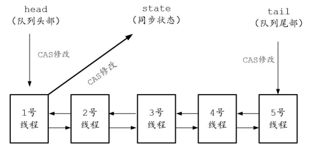

### 什么是 AQS 队列

AQS 是 JUC 提供的一个**用于构建锁和同步容器的基础类**，用于减少由于无效争夺导致的资源浪费和性能恶化。JUC 包内的许多类都是基于 AQS 构建， 例如ReentrantLock、Semaphore、CountDownLatch、ReentrantReadWriteLock、FutureTask等。AQS 解决了在实现同步容器时设计的大量细节问题。

```
public abstract class AbstractQueuedSynchronizer
    extends AbstractOwnableSynchronizer
    implements java.io.Serializable {
}
```


### AQS 的代码设计思路

AQS 出于“分离变与不变”的原则，<font color="red">**基于模板模式实现**</font>。AQS 为锁获取、锁释放的排队和出队过程提供了一系列的模板方法。由于 JUC 的显式锁种类丰富，因此 AQS 将不同锁的具体操作抽取为钩子方法，供各种锁的子类（或者其内部类）去实现。

显示锁和 AQS之间的关系为组合关系。


### 状态标志位

`state` 用于表示同步状态，`volatile` 确保多线程环境下，对 `state` 的修改能立即反映到其他线程中，常用于简单的状态标记或轻量级的同步控制。在 `ReentrantLock` 类中，`state` 就用于实现可重入锁。

同时， AQS 提供了 CAS 算法实现的修改方法 `compareAndSetState()`。

```java
public abstract class AbstractQueuedSynchronizer
    extends AbstractOwnableSynchronizer
    implements java.io.Serializable {
    
    /**
     * The synchronization state.
     */
    private volatile int state;
    
     protected final int getState() {
        return state;
    }
    
    protected final void setState(int newState) {
        state = newState;
    }
    
    // CAS 修改方法
    protected final boolean compareAndSetState(int expect, int update) {
        return U.compareAndSetInt(this, STATE, expect, update);
    }
    
}
```


### 底层数据结构

AQS（AbstractQueuedSynchronizer）内部维护的确是一个 **FIFO（先进先出） 的双向链表结构**，用于管理线程的同步状态。这个双向链表的结构特点是，能够从任意节点很方便地访问它的前驱和后继节点，从而在需要唤醒某个线程时，可以快速地找到并操作相关节点。

AQS 的 **`Node` 节点是封装了线程的基本单元**，它们存储线程的信息以及线程的状态。每个线程在争抢锁失败后，会被封装成一个 `Node` 节点，并添加到队列的尾部。当持有锁的线程释放锁时，它会唤醒队列中第一个等待的节点（FIFO），该节点的线程将重新尝试获取锁。如果成功获取锁，该线程将继续执行。

```java
  private transient volatile Node head;
 
  private transient volatile Node tail;
 
  abstract static class Node {
        volatile Node prev;       // initially attached via casTail
        volatile Node next;       // visibly nonnull when signallable
        Thread waiter;            // visibly nonnull when enqueued
        volatile int status;      // written by owner, atomic bit ops by others
        ...
  }
 
```




### 入队和出队

每当线程通过 AQS 获取锁失败时，线程将被封装成一个 Node 节点，通过 CAS 原子操作插入队列尾部。当有线程释放锁时，AQS 会尝试让队首的后驱节点占用锁。AQS的队首节点和队尾节点都是懒加载的。

```java
    final void enqueue(Node node) {
        if (node != null) {
            for (;;) {
                Node t = tail;
                node.setPrevRelaxed(t);        // avoid unnecessary fence
                if (t == null)                 // initialize
                    tryInitializeHead();
                else if (casTail(t, node)) {
                    t.next = node;
                    if (t.status < 0)          // wake up to clean link
                        LockSupport.unpark(node.waiter);
                    break;
                }
            }
        }
    }

```


### AQS 提供的钩子方法

AQS **针对共享锁和独享锁这两种资源共享方式提供了不同的模板方法**，定义了不同的钩子方法：

- tryAcquire(int)：独占锁钩子，尝试获取资源。若成功则返回true，若失败则返回false。
- tryRelease(int)：独占锁钩子，尝试释放资源。若成功则返回true，若失败则返回false。
- tryAcquireShared(int)：共享锁钩子，尝试获取资源，负数表示失败；0表示成功，但没有剩 余可用资源；正数表示成功，且有剩余资源。
- tryReleaseShared(int)：共享锁钩子，尝试释放资源。若成功则返回true，若失败则返回false。
- isHeldExclusively()：独占锁钩子，判断该线程是否正在独占资源。只有用到condition条件 队列时才需要去实现它。