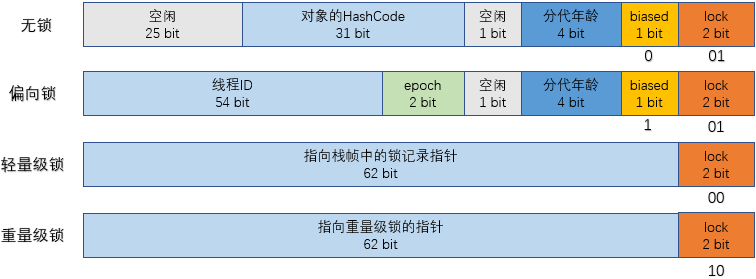

## 一、Java 内置锁

### 1.1 什么是 Java 内置锁

Java 内置锁（intrinsic lock）是 Java 提供的一种用于同步的机制，属于互斥锁。

**每个 Java 对象都可以用作一个内置锁**。线程进入同步代码块或方法时会自动获得该锁，在退出同步代码块或方法时会释放该锁。获得内置锁的唯一途径就是进入被这个锁保护的同步代码块或方法。

**Java 的内置锁基于 `synchronized` 关键字来实现**，可以确保多个线程在访问共享资源时不会发生冲突。使用 `synchronized(syncObject) `调用相当于获取 syncObject 的内置锁，所以可以使用内置锁对临界区代码段进行排他性保护。

### 1.2 为什么 Java 内置锁也被称为监视器锁

在 Java 中，**每一个 Java 对象实例都会关联一个 `Monitor` 对象**，因此这也被称为对象锁。`Monitor` 对象称为管程或监视器锁。这个 `Monitor` 对象既可以和关联对象一起创建和销毁，也可以在线程试图获取锁对象时生成。当 `Monitor` 对象由线程持有时，它便处于锁定状态。

具体细节查看 [【Java 多线程】 深入了解监视器锁 ](https://www.cnblogs.com/zebt/articles/17737727.html)

## 二、内置锁的状态

在对象结构里，对象头中的 Mark Word 记录着内置锁的信息。内置锁的 4 种状态如下：

其中，Mark Word 部分内容的含义如下：

- `biased`：对象是否启用偏向锁标记，只占1个二进制位。为1时表示对象启用偏向锁， 为0时表示对象没有偏向锁。
- `lock`：锁状态标记位，占两个二进制位，由于希望用尽可能少的二进制位表示尽可能多的 信息，所以设置了lock标记。该标记的值不同，整个Mark Word表示的含义不同。

**内置锁状态随着竞争情况升级，但是不能降级**。锁状态的升级顺序通常是：无锁 -> 偏向锁 -> 轻量级锁 -> 重量级锁。这种能升级却不能降级的策略，其目的是为了提高获得锁和释放锁的效率。

### 2.1 无锁状态

Java对象刚创建时还没有任何线程来竞争，说明该对象处于无锁状态（无线程竞争它）

### 2.2 偏向锁状态

**定义**：偏向锁是指一段同步代码一直被同一个线程所访问，那么该线程会自动获取锁，降低获取锁的代价。

**工作原理**：当一个线程获得偏向锁后，锁会偏向这个线程，如果同一个线程再次进入同步块，不需要进行任何同步操作。只有当其他线程尝试竞争该锁时，偏向锁才会被撤销。

**使用场景**：适用于绝大多数情况下只有一个线程访问同步块。

### 2.3 轻量级锁状态

**定义**：轻量级锁是一种在多线程竞争较少的情况下，用于减少传统重量级锁（操作系统互斥量）带来的性能开销的锁机制。

**工作原理**：

- 锁记录：当有两个线程开始竞争这个锁对象时，偏向锁升级为轻量级锁，**两个线程公平竞争**，哪个线程先占有锁对象，锁对象的 Mark Word 就指向哪个线程的栈帧中的锁记录。
- 自旋等待：企图抢占的线程会**通过自旋的形式尝试获取锁**，不会阻塞抢锁线程，以便提高性能。自旋原理非常简单，如果持有锁的线程能在很短时间内释放锁资源，那么那些等待竞争锁的 线程就不需要做内核态和用户态之间的切换进入阻塞挂起状态，它们只需要等一等（自旋），等持有锁的线程释放锁后即可立即获取锁，这样就**避免用户线程和内核切换的消耗**。
- CAS获取锁：线程使用 CAS 操作尝试将锁对象的 Mark Word 更新为指向线程锁记录的指针，并将锁标志位修改为表示轻量级锁的状态。如果 CAS 操作成功，表示线程获得了锁。

**锁升级：**如果持有锁的线程执行的时间**超过自旋等待的最大时间仍没有释放锁**，就会导致其他争用锁 的线程在最大等待时间内还是获取不到锁，自旋不会一直持续下去，这时争用线程会停止自旋进入阻塞状态，该锁膨胀为重量级锁

**使用场景**：适用于多线程竞争不激烈的情况。

### 2.4 重量级锁

**定义**：重量级锁是传统的互斥锁，会让其他申请的线程之间进入阻塞。重量级锁基于操作系统的Mutex Lock 实现，**线程阻塞和唤醒操作需要进程在内核态和用户态之间来回切换**，导致其性能非常低。

**工作原理**：重量级锁依赖于操作系统的互斥机制，当一个线程获取锁时，其他线程会被阻塞。

### 2.5 不同锁的区别

**轻量级锁与偏向锁类似，都是jdk对于多线程的优化。**

- 偏向锁是在无资源竞争的情况下完全消除同步
- 轻量级锁是通过CAS来避免开销较大的互斥操作
- 重量级锁则是使用操作系统底层的互斥操作

| 锁类型   | 优点                                                         | 缺点                                            | 适用场景                           |
| -------- | ------------------------------------------------------------ | ----------------------------------------------- | ---------------------------------- |
| 偏向锁   | 加锁和解锁不需要额外的消耗，和执行非同步方法比仅存在纳秒级的差距 | 如果线程间存在锁竞争，会带来额外的锁撤销的消耗  | 适用于只有一个线程访问临界区的场景 |
| 轻量级锁 | 竞争的线程不会阻塞，提高了程序的响应速度                     | 抢不到锁竞争的线程使用 CAS 自旋等待，会消耗 CPU | 锁占用时间很短，吞吐量高           |
| 重量级锁 | 线程竞争不使用自旋，不会消耗 CPU                             | 线程阻塞，响应时间缓慢                          | 锁占用时间较长，吞吐量低           |

## 参考资料

[【Synchronized】Java 内置锁的使用及原理、锁升级详解（强烈阅读，讲解十分详细） ](https://www.cnblogs.com/kukuxjx/p/17250132.html)

[【Java 多线程】5 - 7 深入了解监视器锁 （讲解java 对象头、Monitor 对象）](https://www.cnblogs.com/zebt/articles/17737727.html)

《 极致经典（卷2）：Java高并发核心编程(卷2 加强版) -特供v21-release》