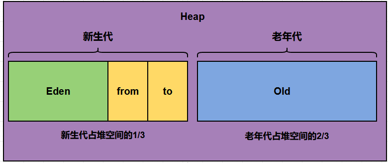

### 如何判断对象是否已死

垃圾收集器在对堆进行回收前，第一步就是判断哪些对象死亡（不可达）。 **死亡指不可能再被任何途径使用的对象**。

**(1) 引用计数法（Reference Counting）**

引用计数法**为每个对象维护一个引用计数器**。当有一个新的引用指向该对象时，计数器加一；当一个引用不再指向该对象时，计数器减一。如果计数器的值为零，说明该对象不再被任何其他对象引用，因此可以认为该对象是死亡的，能够被垃圾回收器回收。

但是，该算法**无法解决循环引用问题**：如果两个对象互相引用，但没有其他对象引用它们，引用计数不会归零，导致它们无法被回收。

**(2) 可达性分析算法（Reachability Analysis）**

可达性分析算法的基本思路是以一组称为 **GC Roots** 的根对象为起点，遍历对象引用关系。如果一个对象从 GC Roots 不可达，那么该对象就被认为是“死”的，可以被垃圾回收。

### 对象死亡的判定过程

即使在可达性分析算法中判定为不可达的对象，也不是“非死不可”的，这时候它们暂时还处于“缓刑”阶段，**要真正宣告一个对象死亡，至少要经历两次标记过程**。

具体标记过程如下：

1. **第一次标记**： 如果对象在经过可达性分析后不可达，垃圾回收器会进行第一次标记。随后进行一次筛选，筛选的条件是**判断此对象是否有必要执行 finalize()方法**。
   - 假如对象没有覆盖 finalize() 方法，或者finalize() 方法已经被虚拟机调用过，那么虚拟机将这两种情况都视为“没有必要执行”。这时，对象会被回收。
   - 如果对象覆盖了 `finalize()` 方法，并且该方法尚未被调用过，虚拟机判定为有必要执行。这时，对象将处于处于 **“finalize”** 阶段，并不一定会立即被回收。

2. **Finalization 阶段**： 如果对象覆盖了 `finalize()` 方法，并且该方法尚未被调用过，那么 JVM 会将这个对象放入一个 `F-Queue` 队列中，等待 `finalize()` 方法被调用。finalize()方法是对 象逃脱死亡命运的最后一次机会。
   - 如果**对象在 `finalize()` 方法中重新将自己与其他对象关联起来**（例如将自己赋值给一个类的静态字段），对象可能会“复活”。
   - 如果 `finalize()` 方法没有让对象复活，或者对象没有重写 `finalize()` 方法，那么对象会被再次标记为“不可达”。

3. **第二次标记**： 在 `finalize()` 之后，如果对象仍然不可达，那么将会被确认为死亡，并会在下一次垃圾回收时被回收。

### 分代收集理论的概念

针对新生代和老年代，收集的定义有：

- 部分收集（Partial GC）：指目标不是完整收集整个Java堆的垃圾收集。其中又分为：
  - 新生代收集（Minor GC/Young GC）：指目标只是新生代的垃圾收集。
  - 老年代收集（Major GC/Old GC）：指目标只是老年代的垃圾收集。目前只有CMS收集器会有单 独收集老年代的行为。
  - 混合收集（Mixed GC）：指目标是收集整个新生代以及部分老年代的垃圾收集。目前只有G1收 集器会有这种行为。
- 整堆收集（Full GC）：收集整个Java堆和方法区的垃圾收集。

### 分代收集理论下的堆内存划分

**新生代**

新生代是用于存放新创建的对象。由于大多数对象的生命周期较短，因此它们首先分配到新生代。新生代又进一步划分为三个区域：

1. **Eden（伊甸园区）**：大多数新对象在这里被分配。当 Eden 满了时，会触发一次次要垃圾回收（Minor GC），并将存活的对象移到 Survivor 区。
2. **Survivor 区**：新生代中的存活对象被转移到这两个 Survivor 区（S0 和 S1），它们是彼此对称的。每次垃圾回收后，存活的对象在这两个区之间不断互相复制和移动。一个 Survivor 区为空，另一个则保存存活的对象。

**老年代**

当对象在新生代经过几次垃圾回收依然存活，或者它的生命周期较长，它们会被晋升到老年代。老年代主要存放那些生命周期较长的对象。

### 垃圾收集器的理论方法

#### 标记-清除算法

**标记-清除算法**：垃圾回收器会遍历所有不可达的对象，标记它们为可回收状态，并在垃圾回收阶段清除这些对象，回收它们的内存。

存在问题：

- 执行效率不稳定，当面对大量可回收对象时效率较低
- 内存空间碎片化，标记-清楚会产生不连续的内存碎片

#### 标记-复制算法

为了解决标记-清除算法面对大量可回收对象时执行效率低 的问题

**标记-复制算法**：在年轻代中，通常使用复制算法，通过可达性分析将存活对象**复制到新的区域**，不可达的对象被认为死亡并直接丢弃。

存在问题：

- 将可用内存缩小为原来的一半
- 当对象存活率较高时，执行较多的复制操作

#### 标记-整理算法

**标记-整理算法**：标记不可达对象后，将存活对象**移动到内存的连续区域**，整理内存，回收死亡对象的内存空间。

### 垃圾收集器

垃圾收集器的具体实现主要有 Garbage First（简称G1）、CMS（Concurrent Mark Sweep）收集器。

#### CMS 收集器（不推荐使用）

CMS（Concurrent Mark Sweep）收集器是一种以**获取最短回收停顿时间为目标的收集器**。

CMS收集器是**基于标记-清除算法实现**的，实现步骤有：

- 初始标记（CMS initial mark）：标记一下 GC Roots 能直接关联到的对象，速度很快
- 并发标记（CMS concurrent mark）：从 GC Roots 的直接关联对象开始遍历整个对象图的过程，这个过程耗时较长但是不需要停顿用户线程，可以与垃圾收集线程一起并发运行
- 重新标记（CMS remark）：重新标记阶段则是为了修正并发标记期间，因用户程序继续运作而导致标记产生变动的那一部分对象的标记记录
- 并发清除（CMS concurrent sweep）清理删除掉标记阶段判断的已经死亡的 对象，由于不需要移动存活对象，所以这个阶段也是可以与用户线程同时并发的。

其中，**初始标记、重新标记这两个步骤仍然需要“Stop The World”**。

####  Garbage First 收集器

(1) **设计思想**

 Garbage First 收集器使用了 **Mixed GC 模式** 。

**Mixed GC 模式** ：在G1收集器出现之前的所有 其他收集器，包括CMS在内，垃圾收集的目标范围要么是整个新生代（Minor GC），要么就是整个老 年代（Major GC），再要么就是整个Java堆（Full GC）。而G1跳出了这个樊笼，它可以**面向堆内存任 何部分来组成回收集（Collection Set，一般简称CSet）进行回收**，衡量标准不再是它属于哪个分代，而 是哪块内存中存放的垃圾数量最多，回收收益最大，

**(2) 实现思路**

G1开创的**基于Region的堆内存布局**是它能够实现这个目标的关键，即 ”化整为零“ 的解题思路。同时，根据每次清除的 Region 数目，从而建立可靠的停顿预测模型。

虽然G1也仍是遵循分代收集理 论设计的，但其堆内存的布局与其他收集器有非常明显的差异：G1不再坚持固定大小以及固定数量的 分代区域划分，而是把连续的Java堆划分为多个大小相等的独立区域（Region），每一个Region都可以根据需要，扮演新生代的Eden空间、Survivor空间，或者老年代空间。收集器能够对扮演不同角色的 Region采用不同的策略去处理，这样无论是新创建的对象还是已经存活了一段时间、熬过多次收集的 旧对象都能获取很好的收集效果。

**(3) 运作过程**

在**基于Region的堆内存布局**的基础上，G1收集器使用标记—整理算法，运作过程大致可划分为以下四个步骤：

- 初始标记（Initial Marking）：仅仅只是标记一下GC Roots能直接关联到的对象，
- 并发标记（Concurrent Marking）：从GC Root开始对堆中对象进行可达性分析，递归扫描整个堆里的对象图
- 最终标记（Final Marking）：对用户线程做另一个短暂的暂停，用于处理并发阶段结束后仍遗留 下来的最后那少量的SATB记录。
- 筛选回收（Live Data Counting and Evacuation）：负责更新Region的统计数据，对各个Region的回 收价值和成本进行排序，根据用户所期望的停顿时间来制定回收计划，可以自由选择任意多个Region 构成回收集，然后把决定回收的那一部分Region的存活对象复制到空的Region中，再清理掉整个旧 Region的全部空间。

其中，除了并发标记外，其余阶段也是要完全暂停用户线程的。

**（4）大对象区**

G1 收集器为大对象特意分配了专门的区域。