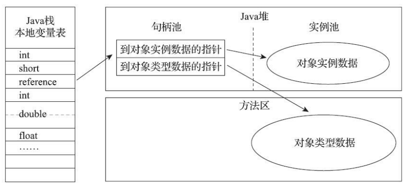
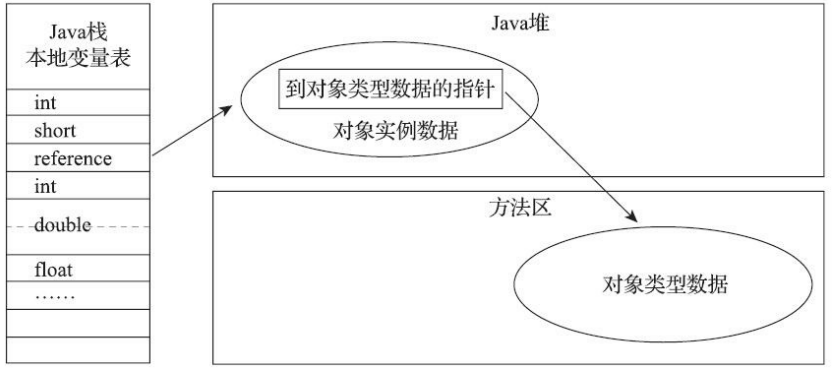

### 对象的创建过程

在 Java 虚拟机（ JVM ）中，创建一个对象的过程涉及多个步骤，从类加载到内存分配，再到对象初始化。

```plaintext
1. 类加载检查 --> 2. 内存分配 --> 3. 内存初始化 --> 4. 对象头设置 --> 5. 构造函数调用 --> 6. 返回引用
```

详细创建过程如下：

1. **类加载检查**

   当 Java 虚拟机遇到一条字节码 new 指令时，首先将去检查这个指令的参数是否能在常量池中定位到一个类的符号引用，并且检查这个符号引用代表的类是否已被加载、解析和初始化过。如果没有，那 必须先执行相应的类加载过程。

2. **内存分配**

   在类加载检查通过后，**虚拟机根据新生对象的大小在堆中分配一块连续的内存空间**。将为新生对象分配内存。对象所需内存的大小在类加载完成后便可完全确定。

   内存分配方式有：

   - **指针碰撞（Bump-the-pointer）**：如果堆内存是规整的，所有已使用内存位于一边，空闲内存在另一边，中间有一个指针指示内存边界，分配时只需移动指针。
   - **空闲列表（Free List）**：如果堆中已使用和未使用的内存交错存在，JVM 会使用一个空闲列表来找到合适的内存块。

   选择哪种分配方式由 Java 堆是否规整决定，而 Java 堆是否规整又由所采用 的垃圾收集器是否带有空间压缩整理（Compact）的能力决定。实际上来说，**内存分配的方式依赖于垃圾收集器的实现**。

   另外，对象创建的线程安全问题由CAS配上失败重试和本地线程分配缓冲（Thread Local Allocation Buffer，TLAB）来解决

3. **内存初始化**

   内存分配完成之后，**虚拟机必须将分配到的内存空间（但不包括对象头）都初始化为零值**。这步操作保证了对象的实例字段 在Java代码中可以不赋初始值就直接使用，使程序能访问到这些字段的数据类型所对应的零值。

4. **对象头设置**

   Java虚拟机还要对对象进行必要的设置，通常包括以下内容：

   - **Mark Word**：包含对象的哈希码、GC 标志、锁状态、对象的GC分代年龄等。

   - **类元数据指针**：指向对象对应的类元数据，标识该对象是哪个类的实例。

   - **数组长度（如果是数组）**：如果对象是数组，还需要记录数组的长度。

   根据虚拟机当前运行状态的不同，如是否启用偏向锁等，对象头会有不同的设置方式。

5. **构造函数调用**

   new 指令之后会接着执行 Class 文件中的 `<init>()` 方法，按照程序员的意愿对对象进行初始化.

6. **返回对象的引用**

   对象创建完毕后，JVM 将该对象的引用返回给调用者。引用是指向堆中对象的内存地址。


### 对象的内存布局

在HotSpot虚拟机里，对象在堆内存中的存储布局可以划分为三个部分：对象头（Header）、实例 数据（Instance Data）和对齐填充（Padding）。

1. **对象头**

   对象头是 JVM 用来<font color="blue">**存储对象的元数据信息的部分**</font>，通常包括两部分内容：

   - **标记字段（Mark Word）**：用于存储对象自身的运行时数据，如哈希码（HashCode）、GC分代年龄、锁状态标志、线程持有的锁、偏向线程ID、偏向时间戳等，这部 分数据的长度在32位和64位的虚拟机（未开启压缩指针）中分别为32个比特和64个比特。

   - **类型指针（Type Pointer）**：即对象指向它的类型元数据的指针，Java虚拟机通过这个指针来确定该对象是哪个类的实例。

   对于数组类型的对象，对象头还会存储数组的长度信息。

2. **实例数据**

   实例数据部分是<font color="blue">**对象真正存储的有效信息**</font>，即对象的实例变量。实例数据部分存储了对象的所有非静态字段（静态字段属于类，不属于对象，因此存储在方法区中）。

   这部分的存储顺序会受到虚拟机分配策略参数（-XX：FieldsAllocationStyle参数）和字段在Java源码中定义顺序的影响。

3. **对齐填充**

   为了确保对象的内存地址能够按照机器的字节对齐要求进行排列，JVM 可能会在对象的内存布局中加入一些填充字节。

   - 对齐的目的是为了提高内存访问效率。**JVM 通常要求对象的大小是 8 字节的倍数**，因此如果对象的大小不是 8 的倍数，JVM 会填充一些字节使其对齐。

   - 这些填充字节通常位于对象的末尾，并不包含有意义的数据。


### 对象的访问定位

Java 对象的访问定位是指<font color="blue">**JVM 如何通过 Java 虚拟机栈上的 reference 数据在堆中找到对象的实际存储位置**</font> 。《Java虚拟机规范》里面只规定了reference 数据它是一个指向对象的引用，并没有定义 这个引用应该通过什么方式去定位、访问到堆中对象的具体位置，所以对象访问方式也是由虚拟机实现而定的。

主流的访问方式主要由句柄和直接指针两种。

**(1) 句柄访问方式（Handle Access）**

在句柄访问方式下,  Java 堆中将可能会划分出一块内存来作为句柄池，reference 中存储的就是对象的句柄地址，而句柄中包含了对象实例数据与类型数据各自具体的地址信息。

> 句柄（**Handle**）是一种间接的引用方式，它提供了对资源（如对象、文件、内存块、设备等）的间接访问。



使用句柄来访问的最大好处就是 reference 中存储的是稳定句柄地址，在对象被移动（垃圾收集时移动对象是非常普遍的行为）时只会改变句柄中的实例数据指针，而 <font color="red">**reference本身不需要被修改**</font>。

但是，由于增加了句柄的间接访问，需要多一次内存的访问操作，性能上稍逊于直接指针访问方式。


**(2) 直接指针访问方式（Direct Pointer Access）**

在直接指针访问方式下，reference 数据直接指向对象的实例数据内存地址。另外，Java堆中对象的内存布局必须考虑如何放置访问类型数据的相关信息。



使用直接指针来访问最大的好处就是**速度更快**，它节省了一次指针定位的时间开销。

但是，当对象在内存中移动（如垃圾回收期间），所有指向该对象的引用都需要更新，以确保它们仍然指向正确的内存地址。这对内存管理和维护程序的正确性提出了很大的挑战。