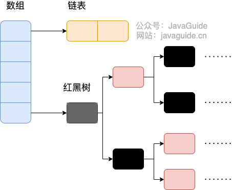

### HashMap 简介

`HashMap` 是 Java 集合框架中的一个实现了 `Map` 接口的类。它基于哈希表实现，提供了一个键值对的映射关系，并且允许快速的查找、插入和删除操作。

```java
public class HashMap<K,V> extends AbstractMap<K,V>
    implements Map<K,V>, Cloneable, Serializable{
    ...
}
```


### 底层数据结构

在 JDK 17， 数据结构为 <font color="red">**数组 + 链表 / 红黑树**</font>。其中，

- 数组： 存放 HashMap 里面的键值对。
- 链表 / 红黑树：解决哈希冲突。当链表达到一定长度时，链表将会转化为红黑树。




`table` 是 `HashMap` 用来存储键值对的数组，具体细节为：

- 每个元素是一个链表的头节点（或者在树化的情况下是一个红黑树的根节点）。
- 数组的长度总是 2 的幂，可以通过掩码操作（位运算）高效地计算索引， 这有助于哈希运算的均匀分布。
- 数组在第一次使用时被初始化，并根据需要进行扩容。扩容时，数组的长度会增加到下一个 2 的幂次方。

```java
public class HashMap<K,V> extends AbstractMap<K,V>
    implements Map<K,V>, Cloneable, Serializable{
    
    /**
     * The table, initialized on first use, and resized as
     * necessary. When allocated, length is always a power of two.
     * (We also tolerate length zero in some operations to allow
     * bootstrapping mechanics that are currently not needed.)
     */
    transient Node<K,V>[] table;
    
    static class Node<K,V> implements Map.Entry<K,V> {
        final int hash;     // 哈希值
        final K key;        // 键
        V value;            // 值
        Node<K,V> next;     // 指向下一个节点，链表或者红黑树中的节点

        // 构造函数、setter、getter 方法
        ...
    }
   
}

```


### 较为重要的参数

`HashMap` 中需要了解的参数有 `threshold` 和 `loadFactor`。

```java
public class HashMap<K,V> extends AbstractMap<K,V>
    implements Map<K,V>, Cloneable, Serializable {

    /**
     * HashMap 需要扩容的阈值。
     * 当 HashMap 中的元素数量达到该阈值时，会触发 HashMap 的扩容操作。
     * 阈值计算公式为：threshold = capacity * load factor
     */
    int threshold;

    /**
     * HashMap 的加载因子。
     * 加载因子用于衡量 HashMap 的填充程度，影响扩容的频率。
     * 加载因子越大，HashMap的利用率越高，但可能增加碰撞的概率，从而影响性能。
     */
    final float loadFactor;
}

```

其中，`loadFactor` 会在无参构造函数里面初始化为 0.75 。


### 什么时候链表转换为红黑树

在 `HashMap` 中，链表会在特定条件下转换为红黑树，以提高性能。具体流程为：

1. **检查链表长度是否超过阈值**：当一个哈希桶中的链表长度超过 `TREEIFY_THRESHOLD`，调用`treeifyBin()` 函数，链表会被转换为红黑树。相关源码为：

   ```java
   // 当某个链表的长度超过此阈值时，该链表可能会转换为红黑树以提高查找效率
   static final int TREEIFY_THRESHOLD = 8;
     
   final V putVal(int hash, K key, V value, boolean onlyIfAbsent,
                      boolean evict) {
   	...
   	if (binCount >= TREEIFY_THRESHOLD - 1) // -1 for 1st
       	treeifyBin(tab, hash);
       ...                   
   }
   ```
   
2. **链表转化为红黑树**：首先，创建一个红黑树，开始时将链表中的节点插入到红黑树中。每个链表节点会被转换为红黑树节点（`TreeNode`）。然后，检查哈希表是否为空或其长度是否小于红黑树所需的最小容量。相关源码为：

   ```java
   // 当给定索引的桶中的链表转换为红黑树时，哈希表要求的最小容量
   static final int MIN_TREEIFY_CAPACITY = 64;
   
   /**
    * 将给定索引的桶中的链表转换为红黑树，前提是哈希表的容量足够。
    * 如果哈希表的容量不足，则会先进行扩容。
    *
    * @param tab 哈希表（桶数组）。
    * @param hash 键的哈希值。
    */
   final void treeifyBin(Node<K,V>[] tab, int hash) {
       int n, index;
       Node<K,V> e;
   
       // 检查哈希表是否为空或其长度是否小于红黑树所需的最小容量
       if (tab == null || (n = tab.length) < MIN_TREEIFY_CAPACITY) {
           // 如果哈希表的容量不足，则进行扩容
           resize();
       } else if ((e = tab[index = (n - 1) & hash]) != null) {
           // 如果指定索引的桶不为空，则开始将链表转换为红黑树
           TreeNode<K,V> hd = null, tl = null; // 红黑树的头节点和尾节点
   
           // 遍历桶中的链表
           do {
               // 将链表中的节点转换为 TreeNode
               TreeNode<K,V> p = replacementTreeNode(e, null);
   
               // 将节点链接成一个双向链表，以构建红黑树
               if (tl == null) {
                   // 如果是链表中的第一个节点，则将其设置为红黑树的头节点
                   hd = p;
               } else {
                   // 否则，将当前节点链接到前一个节点
                   p.prev = tl;
                   tl.next = p;
               }
               // 更新尾节点为当前节点
               tl = p;
           } while ((e = e.next) != null); // 继续遍历直到链表末尾
   
           // 将转换后的红黑树放回哈希表的对应桶中
           if ((tab[index] = hd) != null) {
               // 调用 treeify 方法将链表转换为红黑树，调整树的结构以保持平衡
               hd.treeify(tab);
           }
       }
   }
   
   ```

   


### 链表转换为红黑树的优劣势

**优势**：

- 当某个哈桶中的元素数量超过一定阈值（`TREEIFY_THRESHOLD`），链表会被转换成一个平衡树（红黑树），以提高性能。树化使得在桶中元素数量过多时，**查找时间从 O(n) 降低到 O(log n)**。

**劣势**：

- `TreeNode`  占用的空间是普通节点的两倍，因此只有在桶中元素数量足够多时才会使用树化。树化可以减少性能下降，但在  `hashCode` 分布良好的情况下，树化通常不会被使用。


### 参考资料

[HashMap 源码分析 | JavaGuide](https://javaguide.cn/java/collection/hashmap-source-code.html)