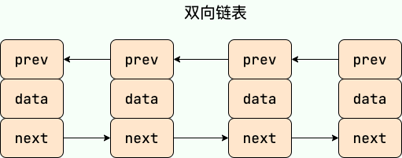

### LinkedList 类简介

 `ArrayList` 继承了 `AbstractSequentialList`，实现了 `List<E>`, `Deque<E>`, `Cloneable`, `java.io.Serializable` 接口。

```java
public class LinkedList<E>
    extends AbstractSequentialList<E>
    implements List<E>, Deque<E>, Cloneable, java.io.Serializable
{
	...
}
```


### 底层数据结构

`LinkedList` 是一个基于双向链表实现的集合类。



```java
public class LinkedList<E>
    extends AbstractSequentialList<E>
    implements List<E>, Deque<E>, Cloneable, java.io.Serializable
{
    /**
     * Pointer to first node.
     */
    transient Node<E> first;

    /**
     * Pointer to last node.
     */
    transient Node<E> last;
    
    /**
      *	链表中的节点类型
      */
    private static class Node<E> {
        E item;
        Node<E> next;
        Node<E> prev;

        Node(Node<E> prev, E element, Node<E> next) {
            this.item = element;
            this.next = next;
            this.prev = prev;
        }
    }
}
```


### LinkedList  时间复杂度

`LinkedList` 在首尾插入、删除元素时，时间复杂度约为 $O(1)$。

`LinkedList` 在指定位置插入、删除元素时，时间复杂度约为 $O(n)$。


### 参考资料

[LinkedList 源码分析 | JavaGuide](https://javaguide.cn/java/collection/linkedlist-source-code.html#linkedlist-简介)