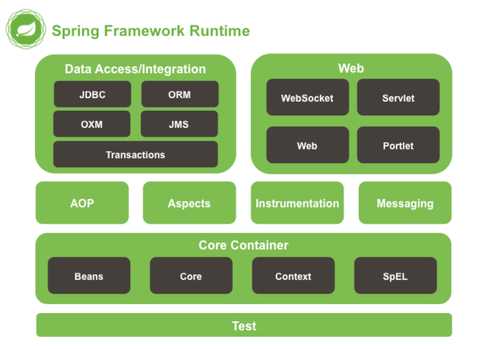

### 什么是 Spring 

Spring 是一个开源的轻量级JavaEE应用框架，旨在简化 Java 应用的开发。

它提供了一套全面的基础设施，包括依赖注入、面向切面编程、事务管理、数据访问、Web开发、消息、测试等功能。

### 为什么选择 Spring

[Spring | Why Spring](https://spring.io/why-spring)

### Spring 发展历史

Spring 包含 JSR 规范。

**JSR**（Java Specification Request）是对 Java 平台添加新规范和标准的请求。每个 JSR 定义了 Java 平台的某个特定方面的标准规范和 API，通常由 Java 社区过程（ JCP，Java Community Process）进行管理。

[Spring Framework Overview :: Spring Framework](https://docs.spring.io/spring-framework/reference/overview.html#overview-philosophy)

### Spring 设计哲学

- 提供每个级别的选择，运用用户延迟设计决策。

[Design Philosophy](https://docs.spring.io/spring-framework/reference/overview.html#overview-philosophy)

### Spring 框架的生态

Spring 发展到现在已经不仅仅是 Spring 框架本身的内容，  Spring 目前提供了大量的基于 Spring 的项目，可以用来更深入地降低我们的开发难度，提高开发效率。

我们常使用的基于 Spring 的项目有：

- Spring Boot：使用默认开发配置来实现快速开发

- Spring Cloud： 为分布式系统开发提供工具集
- Spring Security： 通过认证和授权保护应用

### Spring 框架原则

Spring 框架本身有四大原则：

- 使用 POJO 进行轻量级和最小入式开发
- 通过依赖注入和基于接口编程实现松耦合
- 通过 AOP 和默认习进行声明式编程
- 使用 AOP 和模板( template )减少模式化代码

### Spring Framework 组成模块

### Spring 框架提供的扩展点

- Spring MVC中的Handlerinterceptor: 用于拦截处理请求，可以在请求处理前、处理中和处理后执行特定逻辑。
- Spring MVC中的ControllerAdvice: 用于全局处理控制器的异常、数据绑定和数据校验
- Spring Boot的自动配置: 通过**创建自定义的自动配置类**，可以实现对框架和第三方库的自动配置
- 自定义注解: 创建自定义注解，用于实现特定功能或约定，如权限控制、日志记录等。

### 参考资料

