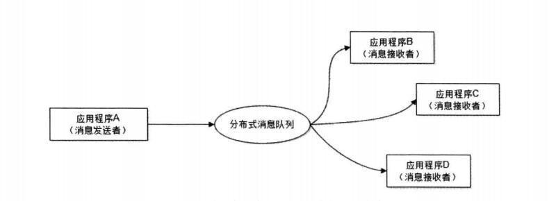
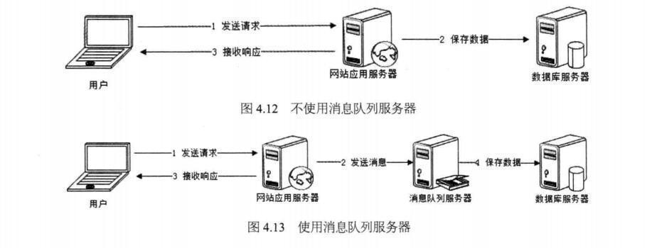
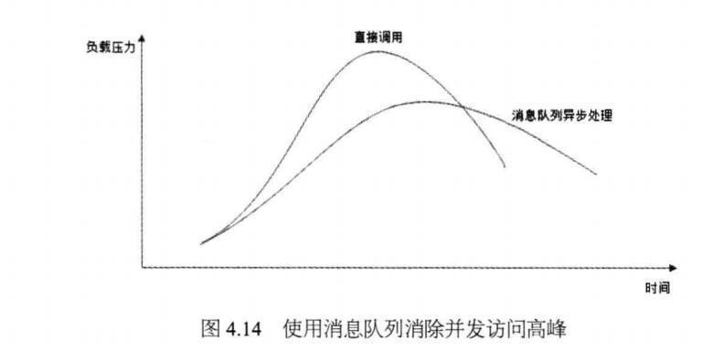

[TOC]

# 一、消息队列概述

## 1.1 什么是消息队列

消息队列(Message Queue, MQ)是一种用于在应用程序之间或不同组件之间进行**异步通信的机制**。

它是一种存储和转发消息的系统，允许生产者将消息发送到队列，然后由消费者从队列中接收消息。

## 1.2 消息队列的作用和优势

消息队列的主要作用包括：

- **解耦**：通过引入消息队列，生产者和消费者之间实现了解耦。它们不需要直接知道彼此的存在，而是通过发送和接收消息进行通信。
- **异步**： 生产者和消费者之间的通信是异步的，即生产者不需要等待消费者立即处理消息。通过异步处理提高系统性能（削峰、减少响应所需时间）
- **削峰**：将某一段时间的超高流量分摊到更长的一段时间内去消化，避免了流量洪峰击垮系统。
- **缓冲**：队列充当了一个缓冲区，使得即使生产者和消费者的速度不一致，也能够平滑地进行通信。

> 实际上，这三个作用就是消息队列的典型应用场景
>
> 同时，异步是实现削峰和缓冲的原因。

### 1.2.1 解耦

如果模块之间不存在直接调用，那么新增模块或者修改模块就对其他模块影响较小，这样系统的可扩展性无疑更好一些。

我们最常见的**事件驱动架构**类似生产者消费者模式，在大型网站中通常用利用消息队列实现事件驱动结构。

### 1.2.2 异步

在不使用消息队列服务器的时候，用户的请求数据直接写入数据库，在高并发的情况下数据库压力剧增，使得响应速度变慢。

但是在使用消息队列之后，用户的请求数据发送给消息队列之后立即 返回，再由消息队列的消费者进程从消息队列中获取数据，异步写入数据库。由于**消息队列服务器处理速度快于数据库（消息队列也比数据库有更好的伸缩性），因此响应速度得到大幅改善**。

### 1.2.3 削峰

消息队列具有很好的削峰作用的功能——即通过异步处理，**将短时间高并发产生的事务消息存储在消息队列中，从而削平高峰期的并发事务**

举例：在电子商务一些秒杀、促销活动中，合理使用消息队列可以有效抵御促销活动刚开始大量订单涌入对系统的冲击。如下图所示：

## 1.3 引入消息队列带来的问题

**技术是把双刃剑！**

引入消息队列，会带来新的问题：

- **增加系统复杂性**。 加入MQ之后，你需要保证消息没有被重复消费、处理消息丢失的情况、保证消息传递的顺序性等等问题
- **降低了系统的可用性**。在加入MQ之前，你不用考虑消息丢失或者说MQ挂掉等等的情况，但是，引入MQ之后你就需要去考虑了
- **复杂性增加**。消息队列带来的异步确实可以提高系统响应速度。但是，万一消息的真正消费者并没有正确消费消息怎么办？这样就会导致数据不一致的情况了

## 1.4 典型应用场景

消息队列在分布式系统、微服务架构、实时数据处理等领域广泛应用，为系统提供了可靠、高效的消息传递机制。

1. **微服务架构：** 在微服务架构中，各个微服务之间需要进行异步通信，以提高系统的弹性和可伸缩性。消息队列可以用于解耦微服务之间的通信，实现松耦合和灵活的服务协作。
2. **任务异步处理：** 当需要异步处理耗时的任务时，消息队列可以作为任务队列的中介，生产者将任务放入队列，而消费者则从队列中取出并处理这些任务，从而提高系统的响应速度。
3. **实时数据处理：** 在需要进行实时数据处理和分析的场景中，消息队列可以用于实时事件的传递和处理。例如，日志收集、实时监控系统等都可以通过消息队列实现。
4. **解耦系统组件：** 消息队列可以帮助解耦系统中的不同组件，使它们独立运作。这在大型分布式系统中特别有用，因为组件之间的松耦合可以提高系统的可维护性和可扩展性。
5. **流媒体处理：** 在处理实时流媒体数据时，消息队列可以用于传递和处理数据流。例如，音视频处理、实时推送等场景都可以借助消息队列实现。
6. **事件驱动架构：** 消息队列是事件驱动架构中的关键组件。通过将事件发布到消息队列，系统中的其他组件可以订阅并响应这些事件，从而实现松耦合的事件驱动系统。
7. **订单处理和支付系统：** 在电子商务系统中，消息队列可以用于处理订单和支付事务。例如，将订单信息异步传递给库存管理系统、支付系统等，以提高订单处理的效率和可靠性。
8. **分布式系统通信：** 在分布式系统中，各个节点之间需要进行通信和协同工作。消息队列可以用于支持分布式系统的通信和协同，以实现数据的可靠传递。

这些应用场景展示了消息队列在不同领域中的灵活性和通用性，使其成为构建可靠、可伸缩和弹性系统的重要工具。

# 二、消息队列的核心概念
## 2.1 消息 

## 2.2 队列 

## 2.3 生产者 

##  2.4 消费者 

## 2.5 主题和订阅

# 参考资料

[新手也能看懂，消息队列其实很简单 - 知乎 (zhihu.com)](https://zhuanlan.zhihu.com/p/52773169)