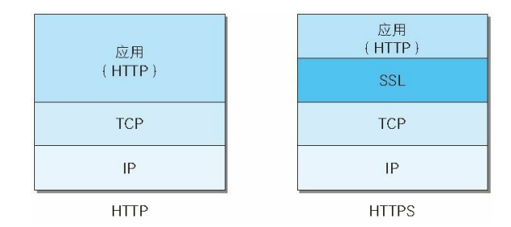

[TOC]

# 一、HTTP的缺点

HTTP中确认访问用户身份的认证

- **通信使用明文**（不加密），内容可能会被窃听
- **不验证通信方的身份**，因此有可能遭遇伪装
- **无法证明报文的完整性**，所以有可能已遭篡改

> 这些不足是未加密协议通常存在的一类问题

## 1.1 通信使用明文可能会被窃听

HTTP协议属于“明文传输协议”，不具备加密的功能。**HTTP报文以“明文”的方式在网络中传输数据**。

按 TCP/IP 协议族的工作机制，**通信内容在所有的通信线路上都有可能遭到窥视**。所谓互联网，是由能连通到全世界的网络组成的。无论世界哪个 角落的服务器在和客户端通信时，在此通信线路上的某些网络设 备、光缆、计算机等都不可能是个人的私有物，所以不排除某个 环节中会遭到恶意窥视行为。因此，**通信使用明文可能会被窃听**，是一个比较大的缺点。

在如何防止窃听保护信息的几种对策中，最为普及的就是加密技术。加密对象主要有：

- **通信线路加密**。HTTP 协议通过和 SSL（Secure Socket Layer，安全套接层）或 TLS（Transport Layer Security，安全层传输协议）的组合使用， 加密 HTTP 的通信内容。用 SSL建立安全通信线路之后，就可以在这条线路上进行 HTTP 通信了。
- **通信内容加密**。对HTTP 报文里所含的内容进行加密处理。不同于SSL/TLS，这种方式仍有内容被篡改的风险。

## 1.2 不验证通信方的身份就可能遭遇伪装

**HTTP 协议中的请求和响应不会对通信方进行确认。**在 HTTP 协议通信时，由于不存在确认通信方的处理步骤，**任何人都可以发起请求**。另外，服务器只要接收到请求，**不管对方是谁都会返回一个响应**（但也仅限于发送端的 IP 地址和端口号没 有被 Web 服务器设定限制访问的前提下）。

因此，通常会存在以下各种隐患：

- 无法确定请求发送至目标的 **Web 服务器**是否是按真实意图返回响应的那台服务器。
- 无法确定响应返回到的**客户端**是否是按真实意图接收响应的那个客户端。
- 无法确定正在通信的对方是否具备**访问权限**。因为某些 Web 服务器上保存着重要的信息，只想发给特定用户通信的权限。
- 由于服务器会对任何人的请求返回一个相应，服务器无法阻止海量下的**DOS攻击**（Denial of Service，拒绝服务攻击）

在如何验证通信方的对策中，HTTPS使用了一种被称为**数字证书**的手段，可用于确定方。

> 数字证书认证的主要目的是确保通信方的身份和通信的机密性，从而防止中间人攻击和数据篡改。而HTTP协议的认证方式(比如Basic认证和Digest认证)的主要目的是对用户进行简单身份验证，验证用户是否有权限访问受保护的资源。

## 1.3 无法证明报文完整性，可能已遭篡改

**HTTP 协议无法证明通信的报文完整性。**在请求报文或响应报文传输途中，报文可能遭攻击者拦截并篡改内容。这种攻击称为**中间人攻击**（Man-in-the-Middle attack，MITM）。

**虽然有使用 HTTP 协议确定报文完整性的方法，但事实上并不便捷、可靠**。其中常用的是 MD5 和 SHA-1 等散列值校验的方法， 以及用来确认文件的数字签名方法。这些方法也依然无法百分百保证确认结果正确。因为 PGP 和 MD5 本身被改写的话，用户是没有办法意识到的。

为了有效防止这些弊端，有必要使用 HTTPS。SSL提供认证和加密处理及摘要功能。仅靠 HTTP 确保完整性是非常困难的，因此 通过和其他协议组合使用来实现这个目标。

# 二、 HTTP+ 加密 + 认证 + 完整性保护 =HTTPS

## 2.1 HTTPS 是身披 SSL 外壳的 HTTP

为了统一解决HTTP协议的这些问题，需要在 HTTP 上再加入加密处理和认证等机制。我们把添加了加密及认证机制的 HTTP 称为 **HTTPS**（HTTP Secure）。

实际上，HTTPS 并非是应用层的一种新协议，只是**将 HTTP 通信接口部分用 SSL/TLS协议代替**而已。通常，HTTP 直接和 TCP 通信。而HTTPS先和 SSL通 信，再由 SSL和 TCP 通信。

> 需要注意的是，**SSL是独立于 HTTP 的协议**。应用层的SMTP 和 Telnet 等其他协议也可配合 SSL协议使用。

## 2.2 HTTPS采用混合加密机制

**HTTPS 采用共享密钥加密和公开密钥加密两者并用的混合加密机制**。若密钥能够实现安全交换，那么有可能会考虑仅使用公开密钥加密来通信。但是公开密钥加密与共享密钥加密相比，其处理速度要慢。

所以应充分利用两者各自的优势，将多种方法组合起来用于通信。**在交换密钥环节使用公开密钥加密方式，之后的建立通信交换报文阶段则使用共享密钥加密方式。**

但是，公开密钥加密方式还是存在一些问题的。那就是**无法证明公开密钥本身就是货真价实的公开密钥**。为了解决上述问题，可以使用由数字证书认证机构（CA，Certificate Authority）和其相关机关颁发的公开密钥证书。

**这部分内容看的不太懂，后面再补充**

## 2.3 HTTPS的安全通信机制

## 2.4 HTTPS存在的问题

既然 HTTPS 那么安全可靠，那为何所有的 Web 网站不一直使用 HTTPS ？

- 与纯文本通信相比，**加密通信会消耗更多的 CPU 及内存资源，导致处理速度变慢**。如果每次通信都加密，会消耗相当多的资源，平 摊到一台计算机上时，能够处理的请求数量必定也会随之减少。
- SLL通信部分要消耗网络资源并对通信进行处理，导致**通信慢**。和使用 HTTP 相比，网络负载可能会变慢 2 到 100 倍。

- 要**节约购买证书的开销**也是原因之一。要进行 HTTPS 通信，证书是必不可少的。而使用的证书必须向认 证机构（CA）购买。证书价格可能会根据不同的认证机构略有不 同。

# 三、HTTP和HTTPS协议区别

- 安全角度

HTTP协议以“明文”的方式在网络中传输数据。HTTPS协议中传输的数据是需要经过TLS/SSL加密后才进行传输的

- 端口号

HTTP协议 ：80

HTTPS协议：443