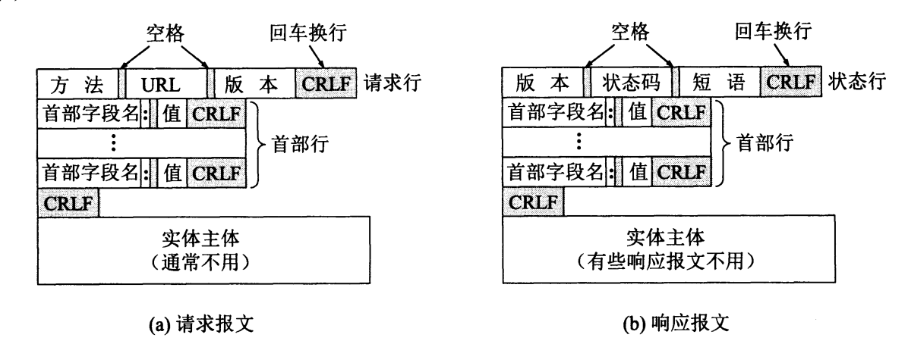

# 一、HTTP报文结构

HTTP有两类报文:

- 请求报文——  从客户向服务器发送请求报文

- 响应报文——  从服务器到客户的回答



HTTP请求报文和响应报文都是由三个部分组成的。可以看出，这两种报文格式的区别就是开始行不同。

- **开始行**，用于区分是请求报文还是响应报文。在请求报文中的开始行叫做<font color="blue">**请求行(Request-Line)**</font>，而在响应报文中的开始行叫做<font color="blue">**状态行(Status-Line)**</font>。在开始行的三个字段之间都以空格分隔开，最后的“CR”和“LF”分别代表“回车”和“换行”。
- **首部行**，用来**说明浏览器、服务器或报文主体的一些信息**。首部可以有好几行，但也可以不使用。在每一个首部行中都有首部字段名和它的值，每一行在结束的地方都要有“回车”和“换行”。整个首部行结束时，还有一空行将首部行和后面的实体主体分开。
- **实体主体**(entity body)，在请求报文中一般都不用这个字段，而在响应报文中也可能没有这个字段。

> 由于HTTP是面向文本的(text-oriented)，因此在报文中的每一个字段都是一些ASCII 码串，因而各个字段的**长度都是不确定的**。


# 二、HTTP请求报文的方法

请求报文的第一行“请求行”只有三个内容，即**方法**，请求资源的URL，以及 HTTP协议的版本。

<font color="blue">**方法**</font>是面向对象技术中使用的专门名词。所谓“方法”就是对所请求的对象进行的操作，这些方法实际上也就是一些命令。因此，**请求报文的类型是由它所采用的方法决定的**。

请求报文中常用的几种方法如下：

| 方法    | 作用                                                    |
| ------- | ------------------------------------------------------- |
| GET     | 获取资源                                                |
| POST    | 传输实体主体                                            |
| PUT     | 上传文件                                                |
| DELETE  | 删除文件                                                |
| HEAD    | 和GET方法类似，但只返回报文首部，不返回报文实体主体部分 |
| PATCH   | 对资源进行部分修改                                      |
| OPTIONS | 查询指定的URL支持的方法                                 |
| CONNECT | 要求用隧道协议连接代理，用来进行环回测试的请求报文      |
| TRACE   | 服务器会将通信路径返回给客户端， 用于代理服务器         |

为了方便记忆，可以将PUT、DELETE、POST、GET理解为客户端对服务端的增删改查。

- PUT：上传文件，向服务器添加数据，可以看作增
- DELETE：删除文件
- POST：传输数据，向服务器提交数据，对服务器数据进行更新。
- GET：获取资源，查询服务器资源

## 2.1 GET和POST请求的区别


# 三、HTTP响应报文的状态码

HTTP响应报文的状态行包括三项内容，即 HTTP的版本，**状态码**，以及解释状态码的简单短语。

下面三种状态行在响应报文中是经常见到的。

```
HTTP/1.1 202 Accepted           {接受}
HTTP/1.1 400 Bad Request        {错误的请求}
Http/1.1 404 Not Found          {找不到}
```


<font color="blue">**状态码(Status-Code)**</font>负责表示客户端 HTTP 请求的返回结果、标记服务器端 的处理是否正常、通知出现的错误等工作。状态码(Status-Code)都是三位数字的，分为5大类。这5大类的状态码都是以不同的数字开头的。

|      | 类别                             | 原因短语                   |
| ---- | -------------------------------- | -------------------------- |
| 1xx  | Informational（信息性状态码）    | 接收的请求正在处理         |
| 2xx  | Success（成功状态码）            | 请求正常处理完毕           |
| 3xx  | Redirection（重定向状态码）      | 需要进行附加操作以完成请求 |
| 4xx  | Client Error（客户端错误状态码） | 服务器无法处理请求         |
| 5xx  | Server Error（服务器错误状态码） | 服务器处理请求出错         |

仅记录在 RFC2616 上的 HTTP 状态码就达 40 种，若再加上 WebDAV（Web-based Distributed Authoring and Versioning，基于万维网 的分布式创作和版本控制）（RFC4918、5842） 和附加 HTTP 状态码 （RFC6585）等扩展，数量就达 **60** 余种。但是，**实际上经常使用的大概只有 14 种**。


- ~~1xx表示通知信息，如请求收到了或正在进行处理。~~
- ~~2xx表示成功，如接受或知道了。~~
- ~~3xx表示重定向，如要完成请求还必须采取进一步的行动。~~
- ~~4xx表示客户的差错，如请求中有错误的语法或不能完成。~~
- ~~5xx表示服务器的差错，如服务器失效无法完成请求。~~


# 参考资料

计算机网络（第7版）-谢希仁 （书籍）